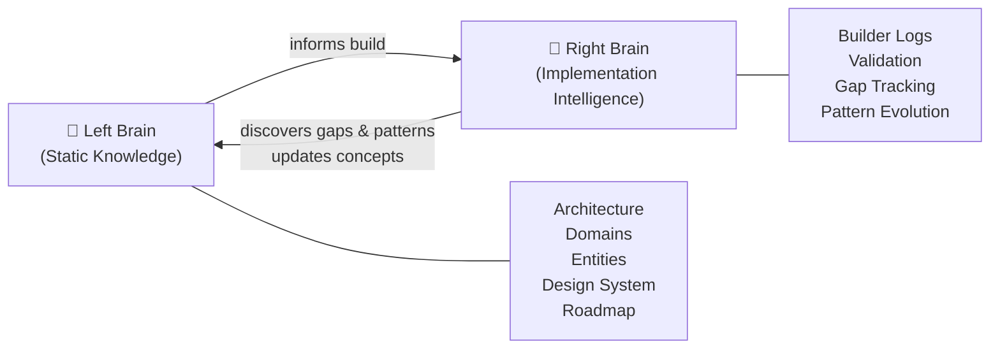
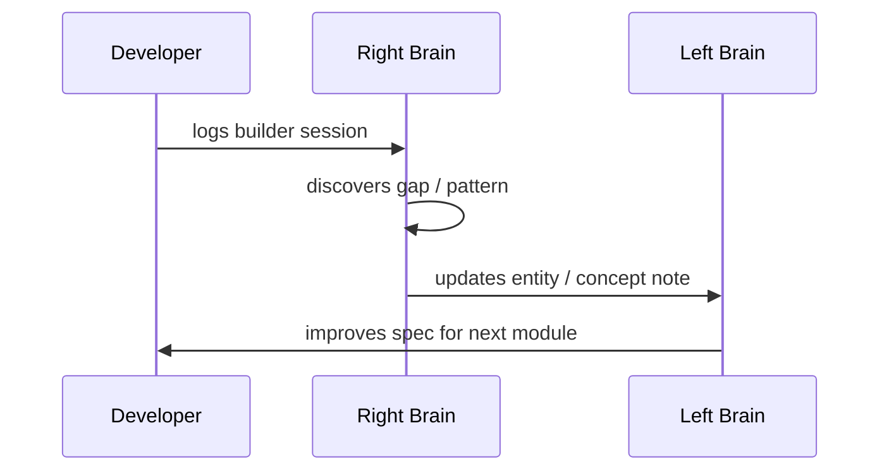

# Vault Philosophy — Two Brains

## The Core Idea

This vault has two hemispheres that mirror how FlowFlex itself works:



**Left Brain** = what FlowFlex IS. Stable, reference-grade documentation.  
**Right Brain** = what's been BUILT, what was LEARNED, what's BROKEN.

---

## Left Brain

Left Brain notes are written once, updated rarely, and always reference-grade.

### Note Types

| Type | Purpose | Template |
|---|---|---|
| MOC | Navigation hub for a section | `tpl_domain-moc` |
| Module | Full spec for one Filament module | `tpl_module` |
| Entity | Core DB model with ERD | `tpl_entity` |
| Concept | Cross-cutting principle | `tpl_concept` |
| Architecture | System decision or pattern | (freeform) |

### Anatomy of a Module Note

```
frontmatter          ← machine-readable metadata
# Title              ← one concept, fully self-contained
## Purpose           ← what problem does this module solve?
## Features          ← user-facing capabilities
## Data Model        ← DB tables, key columns, relationships
## Events            ← events emitted & consumed
## Permissions       ← permission strings
## Competitors       ← what this replaces / beats
## Related           ← bidirectional links to related notes
```

---

## Right Brain

Right Brain files are created when a module moves into active development. They track the implementation journey.

### Activation

When you start building a module:
1. Open [[right-brain/ACTIVATION_GUIDE]]
2. Copy `tpl_module` from `_core/_templates/`
3. Place implementation log in `right-brain/builder-logs/`
4. Update `right-brain/STATUS_Dashboard`

### Builder Log Structure

```
## Module: <name>
### Session YYYY-MM-DD
- What I built
- Decisions made
- Problems hit
- Patterns found
### Gaps Discovered
- [[right-brain/gaps/<gap-name>]]
```

---

## Linking Conventions

- Every note links to its parent MOC
- Module notes link to their entity and related modules
- Right Brain notes always link to their Left Brain source
- Use `[[filename]]` not full paths — Obsidian resolves uniquely

---

## Graph Zones

The Obsidian graph should show three visible clusters:
1. **Left Brain cluster** — dense, stable, highly connected
2. **Right Brain cluster** — sparse at first, grows with each build session
3. **Bridge nodes** — MOCs and entity files that appear in both clusters

---

## The Feedback Loop



Left Brain improves Right Brain BEFORE the build.  
Right Brain improves Left Brain AFTER the build.  
Over time, the vault becomes a self-improving intelligence system.
