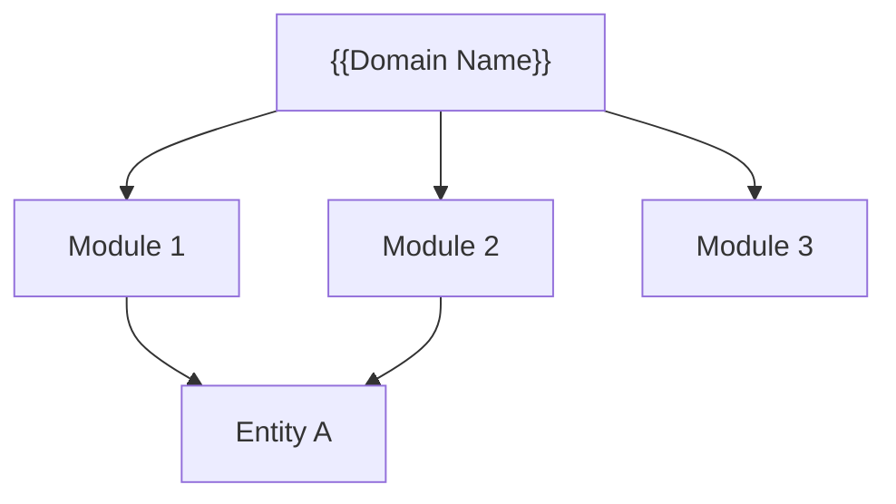
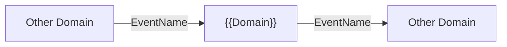

# {{Domain Name}} — Map of Content

> One-line domain summary.

**Panel:** `{{panel}}`  
**Phase:** {{phase}}  
**Migration Range:** `{{range}}`  
**Colour:** `{{#hex}}` / Light: `{{#hex_light}}`  
**Icon:** `heroicon-o-{{icon}}`

---

## Domain Map

---

## Modules

| Module | Phase | Status | Description |
|---|---|---|---|
| [[module-1]] | {{phase}} | planned | Short description |
| [[module-2]] | {{phase}} | planned | Short description |

---

## Cross-Domain Events

| Event | Direction | Partner Domain |
|---|---|---|
| `EventName` | emits → | Other Domain |
| `EventName` | ← consumes | Other Domain |

---

## Permissions Prefix

`{{panel}}.module.*`

---

## Related

- [[MOC_Domains]] — all domains
- [[entity-name]] — primary entity
