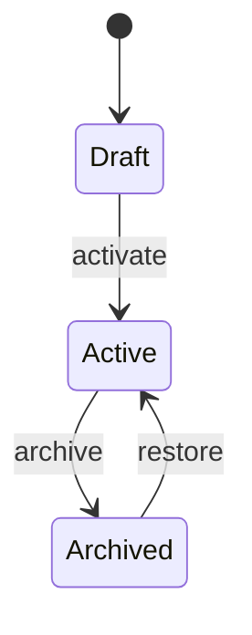

# Entity: {{EntityName}}

> One sentence: what does this record represent? What is the source of truth for?

**Table:** `{{table_name}}`  
**Primary Key:** ULID  
**Soft Deletes:** Yes  
**Multi-Tenant:** `company_id` on every row

---

## Schema

```erDiagram
    {{table_name}} {
        ulid id PK
        ulid company_id FK
        string name
        string status
        timestamp created_at
        timestamp updated_at
        timestamp deleted_at
    }

    companies ||--o{ {{table_name}} : "owns"
```

### Key Columns

| Column | Type | Notes |
|---|---|---|
| `id` | ULID | Primary key |
| `company_id` | ULID FK | Multi-tenancy anchor |
| `name` | string(255) | |
| `status` | enum | |

---

## Relationships

| Relationship | Type | Description |
|---|---|---|
| `company()` | belongsTo | Owning tenant |
| `relatedModel()` | hasMany | Description |

---

## Traits & Interfaces

```php
use BelongsToCompany;     // adds company_id global scope
use HasUlids;             // ULID primary key
use SoftDeletes;          // soft delete
use LogsActivity;         // audit trail
```

---

## Business Rules

- Rule 1: invariant that must always hold
- Rule 2: validation constraint
- Rule 3: state machine constraint (if applicable)

---

## State Machine (if applicable)



---

## Used By Modules

- [[module-a]] — how it uses this entity
- [[module-b]] — how it uses this entity

---

## Related Entities

- [[entity-b]] — relationship description
- [[entity-c]] — relationship description
