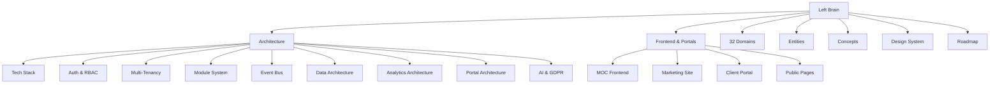

# Left Brain — Master Index

Static knowledge base for FlowFlex. Everything here is reference-grade: read before building, update only when the spec changes.

**32 domains · 311 modules · 11 entities · 11 concepts**

---

## Sections

---

## Architecture

- [[MOC_Architecture]] — system design, patterns, request flows
- [[tech-stack]] — Laravel 13, Vue 3, Filament 5, PostgreSQL, Redis
- [[auth-rbac]] — 2-layer RBAC, Sanctum, Spatie Permission
- [[multi-tenancy]] — company isolation, global scopes, BelongsToCompany
- [[module-system]] — Interface→Service→Controller, ServiceProvider binding
- [[event-bus]] — Laravel events, cross-domain communication
- [[data-architecture]] — DTOs, migrations, ULID keys, migration ranges
- [[analytics-data-architecture]] — read replica, ClickHouse, materialised views
- [[portal-architecture]] — unified PortalKernel, 6 portal types, guards
- [[ai-gdpr-data-residency]] — LLM routing, EU AI Act, data residency

---

## Frontend (Public Pages & Portals)

- [[MOC_Frontend]] — all public Vue+Inertia pages and portal architecture
- [[marketing-site]] — public website, landing pages, pricing
- [[client-portal]] — customer-facing portal
- [[public-pages]] — booking, checkout, learner portal, community

---

## Domains

| # | Domain | Panel | Phase | Modules |
|---|---|---|---|---|
| 00 | [[MOC_Foundation\|Foundation]] | `admin/app` | 0 | 3 |
| 01 | [[MOC_CorePlatform\|Core Platform]] | `admin` | 1 | 12 |
| 02 | [[MOC_HR\|HR & People]] | `hr` | 2/8 | 21 |
| 03 | [[MOC_Projects\|Projects & Work]] | `projects` | 2/8 | 13 |
| 04 | [[MOC_Finance\|Finance & Accounting]] | `finance` | 3/6 | 23 |
| 05 | [[MOC_CRM\|CRM & Sales]] | `crm` | 3/8 | 22 |
| 06 | [[MOC_Marketing\|Marketing & Content]] | `marketing` | 5 | 19 |
| 07 | [[MOC_Operations\|Operations]] | `operations` | 4/5 | 18 |
| 08 | [[MOC_Analytics\|Analytics & BI]] | `analytics` | 6 | 10 |
| 09 | [[MOC_IT\|IT & Security]] | `it` | 4/6 | 12 |
| 10 | [[MOC_Legal\|Legal & Compliance]] | `legal` | 4/7 | 8 |
| 11 | [[MOC_Ecommerce\|E-commerce]] | `ecommerce` | 4/5 | 15 |
| 12 | [[MOC_Communications\|Communications]] | `comms` | 5 | 11 |
| 13 | [[MOC_LMS\|Learning & Development]] | `lms` | 7 | 10 |
| 14 | [[MOC_AI\|AI & Automation]] | `ai` | 6 | 10 |
| 15 | [[MOC_Community\|Community & Social]] | `community` | 7 | 7 |
| 16 | [[MOC_Workplace\|Workplace & Facility]] | `workplace` | 4/6 | 6 |
| 17 | [[MOC_PSA\|Professional Services (PSA)]] | `psa` | 5/7 | 6 |
| 18 | [[MOC_PLG\|Product-Led Growth]] | `plg` | 6/7 | 6 |
| 19 | [[MOC_Travel\|Business Travel]] | `travel` | 5/7 | 6 |
| 20 | [[MOC_ESG\|ESG & Sustainability]] | `esg` | 5/6 | 6 |
| 21 | [[MOC_RealEstate\|Real Estate & Property]] | `realestate` | 6 | 6 |
| 22 | [[MOC_CustomerSuccess\|Customer Success]] | `cs` | 5 | 6 |
| 23 | [[MOC_SubscriptionBilling\|Subscription Billing]] | `subscriptions` | 3 | 6 |
| 24 | [[MOC_Procurement\|Procurement]] | `procurement` | 3 | 6 |
| 25 | [[MOC_FPA\|FP&A]] | `fpa` | 4 | 6 |
| 26 | [[MOC_Events\|Events Management]] | `events` | 5 | 6 |
| 27 | [[MOC_DMS\|Document Management]] | `dms` | 4 | 6 |
| 28 | [[MOC_Whistleblowing\|Whistleblowing & Ethics]] | `whistleblowing` | 4 | 6 |
| 29 | [[MOC_FieldService\|Field Service Management]] | `fsm` | 5 | 8 |
| 30 | [[MOC_Pricing\|Pricing Management]] | `pricing` | 4 | 5 |
| 31 | [[MOC_RiskManagement\|Enterprise Risk Management]] | `risk` | 5 | 6 |

**Total: 32 domains · 311 modules**  
See [[MOC_Domains]] for full registry with panel names, colours, and competitive displacement map.

---

## Entities

- [[MOC_Entities]] — all core data models with ERD
- [[entity-company]] — tenant anchor record
- [[entity-admin]] — FlowFlex staff (admins table, Layer 1 RBAC)
- [[entity-user]] — tenant platform user (users table, Layer 2 RBAC)
- [[entity-employee]] — HR employee profile
- [[entity-contact]] — CRM contact / lead
- [[entity-project]] — project record
- [[entity-invoice]] — financial document
- [[entity-product]] — catalogue item
- [[entity-portal-user]] — external portal users (ESS, client, B2B, partner, learner, member)
- [[entity-module-subscription]] — which modules a company has active
- [[entity-module-catalog]] — module pricing (per-user monthly rates)

---

## Concepts

- [[MOC_Concepts]] — all cross-cutting patterns
- [[concept-multi-tenancy]] — overview → see [[multi-tenancy]] for implementation
- [[concept-interface-service-pattern]] — overview → see [[module-system]] for implementation
- [[concept-dto-pattern]] — spatie/laravel-data, input validation + output serialisation
- [[concept-event-driven]] — overview → see [[event-bus]] for full event map
- [[concept-rbac]] — overview → see [[auth-rbac]] for implementation
- [[concept-soft-deletes]] — all models, 3 hard-delete exceptions
- [[concept-ulid-keys]] — ULID vs UUID, HasUlids trait
- [[concept-platform-features]] — i18n, notifications, workflow rules
- [[concept-custom-objects]] — extensible schema for tenant customisation
- [[concept-formula-engine]] — calculated fields engine
- [[concept-workflow-rules]] — automation trigger/condition/action model

---

## Design System

- [[MOC_DesignSystem]] — navigation hub
- [[brand-foundation]] — master branding: identity, colours, typography, iconography, voice
- [[colour-system]] — CSS custom properties and Tailwind config
- [[typography]] — Bunny Fonts (Inter), type scale, Filament font config

---

## Roadmap

- [[MOC_Roadmap]] — full 9-phase build plan, Gantt, milestones, dependencies
