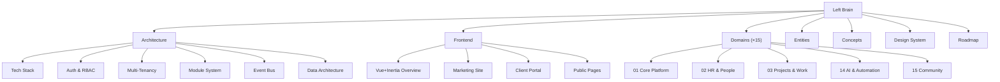

# Left Brain — Master Index

Static knowledge base for FlowFlex. Everything here is reference-grade: read before building, update only when the spec changes.

---

## Sections

---

## Architecture

- [[MOC_Architecture]] — system design, patterns, request flows
- [[tech-stack]] — Laravel 13, Vue 3, Filament 5, PostgreSQL, Redis
- [[auth-rbac]] — 2-layer RBAC, Sanctum, Spatie Permission
- [[multi-tenancy]] — company isolation, global scopes, BelongsToCompany
- [[module-system]] — Interface→Service→Controller, ServiceProvider binding
- [[event-bus]] — Laravel events, cross-domain communication
- [[data-architecture]] — DTOs, migrations, ULID keys
- [[error-handling]] — Inertia errors, custom pages, logging
- [[rate-limiting]] — per-user, per-tenant, per-plan limits

---

## Frontend (Public Pages)

- [[MOC_Frontend]] — all public Vue+Inertia pages (non-Filament)
- [[vue-inertia-overview]] — frontend architecture, TypeScript, SSR
- [[marketing-site]] — public website, landing pages, pricing
- [[client-portal]] — customer-facing portal
- [[public-pages]] — booking, checkout, learner portal, community

---

## Domains

| # | Domain | Panel | Phase | Modules |
|---|---|---|---|---|
| 01 | [[MOC_CorePlatform\|Core Platform]] | `admin` | 1 | 8 |
| 02 | [[MOC_HR\|HR & People]] | `hr` | 2/8 | 15 |
| 03 | [[MOC_Projects\|Projects & Work]] | `projects` | 2/8 | 11 |
| 04 | [[MOC_Finance\|Finance & Accounting]] | `finance` | 3/6 | 14 |
| 05 | [[MOC_CRM\|CRM & Sales]] | `crm` | 3/8 | 13 |
| 06 | [[MOC_Marketing\|Marketing & Content]] | `marketing` | 5 | 12 |
| 07 | [[MOC_Operations\|Operations & Field Service]] | `operations` | 4/5 | 11 |
| 08 | [[MOC_Analytics\|Analytics & BI]] | `analytics` | 6 | 8 |
| 09 | [[MOC_IT\|IT & Security]] | `it` | 4/6 | 8 |
| 10 | [[MOC_Legal\|Legal & Compliance]] | `legal` | 4/7 | 7 |
| 11 | [[MOC_Ecommerce\|E-commerce]] | `ecommerce` | 4/5 | 10 |
| 12 | [[MOC_Communications\|Communications]] | `comms` | 5 | 9 |
| 13 | [[MOC_LMS\|Learning & Development]] | `lms` | 7 | 9 |
| 14 | [[MOC_AI\|AI & Automation]] | `ai` | 6 | 9 |
| 15 | [[MOC_Community\|Community & Social]] | `community` | 7 | 6 |
| 16 | [[MOC_Workplace\|Workplace & Facility]] | `workplace` | 6 | 6 |
| 17 | [[MOC_PSA\|Professional Services (PSA)]] | `psa` | 7 | 6 |
| 18 | [[MOC_PLG\|Product-Led Growth]] | `plg` | 7 | 6 |
| 19 | [[MOC_Travel\|Business Travel]] | `travel` | 7 | 6 |

---

## Entities

- [[MOC_Entities]] — all core data models with ERD
- [[entity-company]] — tenant anchor record
- [[entity-user]] — platform user (admin-side)
- [[entity-employee]] — HR employee profile
- [[entity-contact]] — CRM contact
- [[entity-project]] — project record
- [[entity-invoice]] — financial document
- [[entity-product]] — catalogue item
- [[entity-module-subscription]] — which modules a company has enabled

---

## Concepts

- [[MOC_Concepts]] — all cross-cutting concepts
- [[concept-multi-tenancy]]
- [[concept-interface-service-pattern]]
- [[concept-dto-pattern]]
- [[concept-event-driven]]
- [[concept-rbac]]
- [[concept-soft-deletes]]
- [[concept-ulid-keys]]

---

## Design System

- [[MOC_DesignSystem]] — brand, tokens, components
- [[brand-foundation]]
- [[colour-system]]
- [[typography]]
- [[component-library]]
- [[filament-implementation]]

---

## Roadmap

- [[MOC_Roadmap]] — phase plan, dependencies, milestones
- [[phase-1]] — Core Platform
- [[phase-2]] — HR + Projects (core)
- [[phase-3]] — Finance + CRM (core)
- [[phase-4]] — Operations + IT + Legal + Ecommerce
- [[phase-5]] — Marketing + Communications + Ecommerce extensions
- [[phase-6]] — Analytics + AI & Automation + Finance extensions
- [[phase-7]] — Legal + LMS + Community
- [[phase-8]] — HR + Projects + CRM + all extensions
