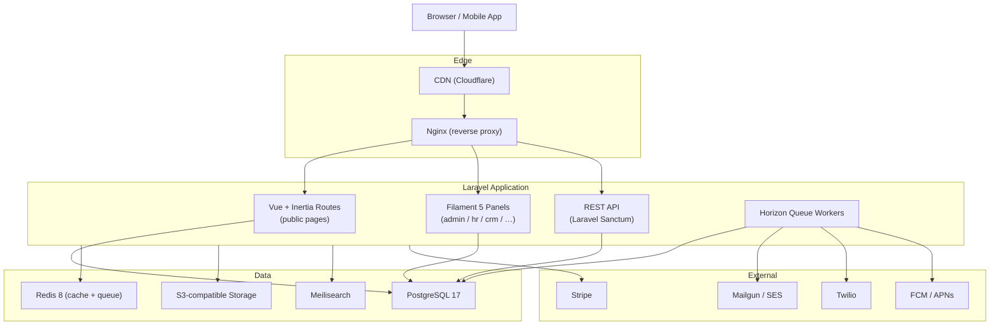
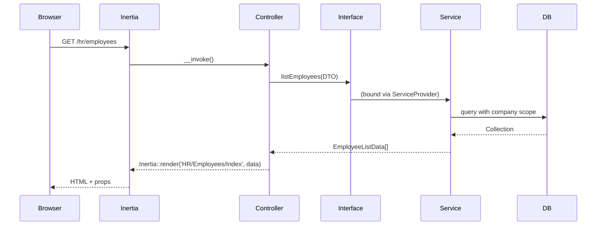

# Architecture — Map of Content

System design, technical decisions, and architectural patterns for FlowFlex.

---

## System Overview

---

## Request Flow

---

## Files

| File | Contents |
|---|---|
| [[tech-stack]] | Full technology stack with rationale |
| [[auth-rbac]] | Authentication flows, 2-layer RBAC |
| [[multi-tenancy]] | Tenant isolation strategy |
| [[module-system]] | Interface/Service/ServiceProvider pattern |
| [[event-bus]] | Cross-domain event architecture |
| [[data-architecture]] | DTOs, migrations, ULID, soft deletes, multi-currency |
| [[analytics-data-architecture]] | Read replica vs warehouse decision, dbt project |
| [[ai-gdpr-data-residency]] | LLM routing, EU AI Act, data residency, GDPR |
| [[portal-architecture]] | Unified 6-portal framework, guard isolation |

---

## Key Architectural Decisions

| Decision | Choice | Rationale |
|---|---|---|
| Admin UI | Filament 5 (Livewire) | Fastest admin CRUD, built-in auth, extensible |
| Public pages | Vue 3 + Inertia | SPA-feel, SSR-capable, shared Laravel routing |
| Primary key | ULID | Sortable, URL-safe, no sequential ID enumeration |
| Multi-tenancy | `company_id` + global scope | Simplest for PostgreSQL, no separate schemas |
| Service binding | Interface + ServiceProvider | Testable, swappable implementations |
| API layer | Laravel Sanctum | Stateful for SPA, token for mobile/API |
| Queue | Horizon + Redis | Full visibility dashboard, priority queues |
| Search | Meilisearch | Typo-tolerant, fast, self-hosted |
| DTO | spatie/laravel-data | Input validation + output serialization in one |

---

## Related

- [[00_MOC_LeftBrain]] — master index
- [[concept-interface-service-pattern]]
- [[concept-multi-tenancy]]
- [[concept-dto-pattern]]
