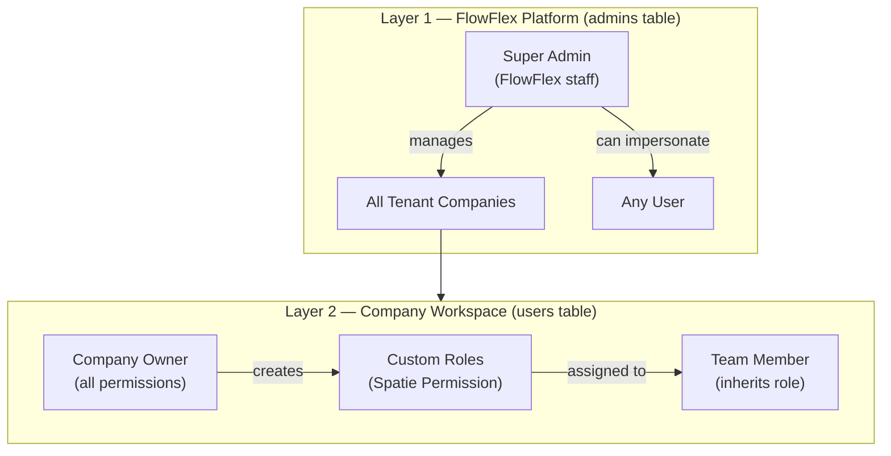
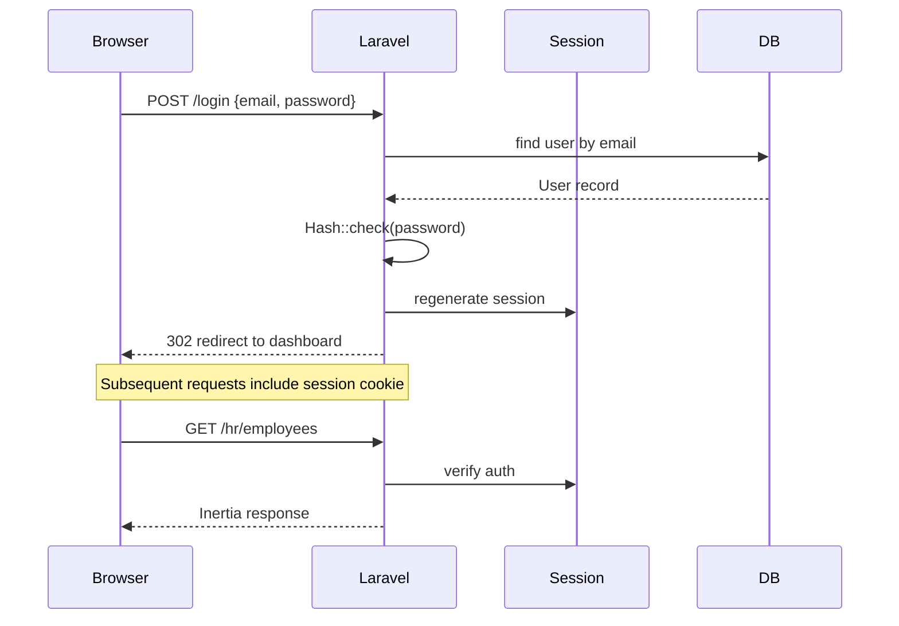
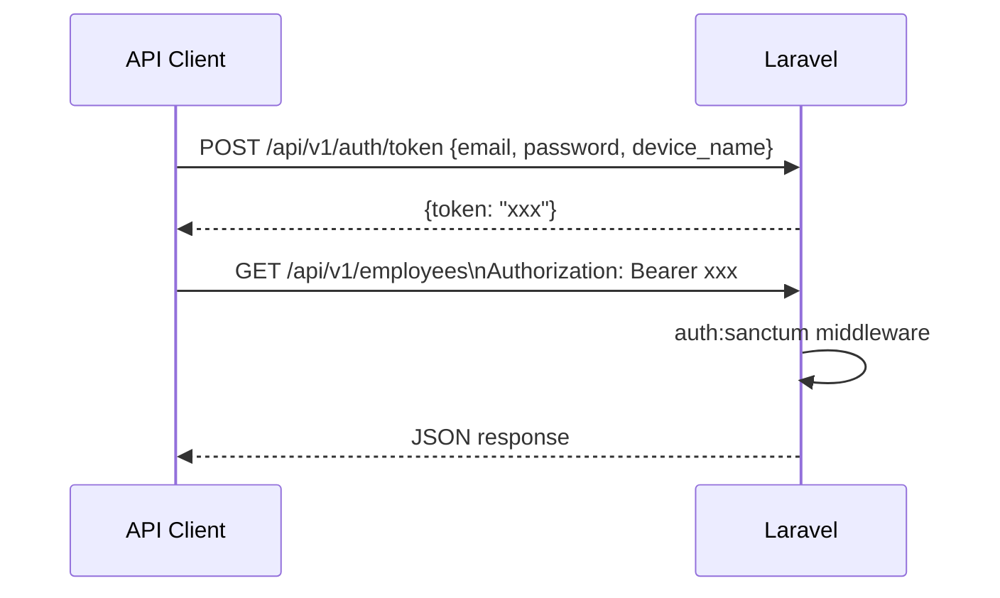

# Authentication & RBAC

FlowFlex uses a **2-layer RBAC** model: one for platform super-admins, one for company users.

---

## Two-Layer Architecture



### Layer 1 — `admins` Table

- Separate table from company users
- Login at `/admin` Filament panel
- Can access all companies for support
- Can impersonate any user with full audit log

### Layer 2 — `users` Table

- Scoped to `company_id`
- Company owner gets all permissions at registration
- All other users assigned one or more custom roles
- Roles are per-company (Spatie's `team` concept)
- Permissions format: `domain.module.action`

---

## Permission Format

```
hr.employees.view-any
hr.employees.view
hr.employees.create
hr.employees.update
hr.employees.delete
finance.invoices.view-any
finance.invoices.approve
crm.contacts.view-any
```

Wildcards for panel-level access:
```
hr.*              → all HR permissions
finance.invoices.*  → all invoice permissions
```

---

## Authentication Flows

### Web (SPA via Inertia)



### API (Token via Sanctum)



---

## Company Owner Bootstrap

When a new company is created:

```php
// In TenantRegistrationService
$owner = User::create([...]);
$role = Role::create(['name' => 'owner', 'team_id' => $company->id]);
$allPermissions = Permission::all();
$role->syncPermissions($allPermissions);
$owner->assignRole($role);
```

---

## Middleware Stack

```php
Route::middleware([
    'auth',
    'verified',
    'company.scope',     // sets company context, blocks suspended tenants
])->group(function () {
    // all domain routes
});
```

`company.scope` middleware:
1. Resolves company from user's `company_id`
2. Sets app-level company context for global scopes
3. Checks company subscription status (blocks if suspended)
4. Injects `current_company` into Inertia shared data

---

## Filament Panel Auth

Each Filament panel has its own auth provider:

```php
// Admin panel (FlowFlex staff only)
->authGuard('admin')
->authModel(Admin::class)

// Domain panels (company users with panel permission)
->authGuard('web')
->authModel(User::class)
->auth(fn (User $user) => $user->can('access.hr-panel'))
```

---

## Related

- [[MOC_Architecture]]
- [[multi-tenancy]]
- [[concept-rbac]]
- [[entity-user]]
