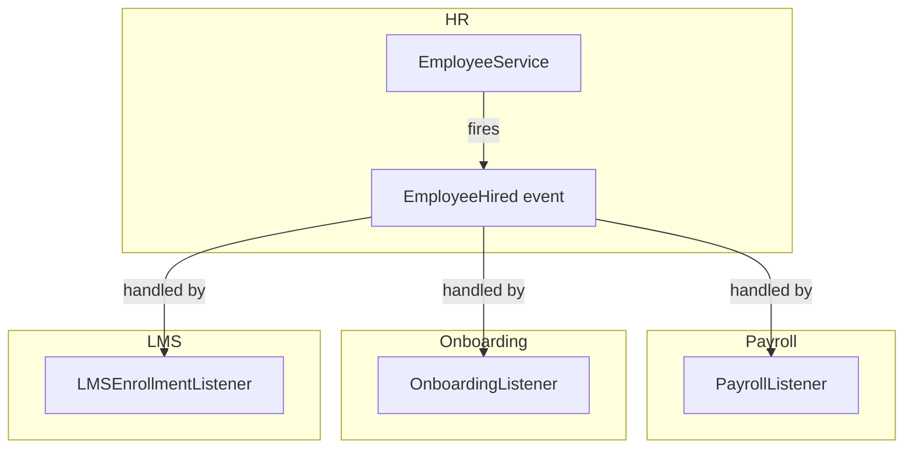

# Event Bus — Cross-Domain Communication

Domains communicate exclusively through Laravel Events. No direct service-to-service calls across domain boundaries.

---

## Architecture



Event emitter (HR domain) has **no knowledge** of which domains consume the event.

---

## Event Structure

```php
namespace App\Events\HR;

class EmployeeHired
{
    public function __construct(
        public readonly string $company_id,
        public readonly string $employee_id,
        public readonly string $user_id,
        public readonly CarbonImmutable $start_date,
        public readonly string $job_title,
    ) {}
}
```

Rules:
- Always include `company_id` — listeners need it for multi-tenancy
- Use typed scalar properties (no model references — models may not exist in consuming domain)
- Immutable value objects

---

## Listener Registration

Listeners registered in `EventServiceProvider`:

```php
protected $listen = [
    EmployeeHired::class => [
        CreatePayrollRecordListener::class,
        StartOnboardingFlowListener::class,
        EnrollInLMSListener::class,
        NotifyITProvisionListener::class,
    ],
    
    LeaveApproved::class => [
        UpdatePayrollDeductionsListener::class,
        UpdateShiftRosterListener::class,
    ],

    InvoicePaid::class => [
        UpdateRevenueReportListener::class,
        TriggerUpsellSequenceListener::class,
    ],
];
```

---

## Queued Listeners

All cross-domain listeners are queued (async):

```php
class CreatePayrollRecordListener implements ShouldQueue
{
    use InteractsWithQueue;

    public string $queue = 'domain-events';
    public int $tries = 3;
    public int $backoff = 30;

    public function handle(EmployeeHired $event): void
    {
        // creates payroll record using PayrollServiceInterface
    }
}
```

---

## Complete Cross-Domain Event Map

| Event | Source Domain | Consumed By |
|---|---|---|
| `EmployeeHired` | HR | Payroll, Onboarding, IT, LMS |
| `EmployeeOffboarded` | HR | IT (revoke), Payroll (final), Assets |
| `LeaveApproved` | HR | Payroll, Scheduling |
| `TimeEntryApproved` | Projects | Payroll, Client Billing |
| `TaskCompleted` | Projects | Project Planning, Invoicing |
| `InvoicePaid` | Finance | CRM, Analytics, Marketing (email trigger) |
| `PurchaseOrderApproved` | Operations | Finance AP/AR |
| `FormSubmissionReceived` | Marketing | CRM (create contact), Email (trigger sequence) |
| `CheckoutCompleted` | Ecommerce | Finance (record sale), Inventory (deduct), CRM |
| `CartAbandoned` | Ecommerce | Marketing (trigger sequence) |
| `TicketResolved` | CRM | Marketing (send CSAT survey) |
| `EventRegistrationReceived` | Marketing | Email (confirmation), CRM (create/update contact) |
| `FieldJobCompleted` | Operations | Finance (create invoice), Inventory (deduct parts) |
| `CertificationExpired` | HR | LMS (renewal course), Notifications |
| `AffiliateCommissionEarned` | Marketing | Finance (record payable) |
| `TimesheetApproved` | PSA | Finance (client billing), Payroll |
| `ProjectBudgetExceeded` | PSA | Notifications (account manager, client) |
| `FeatureFlagEnabled` | PLG | PLG Analytics (track rollout), Notifications |
| `NPSSurveyResponseReceived` | PLG | CRM (update health score), Notifications |
| `TravelBookingApproved` | Travel | Finance (create expense), Notifications (traveller) |
| `DutyOfCareAlertTriggered` | Travel | Notifications (travel manager, emergency contact) |
| `DSARRequestSubmitted` | Legal | Legal (open queue), Notifications (legal team) |
| `DSAREraseCompleted` | Legal | All domains (anonymise), Analytics (warehouse erasure) |
| `ProductionOrderCompleted` | Operations (MFG) | Inventory (add finished goods), Finance (post COGS) |
| `MRPRunCompleted` | Operations (MFG) | Operations (draft POs/production orders created) |

---

## Rules

1. Cross-domain = always via event (never direct service call)
2. Within-domain = direct service call is fine
3. Events carry scalar IDs, not Eloquent models
4. Listeners are always queued
5. Listener failure must not break emitting transaction — use `ShouldQueue`
6. Failed jobs after `$tries = 3` → go to Laravel's `failed_jobs` table (queue: `domain-events-failed`). Horizon monitors this queue and fires `JobFailed` → Notifications domain sends Slack alert to `#platform-alerts`. Retention: 30 days in `failed_jobs`, then purged by scheduled command

---

## Related

- [[MOC_Architecture]]
- [[module-system]]
- [[concept-event-driven]]
