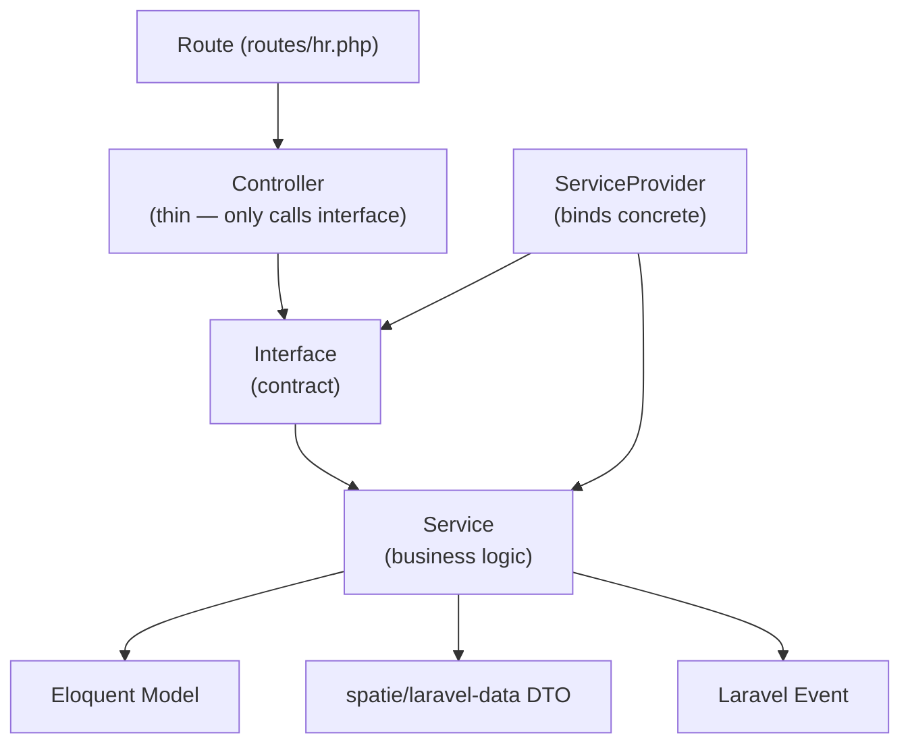

# Module System — Interface/Service Pattern

Every domain module follows the same structural pattern: **Interface → ServiceProvider → Service → Controller → DTO**.

---

## Layer Diagram



---

## File Structure Per Module

```
app/
├── Contracts/
│   └── HR/
│       └── EmployeeServiceInterface.php
├── Services/
│   └── HR/
│       └── EmployeeService.php
├── Providers/
│   └── HR/
│       └── EmployeeServiceProvider.php
├── Http/
│   └── Controllers/
│       └── HR/
│           └── EmployeeController.php
├── Data/
│   └── HR/
│       ├── EmployeeData.php         ← input + output DTO
│       └── CreateEmployeeData.php   ← create-specific
├── Models/
│   └── HR/
│       └── Employee.php
└── Events/
    └── HR/
        └── EmployeeHired.php
```

---

## Interface

```php
namespace App\Contracts\HR;

interface EmployeeServiceInterface
{
    public function list(ListEmployeesData $data): LengthAwarePaginator;
    public function find(string $id): Employee;
    public function create(CreateEmployeeData $data): Employee;
    public function update(string $id, UpdateEmployeeData $data): Employee;
    public function delete(string $id): void;
}
```

---

## Service

```php
namespace App\Services\HR;

class EmployeeService implements EmployeeServiceInterface
{
    public function create(CreateEmployeeData $data): Employee
    {
        $employee = Employee::create($data->toArray());
        event(new EmployeeCreated($employee));
        return $employee;
    }
}
```

---

## ServiceProvider

```php
namespace App\Providers\HR;

class EmployeeServiceProvider extends ServiceProvider
{
    public function register(): void
    {
        $this->app->bind(
            EmployeeServiceInterface::class,
            EmployeeService::class,
        );
    }
}
```

Registered in `bootstrap/providers.php`.

---

## Controller

```php
namespace App\Http\Controllers\HR;

class EmployeeController extends Controller
{
    public function __construct(
        private readonly EmployeeServiceInterface $employees,
    ) {}

    public function index(ListEmployeesData $data): Response
    {
        return Inertia::render('HR/Employees/Index', [
            'employees' => $this->employees->list($data),
        ]);
    }

    public function store(CreateEmployeeData $data): RedirectResponse
    {
        $this->employees->create($data);
        return redirect()->route('hr.employees.index');
    }
}
```

Controllers are **thin by design**. No business logic, no direct model access.

---

## DTOs (spatie/laravel-data)

DTOs serve dual purpose: validate input AND serialize output.

```php
namespace App\Data\HR;

class EmployeeData extends Data
{
    public function __construct(
        public readonly string $first_name,
        public readonly string $last_name,
        #[Email]
        public readonly string $email,
        #[Date]
        public readonly CarbonImmutable $start_date,
        public readonly ?string $job_title = null,
    ) {}
}
```

---

## Filament Resources

Filament resources map to the same domain folder structure:

```
app/Filament/
└── HR/
    └── Resources/
        └── EmployeeResource.php
            └── Pages/
                ├── ListEmployees.php
                ├── CreateEmployee.php
                └── EditEmployee.php
```

Filament resources call the Service directly (not through Inertia controllers).

---

## Rules

1. Controllers never touch Eloquent models directly
2. Services never return Eloquent collections — always DTOs or paginator
3. Events always fired from Service, never from Controller
4. DTOs always used for input validation (no raw `request()->all()`)
5. ServiceProvider is the only place where concrete class is named
6. Tests mock the Interface, not the Service

---

## Related

- [[MOC_Architecture]]
- [[concept-interface-service-pattern]]
- [[concept-dto-pattern]]
- [[event-bus]]
