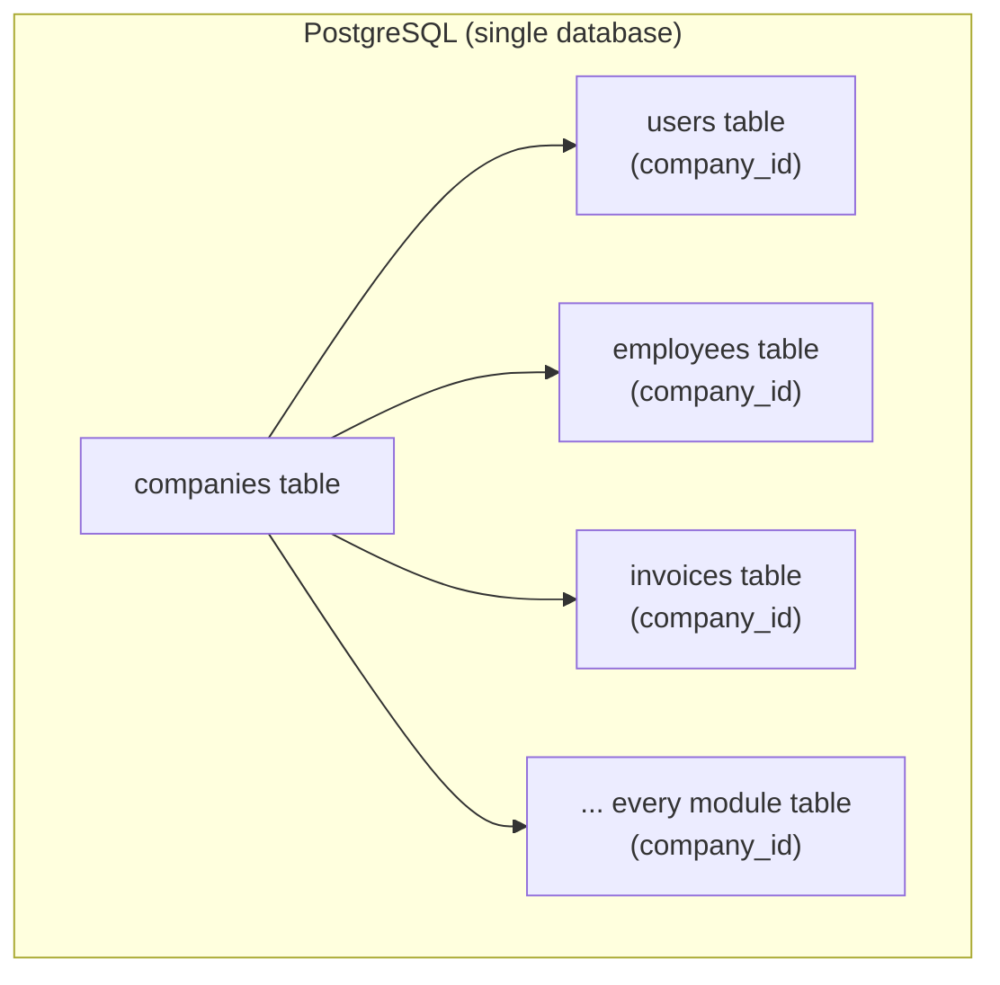

# Multi-Tenancy

FlowFlex uses **shared-database, shared-schema** multi-tenancy. Every row on every module table carries a `company_id`.

---

## Strategy



**Why shared schema?**
- Simplest setup — no per-tenant migrations
- PostgreSQL row-level security possible in future
- No connection pool explosion
- Easy cross-tenant analytics for super-admins

**Trade-off:** One buggy query can leak across tenants if scope is missing → enforced by `BelongsToCompany` trait.

---

## BelongsToCompany Trait

Every module model uses this trait:

```php
trait BelongsToCompany
{
    protected static function bootBelongsToCompany(): void
    {
        static::addGlobalScope(new CompanyScope);
        
        static::creating(function ($model) {
            if (! $model->company_id) {
                $model->company_id = app(CompanyContext::class)->current()->id;
            }
        });
    }

    public function company(): BelongsTo
    {
        return $this->belongsTo(Company::class);
    }
}
```

---

## CompanyScope (Global Scope)

```php
class CompanyScope implements Scope
{
    public function apply(Builder $builder, Model $model): void
    {
        if ($companyId = app(CompanyContext::class)->currentId()) {
            $builder->where($model->getTable() . '.company_id', $companyId);
        }
    }
}
```

Applied automatically to every query. To bypass (super-admin admin panel only):

```php
Employee::withoutGlobalScope(CompanyScope::class)->where('id', $id)->first();
```

**Rule**: `withoutGlobalScope(CompanyScope::class)` is only permitted inside `app/Filament/Admin/` (the `/admin` panel). Never in `app/Filament/App/`, `app/Http/Controllers/`, or `app/Services/`. Enforce via code review checklist — there is no compile-time guard.

---

## CompanyContext Service

Singleton bound in the request lifecycle:

```php
class CompanyContext
{
    private ?Company $company = null;

    public function set(Company $company): void
    {
        $this->company = $company;
    }

    public function current(): Company
    {
        return $this->company ?? throw new MissingCompanyContextException;
    }

    public function currentId(): ?string
    {
        return $this->company?->id;
    }
}
```

Set by `SetCompanyContext` middleware (runs after auth).

---

## Tenant Isolation Checklist

Before every new module:

- [ ] Migration adds `company_id ulid not null references companies(id)`
- [ ] Model uses `BelongsToCompany` trait
- [ ] Model uses `HasUlids` trait
- [ ] Model uses `SoftDeletes`
- [ ] Any raw queries include `company_id` filter
- [ ] File uploads stored in `companies/{company_id}/...` path — enforced via `FileStorageService::pathFor(Company $company, string $filename)` helper; never call `Storage::put()` directly with a raw path
- [ ] Events carry `company_id` in payload
- [ ] Queue jobs verify `company_id` on dispatch and on handle

---

## Module Subscriptions

Companies only see modules they've subscribed to:

```php
// In AuthServiceProvider
Gate::define('access.hr-panel', function (User $user) {
    return $user->company->hasModule('hr');
});
```

Module access controlled by `company_module_subscriptions` table.

---

## Related

- [[MOC_Architecture]]
- [[auth-rbac]]
- [[entity-company]]
- [[concept-multi-tenancy]]
