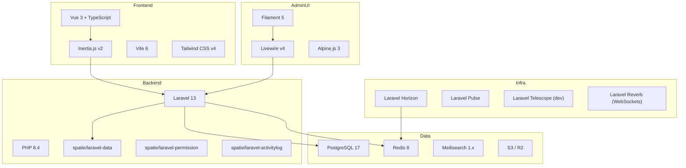
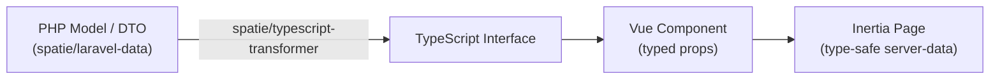

# Tech Stack

## Full Stack Diagram

---

## Layer-by-Layer

### Backend (Laravel 13)

| Package | Version | Purpose |
|---|---|---|
| `laravel/framework` | 13.x | Core framework — confirmed Laravel 13 |
| `laravel/sanctum` | 4.x | SPA auth + API tokens |
| `laravel/horizon` | 5.x | Queue monitoring |
| `laravel/pulse` | 1.x | App health metrics |
| `laravel/reverb` | 1.x | WebSocket server |
| `spatie/laravel-data` | 4.x | DTOs (input + output) |
| `spatie/laravel-permission` | 6.x | Role/permission RBAC |
| `spatie/laravel-activitylog` | 5.x | Audit trail |
| `spatie/laravel-media-library` | 11.x | File attachments |
| `spatie/laravel-typescript-transformer` | 2.x | Auto-generate TS types |
| `stripe/stripe-php` | 14.x | Payments |

### Frontend (Vue 3 + Inertia)

| Package | Version | Purpose |
|---|---|---|
| `vue` | 3.5.x | UI framework |
| `@inertiajs/vue3` | 2.x | SPA without API |
| `typescript` | 5.x | Type safety |
| `vite` | 6.x | Build tool |
| `tailwindcss` | 4.x | Utility CSS |
| `@vueuse/core` | latest | Composables |
| `zod` | 3.x | Frontend validation |
| `chart.js` | 4.x | Data visualisation |
| `@tiptap/vue-3` | 2.x | Rich text editor |

### Admin Panel (Filament 5)

| Package | Purpose |
|---|---|
| `filament/filament` | Panel framework |
| `filament/spatie-laravel-media-library-plugin` | Media in Filament |
| `filament/spatie-laravel-translatable-plugin` | Translations |
| `bezhansalleh/filament-shield` | Permission UI |

### Database & Cache

| Technology | Version | Purpose |
|---|---|---|
| PostgreSQL | 17 | Primary database |
| Redis | 8 | Cache, queues, sessions, WebSocket broadcast |
| Meilisearch | 1.x | Full-text search |

---

## Type Flow

All server-to-client data is typed end-to-end.

---

## Frontend vs Admin Decision

| Context | Technology | Reason |
|---|---|---|
| Business module admin panels | Filament 5 | CRUD-first, fastest to build |
| Public marketing site | Vue 3 + Inertia | SEO, custom design, no auth |
| Client portal | Vue 3 + Inertia | Custom UX, branded |
| Learner portal | Vue 3 + Inertia | External users, custom flow |
| Community pages | Vue 3 + Inertia | Social UX, public/authenticated |
| Booking & checkout | Vue 3 + Inertia | Conversion-optimized flow |
| Mobile app (future) | React Native / Capacitor | TBD |

---

## Key Constraints

- PHP 8.4+ — use named arguments, typed properties, readonly, enums everywhere
- PostgreSQL only — no MySQL compat layer
- ULID primary keys on all tables
- Soft deletes on all models
- Every model with `company_id` must use `BelongsToCompany` trait
- Never run N+1 — use `with()` always, test with Telescope
- All mutations through DTOs — no raw arrays into models

---

## Related

- [[MOC_Architecture]]
- [[data-architecture]]
- [[concept-dto-pattern]]
