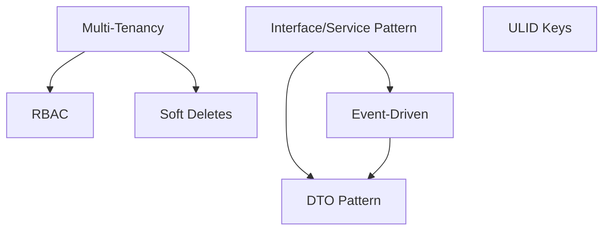

# Concepts — Map of Content

Cross-cutting principles that apply across all domains and modules.

---

## Index

| Concept | Category | One-liner |
|---|---|---|
| [[concept-multi-tenancy]] | architecture | One database, company_id everywhere |
| [[concept-interface-service-pattern]] | architecture | Interface → ServiceProvider → Service → Controller |
| [[concept-dto-pattern]] | data | spatie/laravel-data replaces FormRequest + JsonResource |
| [[concept-event-driven]] | architecture | Cross-domain communication via Laravel Events only |
| [[concept-rbac]] | security | 2-layer: FlowFlex admins + company roles |
| [[concept-soft-deletes]] | data | Never hard-delete; purge after 90 days |
| [[concept-ulid-keys]] | data | Sortable, URL-safe, no sequential enumeration |
| [[concept-platform-features]] | architecture | i18n, white-label, mobile, API marketplace, SOC 2 |
| [[concept-custom-objects]] | architecture | Admin-defined data entities without code — Phase 1-2 priority |
| [[concept-formula-engine]] | data | Calculated fields from other fields; Excel-style formula syntax |
| [[concept-workflow-rules]] | architecture | Trigger-action automation; no-code; Phase 3 |

---

## Concept Relationships

---

## Related

- [[00_MOC_LeftBrain]]
- [[MOC_Architecture]]
