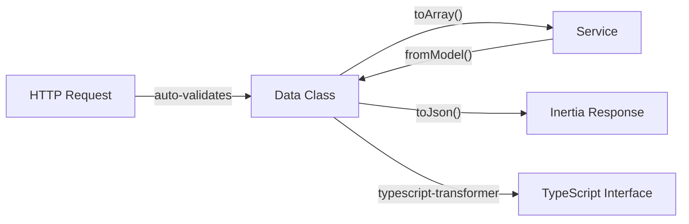

# Concept: DTO Pattern (spatie/laravel-data)

spatie/laravel-data Data classes replace both FormRequest (input validation) and JsonResource (output serialisation). One type serves both directions.

---

## Problem It Solves

Without DTOs: input validated in FormRequest (lives in HTTP layer), output formatted in JsonResource (separate class). Two places to update when schema changes. No type safety. No TypeScript generation.

---

## How It Works



The same `EmployeeData` class validates incoming POST data AND serialises outgoing JSON.

---

## Rules / Invariants

1. Never use `$request->all()` or `$request->validated()` in controllers — use typed Data class
2. Never use `JsonResource` — use Data class with `fromModel()` factory
3. Use `#[Required]`, `#[Email]`, `#[Min]` attributes for validation — not `rules()` array
4. `fromModel()` static method on every Data class
5. Nested data classes for complex objects (e.g. `AddressData` inside `EmployeeData`)

---

## Examples

### Good

```php
// Controller
public function store(CreateEmployeeData $data): RedirectResponse
{
    $this->employees->create($data);
    return redirect()->back();
}

// Data class — validates input AND serialises output
class CreateEmployeeData extends Data
{
    public function __construct(
        #[Required, StringType, Max(100)]
        public readonly string $first_name,
        #[Required, Email]
        public readonly string $email,
    ) {}
}
```

### Bad

```php
// Don't do this
public function store(Request $request): RedirectResponse
{
    $validated = $request->validate([
        'first_name' => 'required|string|max:100',
        'email' => 'required|email',
    ]);
    Employee::create($validated);
}
```

---

## TypeScript Output

spatie/typescript-transformer auto-generates from Data classes:

```typescript
// resources/js/types/generated.d.ts (auto-generated, don't edit)
export interface CreateEmployeeData {
    first_name: string;
    email: string;
}
```

---

## Applied In

Every module's controller, service, and Inertia response.

---

## Related

- [[concept-interface-service-pattern]]
- [[data-architecture]]
- [[tech-stack]]
