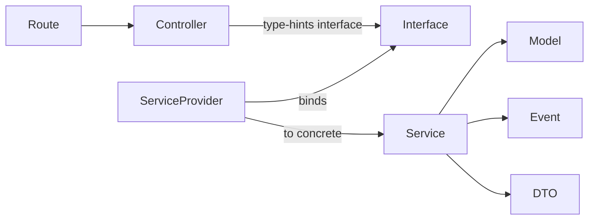

# Concept: Interface/Service Pattern

> **Canonical implementation**: [[module-system]] — full file structure, code examples, rules, Filament resource integration.

Every domain module has an Interface contract, a ServiceProvider that binds the concrete implementation, a Service with all business logic, and a thin Controller that only calls the interface.

---

## Problem It Solves

Without this pattern: business logic bleeds into controllers, making it untestable. Tests can't swap implementations. Modules become tightly coupled.

---

## How It Works



The Controller never imports the Service class. It only ever sees the Interface. The ServiceProvider is the only place where the concrete class is named.

---

## Rules / Invariants

1. Controllers are thin — `__invoke` or max 5 methods, each 1–3 lines
2. Controllers never `new Service()` — only type-hint the Interface
3. Service does all validation, events, and DB operations
4. Interface defines the public API — never expose implementation details
5. One ServiceProvider per module (not one per domain)
6. Tests inject a mock of the Interface — never instantiate the Service in tests

---

## Examples

### Good

```php
class EmployeeController
{
    public function __construct(
        private readonly EmployeeServiceInterface $employees
    ) {}

    public function store(CreateEmployeeData $data): RedirectResponse
    {
        $this->employees->create($data);
        return redirect()->route('hr.employees.index');
    }
}
```

### Bad

```php
class EmployeeController
{
    public function store(Request $request): RedirectResponse
    {
        $employee = new Employee;
        $employee->first_name = $request->first_name;
        $employee->save();
        // direct model access, no DTO, no service
    }
}
```

---

## Applied In

Every module across all 15 domains.

---

## Related

- [[concept-dto-pattern]]
- [[module-system]] — full architecture note
