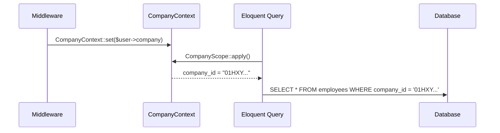

# Concept: Multi-Tenancy

One database, shared schema. Every row on every module table carries `company_id`. Global scope enforces isolation automatically.

---

## Problem It Solves

Without multi-tenancy: one company could accidentally see another's data, or separate databases would require per-tenant migrations and connection pool explosion.

---

## How It Works

1. Every module migration adds `company_id ulid not null references companies(id)`
2. Every module model uses `BelongsToCompany` trait
3. `BelongsToCompany` registers `CompanyScope` as a global Eloquent scope
4. `CompanyScope` appends `WHERE company_id = ?` to every query
5. `company_id` is set automatically on `creating` event from `CompanyContext` singleton
6. `CompanyContext` is populated by `SetCompanyContext` middleware after auth



---

## Rules / Invariants

1. Every module model MUST use `BelongsToCompany`
2. Never use `withoutGlobalScope` except in super-admin context
3. File storage paths MUST include `companies/{company_id}/...`
4. Events MUST carry `company_id` in payload
5. Queue jobs MUST verify `company_id` on both dispatch and handle

---

## Bypassing (Super-Admin Only)

```php
// Only in admin panel controllers — never in company-context code
Employee::withoutGlobalScope(CompanyScope::class)
    ->where('company_id', $targetCompanyId)
    ->get();
```

---

## Applied In

Every module in every domain uses this concept.

---

## Related

- [[concept-rbac]]
- [[multi-tenancy]] — full architecture note
- [[entity-company]]
