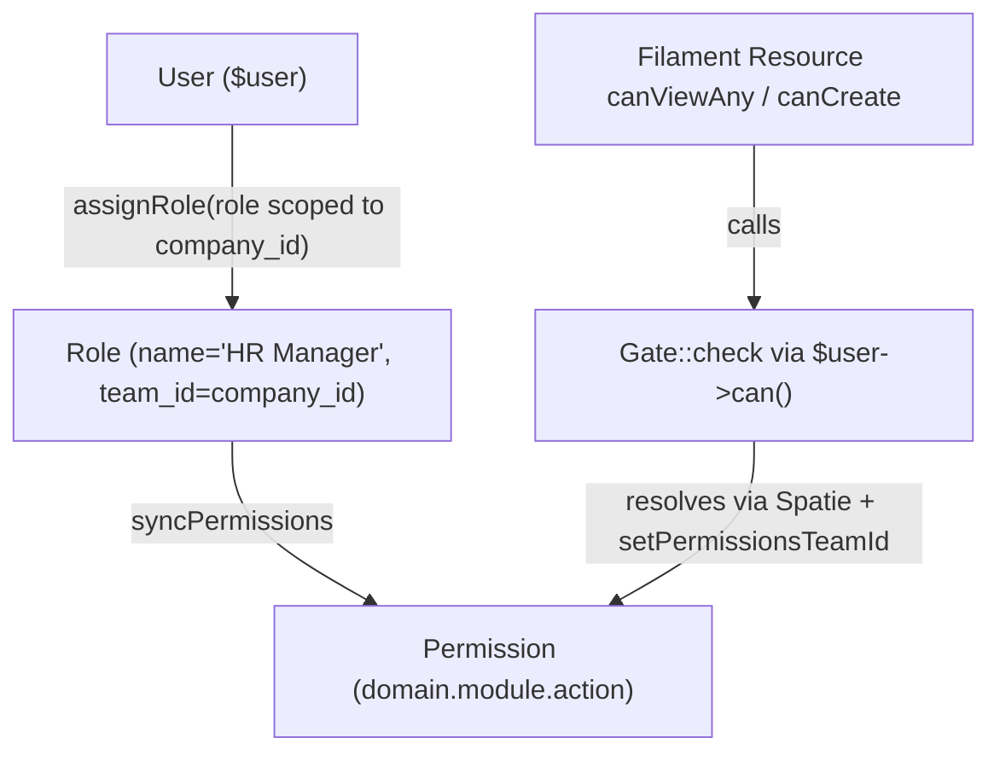

# Concept: RBAC — Role-Based Access Control

> **Canonical implementation**: [[auth-rbac]] — full code, middleware stack, Filament panel auth, company owner bootstrap, Sanctum API tokens.

FlowFlex uses a two-layer RBAC model. The two layers are completely separate: different guards, different models, different permission systems.

---

## Two-Layer Model

### Layer 1: FlowFlex Platform Admins

- **Model**: `Admin` (`admins` table)
- **Guard**: `admin`
- **Panel**: `/admin`
- **Who**: FlowFlex staff only (Max and team). Tenants never touch this layer.
- **Roles**: Plain `role` enum column on the `admins` table — `super_admin`, `support`, `billing`, `readonly`
- **No Spatie Permission**: Admin roles are checked directly (`$admin->role === 'super_admin'`). No team scoping needed. Managed manually in code and seeder.
- **No company context**: Admins have no `company_id`. They operate across all tenants.

### Layer 2: Company Users

- **Model**: `User` (`users` table)
- **Guard**: `web`
- **Panel**: `/app`
- **Who**: Internal company team members accessing the workspace panel.
- **Roles**: Spatie Permission roles, scoped per company using the team concept.
- **Scoping mechanism**: `setPermissionsTeamId($company->id)` is called in `SetCompanyContext` middleware on every request. This tells Spatie Permission which company's roles to resolve.

---

## Company-Side Role Lifecycle

1. **Company created** → the owner `User` is automatically assigned the `owner` role scoped to that company. The `owner` role has all permissions (`*.*.*`).
2. **Owner creates custom roles** in the workspace panel Users & Roles section (e.g. "HR Manager", "Finance Viewer"). Each role is stored in Spatie's `roles` table with `team_id = company_id`.
3. **Owner assigns permissions** to each role using the `domain.module.action` format. The UI groups permissions by domain for readability.
4. **Owner invites team members** and assigns a role on invite. The role is pre-applied when the invited user activates their account.

---

## Permission Format

```
{domain}.{module}.{action}
```

Examples:
- `hr.payroll.run` — run payroll in the HR domain
- `finance.invoices.approve` — approve invoices
- `crm.contacts.view-any` — list all CRM contacts
- `projects.tasks.create` — create tasks in Projects

Standard actions: `view-any`, `view`, `create`, `update`, `delete`, `restore`, `force-delete`, plus domain-specific actions (`run`, `approve`, `export`, `import`).

---

## Wildcard Patterns

Spatie Permission does not natively support wildcards, but FlowFlex resolves them in the `PermissionService` before storing role permissions:

| Pattern | Meaning |
|---|---|
| `hr.*` | All HR permissions across all modules and actions |
| `finance.invoices.*` | All actions on Finance invoices |
| `*.*.view-any` | view-any permission across all domains and modules |

Wildcards are expanded at role-creation time into concrete permission strings so Spatie Permission's standard `can()` check works without modification.

---

## Filament Panel Checks

Each domain panel gate:
```php
// Panel access gate — checked when panel loads
$user->can('access.{domain}-panel')
// e.g. access.hr-panel, access.finance-panel
```

Individual Filament resources check specific permissions:
```php
// Inside a Filament Resource
public static function canViewAny(): bool
{
    return auth()->user()->can('hr.employees.view-any');
}

public static function canCreate(): bool
{
    return auth()->user()->can('hr.employees.create');
}
```

---

## Critical: Middleware Order

`setPermissionsTeamId($company->id)` MUST be called in `SetCompanyContext` middleware BEFORE any permission check, otherwise Spatie Permission resolves against the wrong company's roles (or no roles at all).

```php
// app/Http/Middleware/SetCompanyContext.php
public function handle(Request $request, Closure $next): Response
{
    $company = CompanyContext::resolveFromRequest($request);

    // MUST happen before any ->can() call
    setPermissionsTeamId($company->id);
    CompanyContext::set($company);

    return $next($request);
}
```

This middleware runs early in the `web` middleware stack, before Filament's panel authentication.

---

## Role Resolution Flow



---

## Bypassing for Admin Panel

The FlowFlex admin panel (`/admin`) uses the `Admin` model, which has no Spatie Permission integration. Permission checks in the admin panel are direct comparisons against the `role` enum column:

```php
// In admin Filament resources
public static function canCreate(): bool
{
    return auth('admin')->user()->role === 'super_admin';
}

public static function canViewAny(): bool
{
    return in_array(auth('admin')->user()->role, ['super_admin', 'support', 'readonly']);
}
```

There are no `Role` or `Permission` records in the database for FlowFlex staff. The `admin` guard is completely isolated from Spatie Permission.

---

## Related

- `[[auth-rbac]]` — Foundation module that bootstraps Spatie Permission, runs team migrations, seeds the owner role
- `[[concept-multi-tenancy]]` — company_id scoping that underpins team isolation
- `[[entity-user]]` — User model with HasRoles trait
- `[[workspace-panel]]` — UI where owners manage roles and permissions
