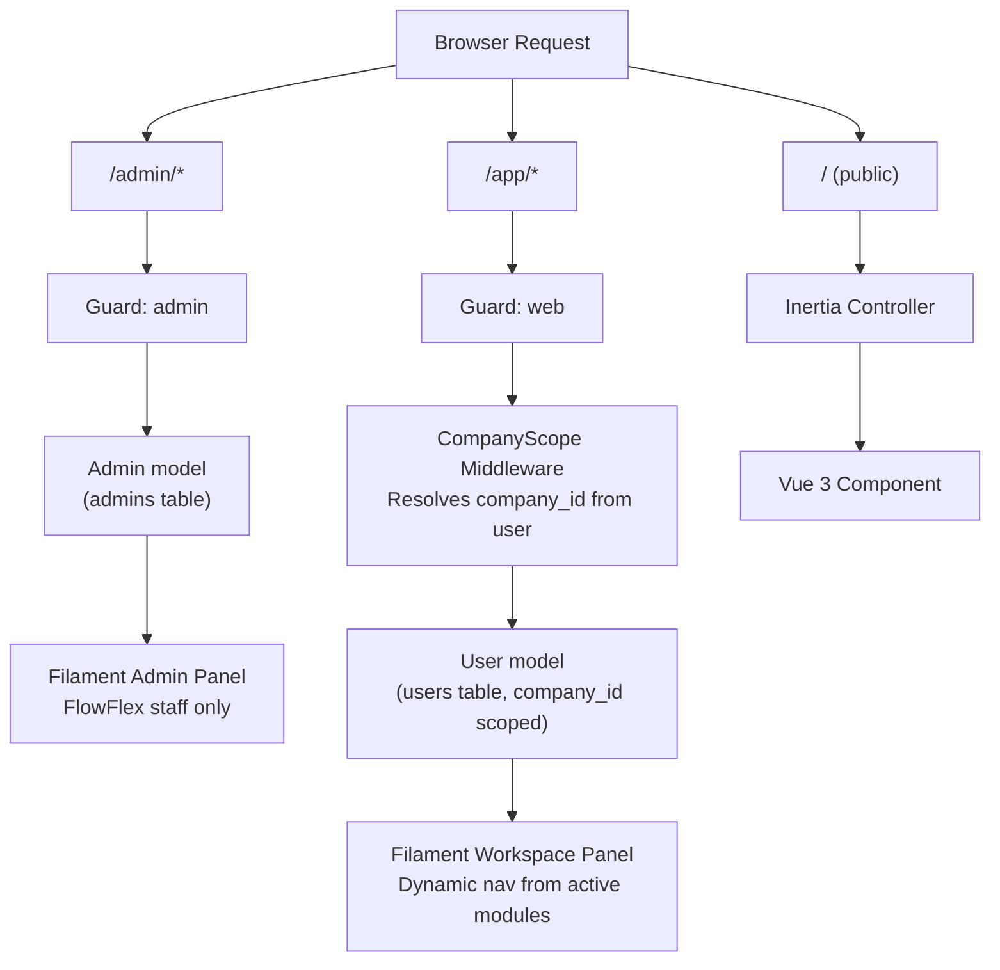

# Foundation — Map of Content

Technical scaffold that must exist before any business domain can be built. Not a business domain — no company user ever sees "Foundation" in their panel. It is what the application IS built on.

---

## What Is Foundation?

Foundation is Phase 0. It is the skeleton every other phase sits on. It covers:
- The Laravel 13 project itself (packages, config, database, queues)
- The two Filament panels that all domain modules load into
- The multi-tenancy layer (Company scoping, context resolution)

There is **no self-service tenant registration**. Companies are created manually by FlowFlex admin staff (Max) via the `/admin` panel. The admin creates the company, the owner user, and activates the relevant modules. Tenants receive an invitation email with a one-time login link.

Without Phase 0 complete, nothing in Phase 1 onward can be built, tested, or demonstrated.

---

## Panels

FlowFlex runs two Filament panels and a public Vue + Inertia layer.

| Panel | Path | Guard | Model | Who Uses It |
|---|---|---|---|---|
| Admin Panel | `/admin` | `admin` | `Admin` | FlowFlex internal staff (Max + team) |
| Workspace Panel | `/app` | `web` | `User` | Tenant company users |
| Public / Portal | `/` | — | — | Marketing visitors, learner portal (Vue 3 + Inertia) |

---

## Module Registry

| Module | Phase | Status | Description |
|---|---|---|---|
| [[project-scaffolding]] | 0 | planned | Laravel 13 + Filament 5 + Vue 3 + Inertia project setup, package installs, base config |
| [[admin-panel-flowflex]] | 0 | planned | Internal FlowFlex staff panel at /admin — company creation, tenant management, billing, health monitoring, impersonation |
| [[workspace-panel]] | 0 | planned | Tenant app shell at /app — dynamic nav from active modules, company settings, user RBAC management |

> **Dependency note**: All Phase 1+ modules depend on this domain being complete. The workspace panel shell, multi-tenancy layer, and admin panel must exist before any business domain module can be loaded or tested.

---

## Panel Architecture

### Admin Panel (`/admin`)
- **Framework**: Filament `AdminPanelProvider`
- **Guard**: `admin` (dedicated guard, separate from `web`)
- **Model**: `Admin` — stored in the `admins` table. FlowFlex staff only. Never shares a table with tenant `User` records.
- **Purpose**: Internal operations — tenant management, billing oversight, system health, support impersonation, platform announcements.
- **Access**: FlowFlex employees only. Not linked from any tenant-facing page.

### Workspace Panel (`/app`)
- **Framework**: Filament `WorkspacePanelProvider` (custom panel provider)
- **Guard**: `web`
- **Model**: `User` — stored in the `users` table, scoped to `company_id`
- **Purpose**: The shell every tenant user works in. Navigation is dynamically assembled from the company's active module subscriptions. All 31 domain panels load as sections within this shell.
- **Access**: Any authenticated tenant user. Company owner controls who can access what via RBAC.

### Public / Portal (`/`)
- **Framework**: Vue 3 + Inertia.js (Laravel controller → Inertia → Vue component)
- **Purpose**: Marketing site, public pricing, learner portal (Phase 7+), partner portal.
- **No Filament**: Completely separate rendering stack.

---

## Two-Layer Auth



---

## Entity Hierarchy

```
Company (tenant)
├── has owner: User (role = owner, all permissions)
├── has many: Users (each scoped to company_id, assigned roles)
├── has many: company_module_subscriptions
│   └── Module (domain.module key, e.g. hr.payroll)
│       └── Feature (documented in module spec — not a separate DB entity)
└── resolved via: CompanyContext (service, set by SetCompanyContext middleware)
```

---

## Related

- [[MOC_Domains]] — all 31 business domains
- [[multi-tenancy]] — CompanyScope, BelongsToCompany trait, CompanyContext
- [[auth-rbac]] — guards, roles, Spatie Permission team concept
- [[tech-stack]] — full package and version list
