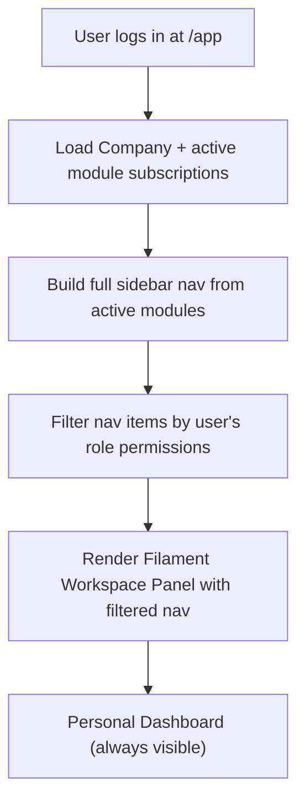

# Workspace Panel — Tenant App Shell

The `/app` Filament panel that every tenant company user sees. Navigation is dynamically built from the company's active module subscriptions. The company owner configures RBAC here. This is the core shell into which all 31 domain panels load.

- **URL**: `/app` (and `/app/{domain}` for domain sections)
- **Guard**: `web`
- **Model**: `User`

---

## Dynamic Navigation

The sidebar navigation is built at runtime by checking which modules the company has active. Only active module sections appear in the sidebar. The company owner's navigation shows all active modules. Other users see only modules they have been granted permission to access via their assigned roles.

This means two users in the same company see different sidebars: an HR Manager sees the HR section but not Finance; a Finance Director sees Finance but not Recruitment. The Filament panel resolves this by running a navigation filter after the active-module check.



---

## Navigation Structure

What a typical company owner sees in the sidebar, with HR + Projects + Finance modules active:

```
⌂  Dashboard               (always visible — personal activity feed)
—— HR & People ——
   Employees
   Leave Management
   Onboarding
—— Projects & Work ——
   Tasks
   Time Tracking
—— Finance & Accounting ——
   Invoices
   Expenses
   Reports
—— Settings ——
   ⚙️  Company Settings
   👥 Users & Roles         (owner only)
   📦 Modules & Billing     (owner only)
```

If a module is deactivated (e.g. Finance is suspended for non-payment), its entire navigation group disappears from the sidebar for all users of that company.

---

## Company Settings Page

Accessible to company owners and users with the `company.settings.manage` permission.

| Setting | Description |
|---|---|
| Company name | Display name shown in the panel header and on invoices |
| Slug | URL-safe identifier, used in internal routing — `company_id` is authoritative, slug is a friendly alias |
| Logo | Uploaded to S3/R2, displayed in the workspace panel header |
| Favicon | Uploaded, used when running on a custom domain (Phase 3+) |
| Primary color | Hex color applied to the Filament panel theme (button accents, sidebar active states) |
| Timezone | Default timezone for all date/time display across the panel |
| Locale | Language + number/date format (e.g. en-GB, nl-NL) |
| Currency | Default currency for Finance module — ISO 4217 code |
| Email domain | Registered domain for future SSO matching (Phase 3+) |

---

## Users & Roles (RBAC for Company Owner)

The owner and users with the `company.rbac.manage` permission can manage who can do what inside the workspace panel.

| Feature | Description |
|---|---|
| Invite users | Owner enters email + selects role → system creates User record (status=invited) → sends invite email with one-time token link → invited user clicks link, sets password on `/app/login?invite_token={token}` → status becomes active → role pre-assigned |
| Role management | Create, rename, and delete custom roles. Assign permission groups to each role. |
| Permission assignment | Granular per-permission assignment using the `{domain}.{module}.{action}` format. The UI groups these by domain for readability. |
| User deactivation | Revoke access immediately — soft-deletes the user and ends any active sessions. |
| Role templates | Predefined starter roles per domain: "HR Manager" gets all `hr.*` permissions; "Finance Viewer" gets `finance.*.view` only. |
| User list | Paginated list of all company users with their role, last login, and status (active/invited/deactivated). |


Invited users who have not yet set their password show as "Invited" status in the user list. The owner can resend the invite email from the user list — this generates a new token and immediately invalidates the old one. Invite tokens expire after 7 days.

---

## Module Marketplace (Owner Only)

The module marketplace is where the company owner enables and disables FlowFlex feature modules. It is the self-service upgrade and downgrade path.

- All available FlowFlex modules are shown, grouped by domain (HR & People, Finance, etc.)
- Active modules have a green "Active" badge and a "Configure" button
- Inactive modules have an "Enable" button — clicking it triggers a billing change (adds to Stripe subscription) and immediately activates the module (creates `company_module_subscriptions` record)
- Disabling a module shows a confirmation ("Your data will be preserved but the module will be hidden from all users") — removes the subscription record, hides the nav group
- Module-specific settings (e.g. default currency for Finance, fiscal year start for Payroll) are accessible via the "Configure" button on active modules

---

## Personal Dashboard

The first page every user lands on after logging in at `/app`. Personalised to the individual.

| Widget | Visible To | Description |
|---|---|---|
| Quick Links | All users | 3–6 most recently accessed Filament resources, updated per visit |
| Pending Approvals | All users | Leave requests awaiting their approval, invoices awaiting sign-off, document approvals — anything requiring action |
| Recent Notifications | All users | Last 10 system notifications (leave approved, invoice paid, task assigned) |
| Company Health | Owner only | MRR, active users this week, failed jobs count, module activation rate |
| Overdue Tasks | All users | Tasks assigned to the user that are past their due date (requires Projects module) |
| Upcoming Events | All users | Calendar events for the next 7 days (requires Events or HR Absence module) |

---

## Technical Implementation Notes

### Navigation Resolution

Navigation is built in a custom Filament `NavigationGroup` resolver that runs once per authenticated request:

```php
// WorkspacePanelProvider
public function navigation(Builder $builder): Builder
{
    $company = CompanyContext::current();
    $activeModules = $company->activeModuleKeys(); // ['hr.profiles', 'finance.invoicing', ...]

    return $builder->groups(
        NavigationRegistry::buildForModules($activeModules, auth()->user())
    );
}
```

Each domain registers its navigation items tagged with its module key. `NavigationRegistry` only includes items whose module key is in the company's active set, then further filters by the user's permissions.

### Company Scope Enforcement

Every Filament resource within the workspace panel uses the `CompanyScope` global scope automatically via the `BelongsToCompany` trait on its backing model. There is no per-resource tenancy check needed — the scope is applied at the Eloquent layer.

---

## Features

- Dynamic sidebar built from active module subscriptions per company
- Per-user navigation filtered by RBAC permissions (`{domain}.{module}.{action}`)
- Company settings management (branding, locale, timezone, currency)
- User invite flow (email invite → signup → automatic role assignment)
- Role creation and permission assignment UI (grouped by domain for readability)
- Role templates for common personas (HR Manager, Finance Viewer, Project Lead)
- Module marketplace — enable and disable modules with billing integration
- Personal dashboard with quick links, pending approvals, and notifications
- Company health widgets for owners
- Mobile-responsive Filament layout (Filament 5 default responsive grid)

---

## Related

- [[MOC_Foundation]]
- [[admin-panel-flowflex]]
- [[entity-company]]
- [[entity-user]]
- [[entity-module-subscription]]
- [[auth-rbac]]
- [[multi-tenancy]]
- [[brand-foundation]] — brand colors, Filament theme tokens, white-label rules
