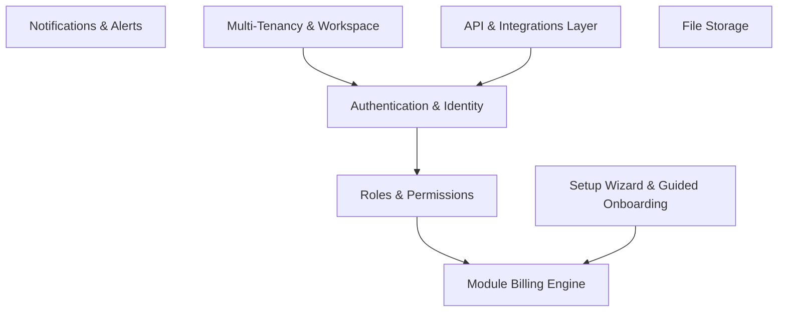

# Core Platform — Map of Content

The foundation every other domain depends on. Authentication, multi-tenancy, permissions, billing, notifications, file storage, API layer, and onboarding.

**Panel:** `admin`  
**Phase:** 1  
**Migration Range:** `000000–099999`  
**Colour:** Gray `#111827`  
**Status:** 📅 Planned

---

## Module Map

---

## Modules

| Module | Status | Description |
|---|---|---|
| Authentication & Identity | 📅 planned | Registration, login, 2FA, social login, password reset |
| Roles & Permissions (RBAC) | 📅 planned | 2-layer RBAC, Spatie Permission, company scoped |
| Module Billing Engine | 📅 planned | Stripe subscriptions, module toggles, usage metering |
| Notifications & Alerts | 📅 planned | In-app, email, push, SMS, webhook notifications |
| API & Integrations Layer | 📅 planned | REST API, OAuth, webhooks, rate limiting |
| Multi-Tenancy & Workspace | 📅 planned | Company isolation, workspace setup, domain config |
| File Storage | 📅 planned | S3-compatible, media library, signed URLs |
| Setup Wizard & Guided Onboarding | 📅 planned | 6-step setup, guided checklist, data import |
| [[notification-preferences\|Notification Preferences]] | planned | Per-user channel + digest + quiet hours preferences |
| [[audit-log\|Audit Log]] | 📅 planned | Immutable activity trail, per-record history, export |
| [[data-import-engine\|Data Import Engine]] | 📅 planned | CSV/Excel bulk import for all entities, column mapping, rollback |
| [[sandbox-environment\|Sandbox Environment]] | 📅 planned | Per-tenant staging environment, production clone, safe testing |

---

## Key Architecture Concepts Used

- [[multi-tenancy]] — every module anchored to `company_id`
- [[auth-rbac]] — 2-layer RBAC from this domain
- [[module-system]] — Interface/Service pattern bootstrapped here

---

## Related

- [[MOC_Domains]]
- [[entity-company]]
- [[entity-user]]
- [[entity-module-subscription]]
