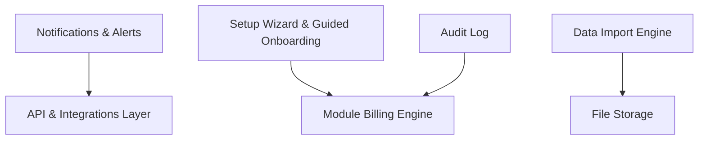

# Core Platform — Map of Content

The features every domain module depends on: notifications, file storage, API layer, billing engine, setup wizard, audit log. Authentication and multi-tenancy foundations are handled in Phase 0 (Foundation).

**Panel:** `admin`  
**Phase:** 1  
**Migration Range:** `010000–099999`  
**Colour:** Gray `#111827`  
**Status:** 🔄 In Progress

---

## Module Map

---

## Modules

| Module | Phase | Status | Description |
|---|---|---|---|
| [[rbac-management-ui\|RBAC Management UI]] | 1 | in-progress | Company owner UI for creating roles, assigning domain.module.action permissions — built on top of Spatie Permission which is bootstrapped in Foundation |
| [[module-billing-engine\|Module Billing Engine]] | 1 | in-progress | Stripe subscriptions, module toggle enforcement, plan limits, usage metering |
| [[notifications-alerts\|Notifications & Alerts]] | 1 | in-progress | In-app, email, push, SMS, webhook — cross-domain notification dispatch |
| [[api-integrations-layer\|API & Integrations Layer]] | 1 | in-progress | REST API, Sanctum auth, webhooks, rate limiting |
| [[file-storage\|File Storage]] | 1 | in-progress | S3-compatible, media library, signed URLs, company-scoped paths |
| [[setup-wizard\|Setup Wizard & Guided Onboarding]] | 1 | in-progress | 5-step first-login wizard, guided checklist, progress tracking |
| [[notification-preferences\|Notification Preferences]] | 1 | in-progress | Per-user channel preferences, digest settings, quiet hours |
| [[audit-log\|Audit Log]] | 1 | in-progress | Immutable activity trail, per-record history, export |
| [[data-import-engine\|Data Import Engine]] | 1 | in-progress | CSV/Excel bulk import for all entities, column mapping, rollback |
| [[sandbox-environment\|Sandbox Environment]] | 1 | in-progress | Per-tenant staging environment, production clone, safe testing |
| [[company-workspace-settings\|Company & Workspace Settings]] | 1 | in-progress | Company name, branding, timezone, locale, currency — managed in workspace panel settings |
| [[i18n-localisation\|i18n & Localisation]] | 1 | in-progress | Multi-language UI (EN, NL, DE, FR, ES), per-user locale, number/date/currency formatting |

---

## Key Architecture Concepts Used

- Built on top of Foundation scaffold — see [[MOC_Foundation]]
- [[module-system]] — Interface/Service pattern bootstrapped here

---

## Related

- [[MOC_Domains]]
- [[entity-company]]
- [[entity-user]]
- [[entity-module-subscription]]
