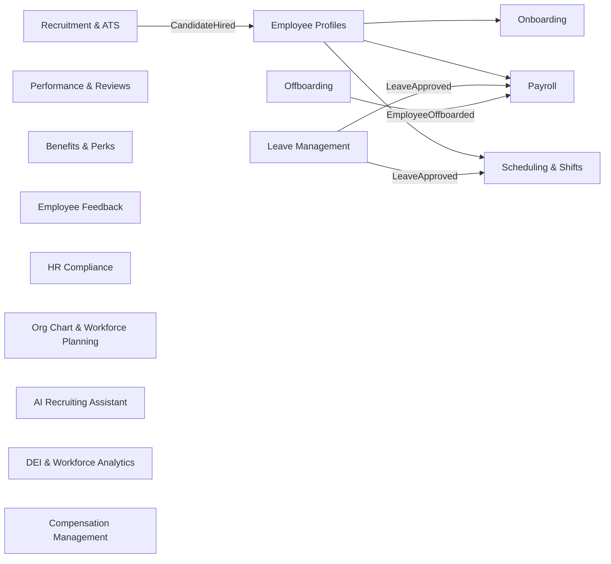

# HR & People — Map of Content

Every stage of the employee lifecycle, from first job posting to final offboarding. Source of truth for who works at the company.

**Panel:** `hr`  
**Phase:** 2 (core) · 3–4 (secondary) · 8 (extensions)  
**Migration Range:** `100000–149999`  
**Colour:** Violet `#7C3AED` / Light: `#EDE9FE`  
**Icon:** `heroicon-o-users`

---

## Module Map

---

## Modules

| Module | Phase | Status | Description |
|---|---|---|---|
| Employee Profiles | 2 | 📅 planned | Central record, directory, org chart anchor |
| Onboarding | 2 | 📅 planned | Structured new hire journeys, task checklists |
| Leave Management | 2 | 📅 planned | Leave requests, balances, policy rules |
| Payroll | 2 | 📅 planned | Pay runs, payslips, tax, integrations |
| Offboarding | 3 | planned | Exit checklist, access revocation, final pay |
| [[performance-reviews-360\|Performance Reviews & 360°]] | 4 | planned | Review cycles, 360 feedback, calibration, OKRs |
| Recruitment & ATS | 4 | planned | Full ATS, job board posting, offer management |
| [[employee-self-service-portal\|Employee Self-Service Portal]] | 3 | planned | `/my/` portal — leave, payslips, documents, profile |
| [[global-payroll\|Global Payroll]] | 4 | planned | Multi-country payroll, contractors, EOR integration |
| Scheduling & Shifts | 8 | planned | Shift building, clock-in/out, rota coverage |
| Benefits & Perks | 8 | planned | Benefits catalogue, enrolment, flex credits |
| Employee Feedback | 8 | planned | Pulse surveys, eNPS, burnout detection |
| HR Compliance | 8 | planned | Mandatory training deadlines, certifications |
| [[org-chart-workforce-planning\|Org Chart & Workforce Planning]] | 8 | planned | Live org chart, span of control, succession planning |
| AI Recruiting Assistant | 8 | planned | JD generation, CV scoring, bias detection |
| DEI & Workforce Analytics | 8 | planned | Pay equity, EU Pay Transparency Directive |
| [[compensation-benefits\|Compensation & Benefits]] | 8 | planned | Salary bands, equity, total comp statements, bonus |
| [[talent-intelligence\|Talent Intelligence]] | 5 | planned | Skills taxonomy, gap analysis, career pathing, internal mobility matching |
| [[employee-wellbeing-mental-health\|Employee Wellbeing & Mental Health]] | 8 | planned | Wellbeing check-ins, burnout early warning, EAP resources |
| [[time-attendance\|Time & Attendance]] | 4 | planned | Hardware clocking (biometric/RFID/geofence), shift-based, payroll export |
| [[hr-people-analytics\|HR & People Analytics]] | 2 | planned | Headcount, attrition, time-to-hire, absence rate, pay equity |

---

## Key Events

| Event | Source | Consumed By |
|---|---|---|
| `EmployeeHired` | Recruitment / Profiles | Onboarding, Payroll, Scheduling, LMS, IT |
| `EmployeeOffboarded` | Offboarding | IT (revoke), Payroll (final), Operations (assets) |
| `LeaveApproved` | Leave | Payroll (deductions), Scheduling (rota) |
| `CandidateHired` | Recruitment | Employee Profiles (create), Onboarding (start) |
| `CertificationExpired` | HR Compliance | LMS (renewal course), Notifications |
| `BurnoutSignalDetected` | Employee Feedback | HR managers, Notifications |
| `TimeEntryApproved` | Projects (consumed) | Payroll (add to pay run) |

---

## Permissions Prefix

`hr.employees.*` · `hr.leave.*` · `hr.payroll.*` · `hr.recruitment.*`  
`hr.performance.*` · `hr.scheduling.*` · `hr.compliance.*`

---

## Competitors Displaced

Personio · BambooHR · Workday · Rippling · FactorialHR

---

## Related

- [[MOC_Domains]]
- [[entity-employee]]
- [[entity-user]]
- [[MOC_Projects]] — time tracking → payroll
- [[MOC_Finance]] — payroll costs → finance
- [[MOC_LMS]] — HR Compliance → LMS courses
