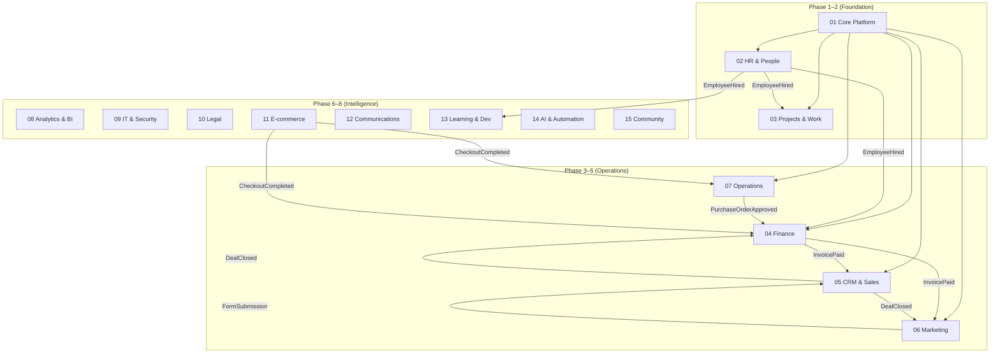

# Domains — Map of Content

31 business domains, each a Filament panel. Plus the public frontend section (not a domain).

---

## Domain Graph

---

## Domain Registry

| # | Domain | Panel | Colour | Phase | Modules |
|---|---|---|---|---|---|
| 01 | [[MOC_CorePlatform\|Core Platform]] | `admin` | `#111827` Gray | 1 | 8 |
| 02 | [[MOC_HR\|HR & People]] | `hr` | `#7C3AED` Violet | 2/8 | 15 |
| 03 | [[MOC_Projects\|Projects & Work]] | `projects` | `#4F46E5` Indigo | 2/8 | 11 |
| 04 | [[MOC_Finance\|Finance & Accounting]] | `finance` | `#059669` Emerald | 3/6 | 14 |
| 05 | [[MOC_CRM\|CRM & Sales]] | `crm` | `#DC2626` Red | 3/8 | 13 |
| 06 | [[MOC_Marketing\|Marketing & Content]] | `marketing` | `#DB2777` Pink | 5 | 12 |
| 07 | [[MOC_Operations\|Operations & Field Service]] | `operations` | `#D97706` Amber | 4/5 | 11 |
| 08 | [[MOC_Analytics\|Analytics & BI]] | `analytics` | `#0284C7` Sky | 6 | 8 |
| 09 | [[MOC_IT\|IT & Security]] | `it` | `#6B7280` Gray-500 | 4/6 | 8 |
| 10 | [[MOC_Legal\|Legal & Compliance]] | `legal` | `#92400E` Amber-800 | 4/7 | 7 |
| 11 | [[MOC_Ecommerce\|E-commerce]] | `ecommerce` | `#0891B2` Cyan | 4/5 | 10 |
| 12 | [[MOC_Communications\|Communications]] | `comms` | `#7C3AED` Violet-600 | 5 | 9 |
| 13 | [[MOC_LMS\|Learning & Development]] | `lms` | `#16A34A` Green | 7 | 9 |
| 14 | [[MOC_AI\|AI & Automation]] | `ai` | `#6366F1` Indigo-500 | 6 | 9 |
| 15 | [[MOC_Community\|Community & Social]] | `community` | `#F59E0B` Amber-400 | 7 | 6 |
| 16 | [[MOC_Workplace\|Workplace & Facility]] | `workplace` | `#0F766E` Teal | 6 | 6 |
| 17 | [[MOC_PSA\|Professional Services (PSA)]] | `psa` | `#7E22CE` Purple | 7 | 6 |
| 18 | [[MOC_PLG\|Product-Led Growth]] | `plg` | `#0369A1` Sky-700 | 7 | 6 |
| 19 | [[MOC_Travel\|Business Travel]] | `travel` | `#1D4ED8` Blue | 7 | 6 |
| 20 | [[MOC_ESG\|ESG & Sustainability]] | `esg` | `#15803D` Green-700 | 5 | 6 |
| 21 | [[MOC_RealEstate\|Real Estate & Property]] | `realestate` | `#57534E` Stone | 6 | 6 |
| 22 | [[MOC_CustomerSuccess\|Customer Success]] | `cs` | `#0EA5E9` Sky | 5 | 6 |
| 23 | [[MOC_SubscriptionBilling\|Subscription Billing & RevOps]] | `subscriptions` | `#10B981` Emerald | 3 | 6 |
| 24 | [[MOC_Procurement\|Procurement & Spend Management]] | `procurement` | `#F97316` Orange | 3 | 6 |
| 25 | [[MOC_FPA\|Financial Planning & Analysis (FP&A)]] | `fpa` | `#6366F1` Indigo | 4 | 6 |
| 26 | [[MOC_Events\|Events Management]] | `events` | `#EC4899` Pink | 5 | 6 |
| 27 | [[MOC_DMS\|Document Management]] | `dms` | `#8B5CF6` Violet | 4 | 6 |
| 28 | [[MOC_Whistleblowing\|Whistleblowing & Ethics Hotline]] | `whistleblowing` | `#6D28D9` Violet-700 | 4 | 4 |
| 29 | [[MOC_FieldService\|Field Service Management]] | `fsm` | `#EA580C` Orange-600 | 5 | 6 |
| 30 | [[MOC_Pricing\|Pricing Management]] | `pricing` | `#0D9488` Teal-600 | 4 | 5 |
| 31 | [[MOC_RiskManagement\|Enterprise Risk Management]] | `risk` | `#B91C1C` Red-700 | 5 | 6 |

**Total: 31 domains · 350+ modules**

---

## Cross-Domain Event Map

| Event | From | To |
|---|---|---|
| `EmployeeHired` | HR | Payroll, Onboarding, IT, LMS |
| `EmployeeOffboarded` | HR | IT, Payroll, Operations (assets) |
| `LeaveApproved` | HR | Payroll, Projects (scheduling) |
| `TimeEntryApproved` | Projects | Payroll, Finance (client billing) |
| `TaskCompleted` | Projects | Finance (milestone invoice) |
| `InvoicePaid` | Finance | CRM, Analytics, Marketing (trigger) |
| `PurchaseOrderApproved` | Operations | Finance (create bill) |
| `FormSubmissionReceived` | Marketing | CRM (create contact), Email (trigger) |
| `EventRegistrationReceived` | Marketing | CRM, Email (confirmation) |
| `AffiliateCommissionEarned` | Marketing | Finance (payable) |
| `CheckoutCompleted` | E-commerce | Finance (record sale), Operations (stock) |
| `CartAbandoned` | E-commerce | Marketing (recovery sequence) |
| `FieldJobCompleted` | Operations | Finance (invoice), Operations (stock) |
| `FieldJobCompleted` | Field Service | Finance (field invoice), Parts (deduct stock) |
| `ReportSubmitted` | Whistleblowing | Case Management (create case), Notifications |
| `ControlTestFailed` | Risk Management | IT (security incident), Legal (compliance) |
| `PriceBookUpdated` | Pricing | Ecommerce (storefront sync), CRM (quote templates) |
| `DiscountApproved` | Pricing | CRM (quote unblocked), Finance (margin recorded) |
| `CertificationExpired` | HR | LMS (renewal), Notifications |
| `TicketResolved` | CRM | Marketing (CSAT survey) |

---

## Competitive Displacement Map

| Domain | Replaces |
|---|---|
| HR & People | Personio, BambooHR, Workday |
| Projects & Work | Jira, Asana, Notion, Google Drive |
| Finance | Xero, QuickBooks, Exact, Afas |
| CRM & Sales | Salesforce, HubSpot, Pipedrive |
| Marketing | Mailchimp, HubSpot Marketing, Hootsuite |
| Operations | NetSuite Inventory, ServiceMax, Fishbowl |
| Analytics | Tableau, Power BI, Metabase |
| IT & Security | Freshservice, Jamf, Okta |
| Legal | DocuSign, ContractSafe, Juro |
| E-commerce | Shopify, WooCommerce, Magento |
| Communications | Slack, Teams, Calendly |
| Learning | Docebo, TalentLMS, Cornerstone |
| AI & Automation | Zapier, Microsoft Copilot, Make |
| Community | Circle.so, Discord, Mighty Networks |
| Customer Success | Gainsight, ChurnZero, Totango |
| Subscription Billing | Chargebee, Recurly, Paddle |
| Procurement | Coupa, Procurify, Spendesk |
| FP&A | Anaplan, Pigment, Mosaic |
| Events | Eventbrite, Cvent, Hopin |
| Document Management | DocuSign, Juro, ContractSafe, Notion |
| Whistleblowing & Ethics | NAVEX EthicsPoint, Speakfully, WhistleB, Convercent |
| Field Service Management | ServiceMax, Salesforce Field Service, Jobber, Commusoft, FieldPulse |
| Pricing Management | Salesforce CPQ, Pricefx, Vendavo, Zilliant |
| Enterprise Risk Management | LogicManager, MetricStream, Riskonnect, ServiceNow GRC |

---

## Related

- [[00_MOC_LeftBrain]]
- [[MOC_Frontend]] — public pages (not a domain)
- [[MOC_Entities]] — shared data models
