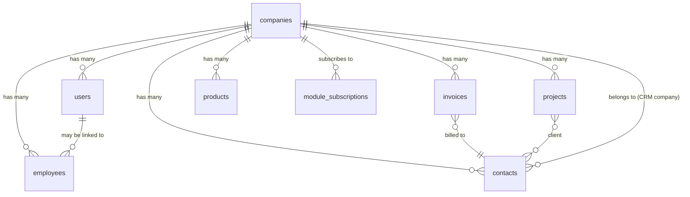
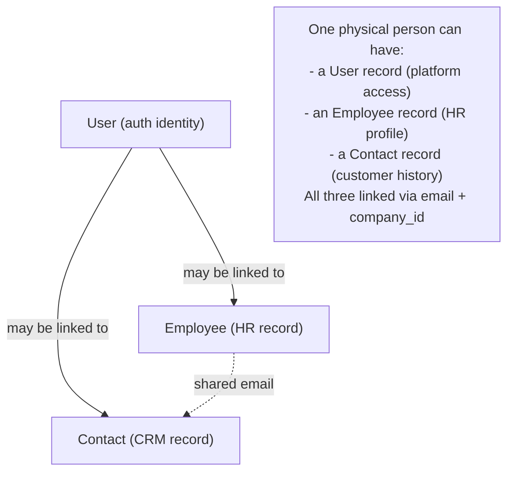

# Entities — Map of Content

Core data models. These are the anchor records that multiple domains reference and extend.

---

## Master ERD

---

## Entity Index

| Entity | Table | Domain | Purpose |
|---|---|---|---|
| [[entity-company]] | `companies` | Core Platform | Tenant anchor. Every row on every table references this. |
| [[entity-user]] | `users` | Core Platform | Platform user — admin panel access, authentication. |
| [[entity-employee]] | `employees` | HR & People | Employed person. Source of truth for HR data. |
| [[entity-contact]] | `contacts` | CRM & Sales | External person (customer, prospect, lead). |
| [[entity-project]] | `projects` | Projects & Work | Work container — tasks, time, documents live here. |
| [[entity-invoice]] | `invoices` | Finance | Financial document — sale, service, or subscription. |
| [[entity-product]] | `products` | E-commerce / Operations | Sellable or physical item. Used by ecommerce + inventory. |
| [[entity-admin]] | `admins` | Foundation | FlowFlex internal staff — Layer 1 RBAC, `/admin` panel only. |
| [[entity-module-subscription]] | `company_module_subscriptions` | Core Platform | Which modules a company has enabled. |
| [[entity-module-catalog]] | `module_catalog` | Core Platform | Master pricing table — per-user monthly price per module key. |

---

## Unified Record Principle

A person is not duplicated — records are linked. The `users` table controls auth, `employees` controls HR, `contacts` controls CRM.

---

## Cross-Entity Rules

1. `company_id` is on every entity — the multi-tenancy anchor
2. ULID primary keys on all entities
3. Soft deletes on all entities
4. `LogsActivity` trait on all entities
5. Deleting a `Company` cascades soft-deletes to all child records

---

## Related

- [[00_MOC_LeftBrain]]
- [[multi-tenancy]]
- [[data-architecture]]
- [[concept-ulid-keys]]
