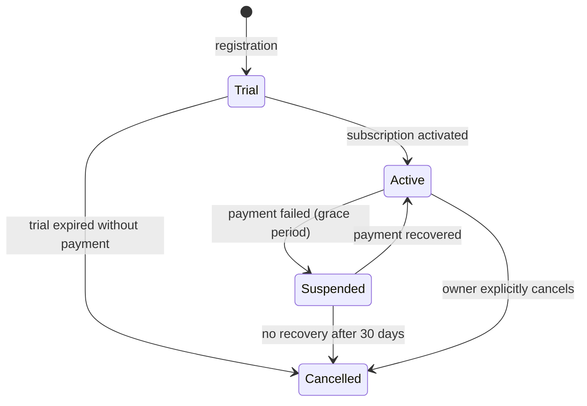

# Entity: Company

The tenant anchor record. Every other record in the system has a `company_id` pointing here.

**Table:** `companies`  
**Multi-Tenant:** This IS the tenant. No `company_id` on this table itself.

---

## Schema

```erDiagram
    companies {
        ulid id PK
        string name
        string slug
        string email
        string plan
        string status
        string timezone
        string locale
        string currency
        json branding
        timestamp trial_ends_at
        timestamp subscribed_at
        timestamp created_at
        timestamp updated_at
        timestamp deleted_at
    }

    companies ||--o{ users : "has many"
    companies ||--o{ company_module_subscriptions : "subscribes to"
```

---

## Key Columns

| Column | Type | Notes |
|---|---|---|
| `id` | ULID | Primary key |
| `name` | string(255) | Company display name |
| `slug` | string(100) | URL-safe identifier, unique |
| `email` | string(255) | Primary billing/contact email |
| `plan` | enum | `starter`, `growth`, `scale`, `enterprise` |
| `status` | enum | `trial`, `active`, `suspended`, `cancelled` |
| `timezone` | string | IANA timezone (e.g. `Europe/Amsterdam`) |
| `locale` | string | BCP 47 locale code (e.g. `nl-NL`) |
| `currency` | string | ISO 4217 (e.g. `EUR`) |
| `branding` | JSON | `{primary_color, logo_url, favicon_url}` |
| `trial_ends_at` | timestamp | null if not on trial |

---

## State Machine



---

## Relationships

| Relationship | Type | Description |
|---|---|---|
| `users()` | hasMany | All platform users for this company |
| `moduleSubscriptions()` | hasMany | Which modules are enabled |
| `employees()` | hasMany | HR employee records |
| `contacts()` | hasMany | CRM contacts |
| `projects()` | hasMany | Projects |
| `invoices()` | hasMany | All invoices |

---

## Business Rules

1. Slug must be unique and URL-safe — used for subdomain routing
2. `status = suspended` blocks all panel access (middleware check)
3. Company deletion is soft — no hard delete except GDPR erasure flow
4. `branding` JSON controls client portal and learner portal appearance
5. `currency` and `locale` default to company owner's registration country

---

## Used By

Every module in every domain. The `BelongsToCompany` trait and `CompanyScope` reference this entity.

---

## Related

- [[MOC_Entities]]
- [[entity-user]]
- [[entity-module-subscription]]
- [[multi-tenancy]]
