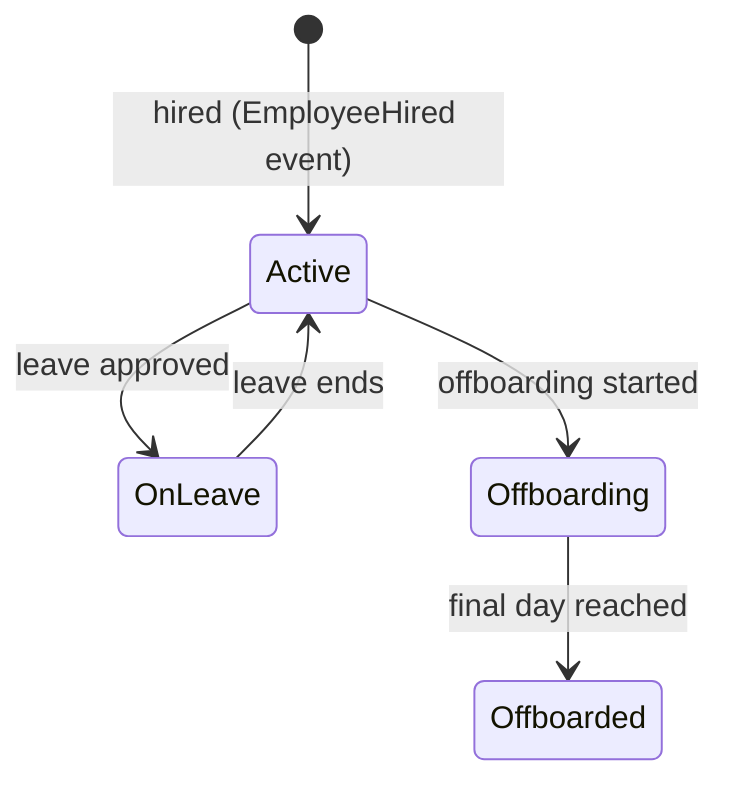

# Entity: Employee

The HR profile for a person employed by the company. Source of truth for all HR data — payroll, leave, performance, scheduling.

**Table:** `employees` (prefixed `hr_employees` in practice)  
**Multi-Tenant:** Yes — `company_id`.

---

## Schema

```erDiagram
    employees {
        ulid id PK
        ulid company_id FK
        ulid user_id FK "nullable — links to platform user"
        string employee_number
        string first_name
        string last_name
        string email
        string phone
        string job_title
        string department
        string employment_type
        string status
        date start_date
        date end_date
        ulid manager_id FK "self-referencing"
        json emergency_contact
        timestamp created_at
        timestamp updated_at
        timestamp deleted_at
    }

    companies ||--o{ employees : "employs"
    users }o--o| employees : "may be linked"
    employees }o--o| employees : "reports to (manager)"
```

---

## Key Columns

| Column | Type | Notes |
|---|---|---|
| `user_id` | ULID FK nullable | Links to `users` table if employee has platform access |
| `employee_number` | string | Company-assigned unique identifier |
| `employment_type` | enum | `full_time`, `part_time`, `contractor`, `intern` |
| `status` | enum | `active`, `on_leave`, `offboarding`, `offboarded` |
| `manager_id` | ULID FK nullable | Self-referencing for org chart |

---

## Relationships

| Relationship | Type | Description |
|---|---|---|
| `company()` | belongsTo | Tenant |
| `user()` | belongsTo | Optional platform user account |
| `manager()` | belongsTo | Direct manager (self-referencing) |
| `directReports()` | hasMany | Employees who report to this employee |
| `leaveBalances()` | hasMany | Leave entitlement per type |
| `payrollRecords()` | hasMany | All payroll entries |
| `skills()` | belongsToMany | Via skills matrix |
| `certifications()` | hasMany | Compliance certifications |

---

## State Machine



---

## Business Rules

1. `employee_number` unique per company
2. When status → `offboarded`: fires `EmployeeOffboarded` event
3. `user_id` nullable — employee can exist without platform login
4. Manager chain must not form a cycle (validation in service)
5. `end_date` set on offboarding — drives payroll final run

---

## Related

- [[MOC_Entities]]
- [[entity-user]]
- [[entity-company]]
- [[MOC_HR]]
