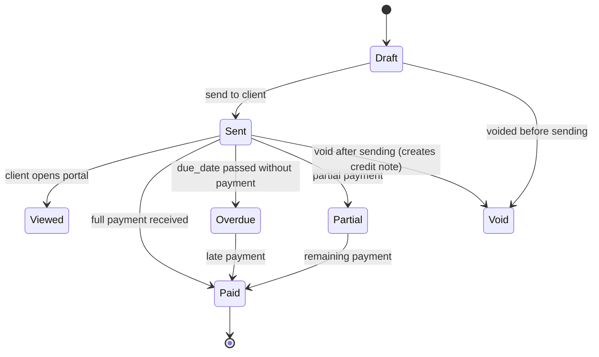

# Entity: Invoice

A financial document representing a sale, service, or subscription charge.

**Table:** `finance_invoices`  
**Multi-Tenant:** Yes — `company_id`.

---

## Schema

```erDiagram
    finance_invoices {
        ulid id PK
        ulid company_id FK
        ulid contact_id FK "nullable"
        string invoice_number
        string status
        string type
        string currency
        decimal subtotal
        decimal tax_amount
        decimal total
        decimal amount_paid
        decimal amount_due
        date issue_date
        date due_date
        date paid_at
        string payment_method
        string stripe_payment_intent_id
        text notes
        timestamp created_at
        timestamp updated_at
        timestamp deleted_at
    }

    finance_invoices ||--o{ finance_invoice_lines : "has lines"
    finance_invoices }o--o| crm_contacts : "billed to"
```

---

## Key Columns

| Column | Type | Notes |
|---|---|---|
| `invoice_number` | string | Auto-incremented per company (e.g. INV-2026-0042) |
| `status` | enum | `draft`, `sent`, `viewed`, `partial`, `paid`, `overdue`, `void` |
| `type` | enum | `invoice`, `credit_note`, `quote`, `recurring` |
| `amount_due` | decimal | `total - amount_paid` — computed |
| `stripe_payment_intent_id` | string nullable | For online payment tracking |

---

## Invoice Lines

```erDiagram
    finance_invoice_lines {
        ulid id PK
        ulid invoice_id FK
        string description
        decimal quantity
        decimal unit_price
        decimal discount_percent
        decimal tax_rate
        decimal line_total
    }
```

---

## State Machine



---

## Events

- `InvoiceSent` → CRM (log interaction), Email (send to client)
- `InvoicePaid` → CRM (update deal), Analytics, Marketing (trigger sequence)
- `InvoiceOverdue` → Notifications, CRM (create follow-up task)

---

## Related

- [[MOC_Entities]]
- [[entity-contact]]
- [[entity-company]]
- [[MOC_Finance]]
