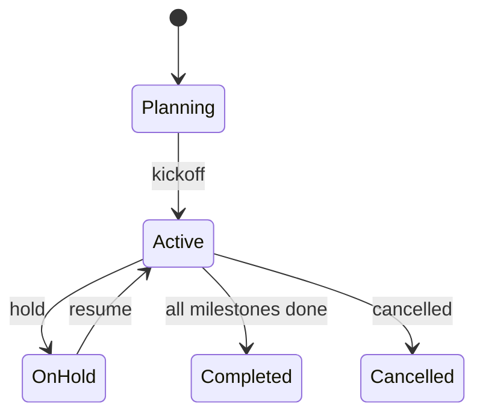

# Entity: Project

A work container. Tasks, time entries, documents, and team members live inside a project.

**Table:** `projects`  
**Multi-Tenant:** Yes — `company_id`.

---

## Schema

```erDiagram
    projects {
        ulid id PK
        ulid company_id FK
        ulid client_contact_id FK "nullable"
        string name
        string description
        string status
        string type
        decimal budget
        date start_date
        date due_date
        date completed_at
        ulid owner_id FK "users"
        timestamp created_at
        timestamp updated_at
        timestamp deleted_at
    }

    companies ||--o{ projects : "owns"
    projects ||--o{ tasks : "contains"
    projects ||--o{ time_entries : "tracks time"
    projects }o--o| crm_contacts : "client"
```

---

## Key Columns

| Column | Type | Notes |
|---|---|---|
| `client_contact_id` | ULID FK nullable | CRM contact or company (billable client) |
| `status` | enum | `planning`, `active`, `on_hold`, `completed`, `cancelled` |
| `type` | enum | `internal`, `client`, `retainer` |
| `budget` | decimal(12,2) | Total approved budget |

---

## Relationships

| Relationship | Type | Description |
|---|---|---|
| `company()` | belongsTo | Tenant |
| `owner()` | belongsTo | Project owner (User) |
| `client()` | belongsTo | CRM Contact (nullable) |
| `tasks()` | hasMany | All tasks |
| `timeEntries()` | hasMany | Time tracked |
| `documents()` | hasMany | Attached files |
| `members()` | belongsToMany | Team members with roles |
| `milestones()` | hasMany | Project milestones |

---

## State Machine



---

## Business Rules

1. `ProjectMilestoneReached` event fires → Finance can trigger milestone invoice
2. `completed_at` set when status → `completed`
3. Deleting project soft-deletes all tasks, time entries, and documents
4. `type = retainer` — linked to Client Billing retainer contract

---

## Related

- [[MOC_Entities]]
- [[entity-contact]]
- [[entity-invoice]]
- [[MOC_Projects]]
