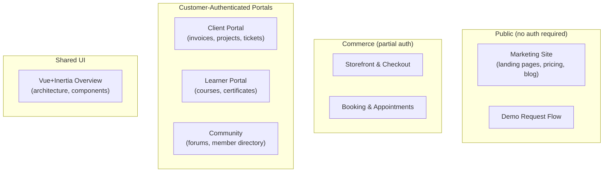
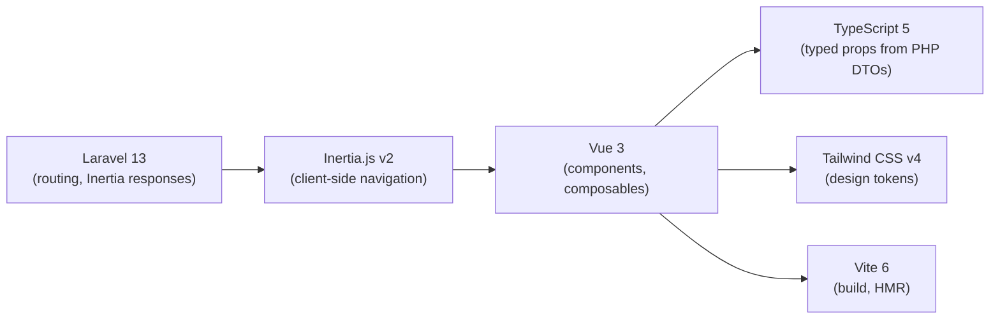

# Frontend — Map of Content

All public-facing Vue 3 + Inertia.js pages. These are **not** Filament panels — they run outside the authenticated admin workspace and are visible to the public, customers, or external users.

---

## What Goes Here



---

## Pages & Sections

### Marketing Site (Public)
- [[marketing-site]] — overview of all marketing site pages
  - Homepage — hero, features grid, pricing preview, social proof
  - Pricing page — plan comparison, monthly/annual toggle, FAQs
  - Features pages — per-domain feature marketing pages
  - Blog — content marketing, SEO articles
  - About / Company — team, mission, culture
  - Demo request flow — multi-step lead capture
  - Legal pages — Terms, Privacy, GDPR, Cookie policy

### Public Commerce Pages
- [[public-pages#storefront]] — product listing + product detail + cart
- [[public-pages#checkout]] — multi-step checkout (Stripe Elements)
- [[public-pages#booking]] — service booking calendar + confirmation

### Customer Portals
- [[client-portal]] — customer-facing portal (invoices, project status, tickets, docs)
- [[learner-portal]] — external learner course access, progress, certificates
- [[community-public]] — community forums, member directory, event listings

---

## Technology



### Key Conventions

- All pages live in `resources/js/pages/` (kebab-case directory per section)
- Shared components: `resources/js/components/`
- Composables: `resources/js/composables/`
- TypeScript types auto-generated from PHP Data classes
- No jQuery, no Bootstrap
- SSR-compatible (Laravel + `@inertiajs/ssr`)

---

## Routing

Public routes in `routes/web.php` (no auth middleware):

```php
// Marketing site
Route::get('/', [MarketingController::class, 'home'])->name('home');
Route::get('/pricing', [MarketingController::class, 'pricing'])->name('pricing');
Route::get('/features/{domain}', [MarketingController::class, 'features'])->name('features');
Route::get('/blog', [BlogController::class, 'index'])->name('blog');

// Client portal (auth:portal guard)
Route::middleware('auth:portal')->prefix('portal')->group(function () {
    Route::get('/dashboard', [PortalController::class, 'dashboard']);
    Route::get('/invoices', [PortalInvoiceController::class, 'index']);
});

// Learner portal (auth:learner guard)
Route::middleware('auth:learner')->prefix('learn')->group(function () {
    Route::get('/courses', [LearnerController::class, 'courses']);
});
```

---

## SEO

- All marketing site pages have meta title, description, OG image in Inertia `<Head>`
- Sitemap auto-generated via `spatie/laravel-sitemap`
- Structured data (JSON-LD) on pricing and homepage
- Blog uses static SSR render for crawler access

---

## Related

- [[00_MOC_LeftBrain]]
- [[tech-stack]]
- [[MOC_Marketing]] — Marketing domain (Filament panel for customers)
- [[MOC_Ecommerce]] — E-commerce domain (Filament + storefront)
- [[MOC_LMS]] — Learning domain (Filament + learner portal)
- [[MOC_Community]] — Community domain (Filament + community pages)
