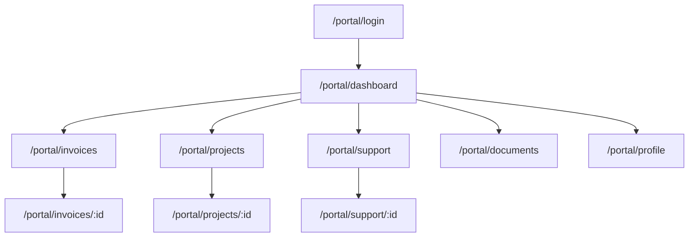

# Client Portal

Customer-facing self-service portal. Separate auth guard (`auth:portal`), branded per company. Customers see their own invoices, projects, tickets, and documents — without access to the Filament admin panels.

---

## Page Map

---

## Features

### Dashboard
- Open invoices summary (amount overdue, next due date)
- Active projects with progress bars
- Open support tickets
- Recent document activity
- Quick actions: Pay invoice, raise ticket, upload document

### Invoices
- List all invoices (filterable: paid/unpaid/overdue)
- Download PDF
- Pay online (Stripe Payment Link or embedded Stripe Elements)
- Dispute invoice (creates internal ticket)

### Projects
- View active and completed projects
- Task completion percentage
- Project timeline (read-only Gantt)
- File attachments from project
- Comment thread (visible to both team and client)

### Support / Helpdesk
- Submit new support ticket
- View open + closed tickets
- Reply to ticket thread
- Upload attachments
- CSAT rating on close

### Documents
- Shared documents from Document Management module
- Download files
- E-sign documents (if E-Signature module enabled)
- Document approval status

### Profile
- Update contact info
- Change password
- Notification preferences (email/push)
- Connected users (if company has multiple portal users)

---

## Branding

Portal is white-labeled per company:
- Custom subdomain: `portal.clientname.com` or `clientname.flowflex.app`
- Company logo in header
- Primary colour from company branding settings
- Footer: company name + contact info
- No FlowFlex branding unless company opts in

---

## Auth Guard

Portal users have a separate `portal_users` table (not `users`):
- Invited by company via Client Portal module
- Limited scope: can only see their own company's data, filtered by portal permissions
- Password reset via separate `/portal/forgot-password` flow

---

## Technology

Vue 3 + Inertia.js + Tailwind. Same build as marketing site (shared Vite config, separate entry point).

---

## Related

- [[MOC_Frontend]]
- [[MOC_CRM]] — Client Portal is a CRM domain module
- [[MOC_Finance]] — Invoices consumed from Finance
- [[MOC_Projects]] — Projects consumed from Projects
