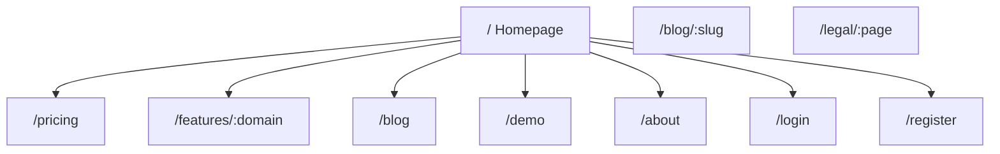

# Marketing Site

FlowFlex's public-facing website. Vue 3 + Inertia.js. No Filament. Managed via CMS module in the `marketing` Filament panel.

---

## Page Map

---

## Homepage

### Hero

- H1: "The AI-native platform that runs your entire business"
- H2: "Replace 12 apps with one workspace. Self-serve in 15 minutes."
- CTAs: "Start free trial" + "Watch 3-min demo"
- Social proof bar: customer logos, "Trusted by X+ teams"

### Differentiators Bar

| Icon | Label |
|---|---|
| ⚡ | Self-serve setup — no consultant needed |
| 🤖 | AI built into every module |
| 🔒 | GDPR-ready, EU data residency |
| 💶 | One subscription, 15 domains |

### Features Grid (by domain)

6-column grid with domain cards: HR, Finance, CRM, Marketing, Operations, Projects, Analytics, IT, Legal, E-commerce, Communications, LMS, AI & Automation, Community.

Each card: icon + domain name + 2–3 key modules.

### Comparison Table

| | FlowFlex | Legacy ERP (SAP/Oracle) | SaaS Stack (12 tools) |
|---|---|---|---|
| Setup time | 15 minutes | 3–18 months | 2–4 weeks |
| Implementation cost | €0 | €50k–€500k | €5k–€20k |
| Monthly cost | from €149 | €2,000+/user | €1,500+/company |
| AI built-in | ✅ Every module | ❌ Add-on | ❌ Separate tool |
| Self-serve | ✅ | ❌ Consultant needed | ✅ per-app |
| Single data model | ✅ | ✅ | ❌ Fragmented |

### Social Proof Section

- Customer testimonials (3–5 pull quotes)
- Case study highlights (ROI numbers)
- G2/Capterra review summary badges

### AI Section

4 capability cards:
- AI Content Studio — generate on-brand content across all channels
- AI Sales Coach — coach reps, forecast deals, identify at-risk
- AI Insights Engine — ask your data anything in plain English
- AI Agents — automate recurring workflows, no code

### Pricing Preview

3-plan summary with "See full pricing" CTA.

---

## Pricing Page

- Monthly / Annual toggle (20% off annual)
- 3-plan comparison table with all features
- Module enable/disable explanation (only pay for what you activate)
- FAQ accordion
- Enterprise CTA

### Plans

| Plan | Price | Users | Domains |
|---|---|---|---|
| Starter | €49/mo | 5 | 3 |
| Growth | €149/mo | 25 | 10 |
| Scale | €399/mo | 100 | All 15 |
| Enterprise | Custom | Unlimited | All + custom |

---

## Features Pages (`/features/:domain`)

Dynamic pages per domain. Template:
- Hero: domain name + value prop sentence
- Feature list (icons + short descriptions)
- Screenshot / product demo embed
- "How it compares" table vs market leader
- Related features from adjacent domains
- CTA: "Start free trial"

---

## Blog

- `/blog` — listing with category filter, search
- `/blog/:slug` — article with TOC, author card, related articles
- Categories: Product Updates, Guides, Comparisons, Use Cases
- SEO-optimised: canonical, OG, JSON-LD Article schema

---

## Demo Request Flow

Multi-step form:
1. Company size + industry
2. Pain points (checkbox: which tools currently used)
3. Name + email + company
4. Schedule (Calendly embed or native calendar)

On submit: triggers `DemoRequestReceived` event → CRM (create lead) + Notification (assign to sales).

---

## Technical Notes

- Admin-managed via CMS & Website Builder module (marketing Filament panel)
- Homepage hero content, testimonials, and comparison table are editable via CMS
- Blog posts written in CMS block editor
- Images served from S3 CDN (Cloudflare)
- `<Head>` via Inertia for per-page meta/OG

---

## Related

- [[MOC_Frontend]]
- [[MOC_Marketing]] — CMS module manages content for this site
- [[marketing-site-overview]] — Obsidian vault docs for Marketing Site
