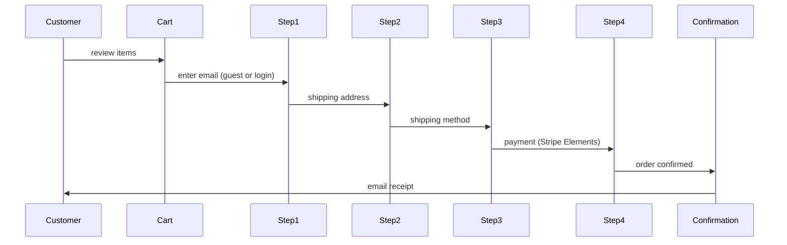

# Public Pages

Additional Vue+Inertia pages that are not part of the core marketing site but are publicly accessible or accessible to external users.

---

## Storefront & Checkout

For companies using the E-commerce module.

### Storefront (`/store`)
- Product grid with category filter + search
- Product detail page: images, description, variants, reviews, stock indicator
- Shopping cart (persistent via localStorage + server session)
- Wishlist (requires account)

### Checkout Flow (`/store/checkout`)

- Guest checkout (no account required)
- Stripe Elements (no redirect)
- Address autocomplete (Google Places or Loqate)
- Order confirmation page + email

---

## Booking & Appointment Scheduling

For companies using the Booking module.

### Service Listing (`/book`)
- Available services with duration + price
- Provider selection (if multiple staff)
- Calendar availability picker (real-time slot check)
- Booking confirmation + email/SMS reminder

### Booking Flow (`/book/:service`)
1. Select date + time slot
2. Customer details (name, email, phone)
3. Optional: intake questions (configured per service)
4. Payment (if paid booking)
5. Confirmation page + calendar invite (.ics)

---

## Learner Portal

For companies using the LMS module with external learners.

### Page Map
- `/learn` — available courses (public catalogue)
- `/learn/:course` — course detail + enrol CTA
- `/learn/my-courses` — enrolled courses progress
- `/learn/course/:id/lesson/:id` — lesson player (video + quiz)
- `/learn/certificates` — earned certificates (downloadable PDF)

White-labeled per company. External learners have separate `learner_users` auth guard.

---

## Community Pages

For companies using the Community module.

### Page Map
- `/community` — homepage (featured posts, events, member spotlight)
- `/community/forums` — topic list
- `/community/forums/:topic/:post` — post + replies
- `/community/members` — member directory (search by skills, location)
- `/community/members/:username` — public member profile
- `/community/events` — event listings
- `/community/events/:slug` — event detail + register

Public ring-fenced by `community_public_access` setting per company (fully public vs members-only).

---

## Public Org Chart

For companies with Public Org Chart enabled.

- `/org` — filterable org chart (department, location)
- Click employee: name, title, department, LinkedIn (if shared)
- No contact info exposed unless employee opts in

---

## Technology Shared Across All Public Pages

| Concern | Solution |
|---|---|
| Auth | Separate guards per portal (`portal`, `learner`, `community`) |
| Branding | Per-company colour + logo via CSS variables |
| Meta/SEO | Inertia `<Head>` per page |
| Performance | Vite code-splitting per section |
| Analytics | GTM or native events to Analytics domain |

---

## Related

- [[MOC_Frontend]]
- [[marketing-site]]
- [[client-portal]]
- [[MOC_Ecommerce]]
- [[MOC_LMS]]
- [[MOC_Community]]
