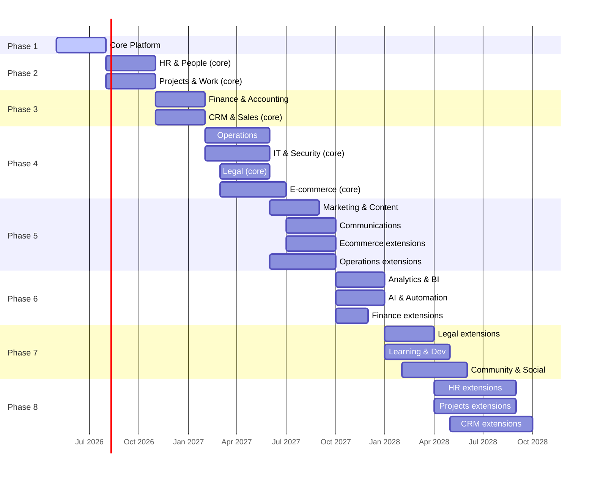

# Roadmap — Map of Content

8-phase build plan from Core Platform through Community & Social.

---

## Phase Overview

---

## Phase Details

### Phase 1 — Core Platform 

Foundation. No domain panel can work without this.

- Authentication & Identity
- Roles & Permissions (RBAC)
- Module Billing Engine
- Notifications & Alerts
- API & Integrations Layer
- Multi-Tenancy & Workspace
- File Storage
- Setup Wizard & Guided Onboarding

### Phase 2 — First Domains 

The modules companies need immediately after signup.

- **HR**: Employee Profiles, Onboarding, Leave Management, Payroll
- **Projects**: Task Management, Time Tracking, Document Management

### Phase 3 — Revenue Core 

Money in, customer relationships out.

- **Finance**: Invoicing, Expenses, Financial Reporting, AP/AR, Bank Reconciliation, Budgeting, Client Billing, Tax, Fixed Assets, Subscriptions/MRR
- **CRM**: Contact & Company Management, Sales Pipeline, Shared Inbox, Customer Support, Quotes & Proposals

### Phase 4 — Operations Layer 🔄

Physical and IT operations.

- **Operations**: Inventory, Assets, Purchasing, Maintenance, Field Service, POS
- **IT**: IT Assets, Internal Helpdesk, SaaS Spend, Access Audit, Security
- **Legal**: Contract Management, Policy Management, Risk Register, Data Privacy
- **E-commerce**: Product Catalogue, Order Management, Storefront & Checkout

### Phase 5 — Marketing & Comms 📅

Growth and communication tooling.

- **Marketing**: CMS, Email, Forms, Social, SEO, Ads, Events, Affiliates, AI Content, SMS/WhatsApp, Push, Influencer
- **Communications**: Chat, Announcements, Video, Intranet, Booking, Native Video, Voice, Async Video, Chat Widget
- **Operations**: Quality, Supply Chain, HSE, Route Optimisation, Vendor Portal
- **E-commerce**: Marketplace, Subscriptions, Digital Products, AI Recommendations, Returns, Abandoned Cart, B2B Portal

### Phase 6 — Intelligence Layer 📅

Analytics and AI that span all domains.

- **Analytics**: Custom Dashboards, Report Builder, KPIs, Data Warehouse, Audit Log, Velocity Metrics, AI Insights, Predictive Analytics
- **AI & Automation**: Workflow Builder, AI Copilot, AI Agents, Integration Hub, Smart Notifications, AI Infrastructure
- **Finance**: Multi-Currency, Open Banking, Cash Flow Forecasting, Revenue Recognition

### Phase 7 — Talent & Community 📅

Learning, succession, and community building.

- **Legal**: Insurance & Licences, AI Contract Intelligence, E-Signature Native
- **LMS**: Course Builder, Skills Matrix, Succession, Mentoring, External Training, AI Learning Coach, Certification, External Learner Portal, Live Classroom
- **Community**: Forums, Member Directory, Events & Meetups, Gamification, Content Gating

### Phase 8 — Deep Extensions 📅

Advanced features across already-built domains.

- **HR**: Offboarding, Performance, Recruitment ATS, Scheduling, Benefits, Feedback, Compliance, Org Chart, AI Recruiting, DEI, Compensation
- **Projects**: Project Planning, Document Approvals, Wiki, Collaboration, Resources, Agile, OKR, Portfolio
- **CRM**: Customer Data Platform, Client Portal, Loyalty, AI Sales Coach, Revenue Intelligence, Deal Room, Sales Sequences, Customer Success

---

## Dependencies

| Phase | Requires |
|---|---|
| 2 | Phase 1 complete |
| 3 | Phase 1–2 complete |
| 4 | Phase 1–3 complete |
| 5 | Phase 4 complete |
| 6 | Phase 5 complete |
| 7 | Phase 6 complete |
| 8 | Phase 3 (CRM/HR) complete — can run alongside 6–7 |

---

## Related

- [[00_MOC_LeftBrain]]
- [[MOC_Domains]]
