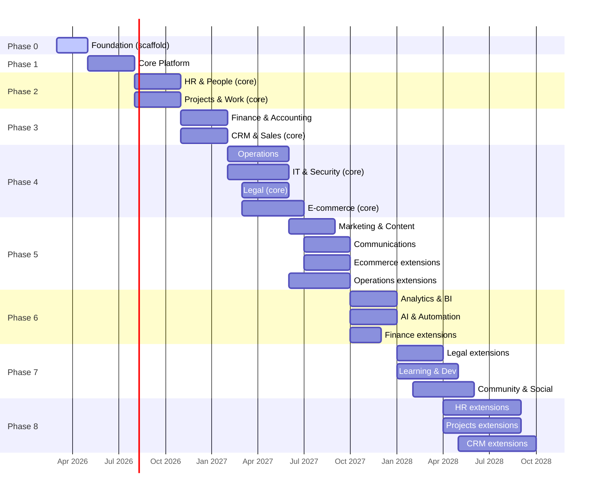

# Roadmap — Map of Content

9-phase build plan from Foundation scaffolding through Community & Social. Phase 0 (Foundation) must be complete before any business domain work begins.

---

## MVP Milestones

- **Phases 0 + 1 complete** = working multi-tenant SaaS shell. A company can sign up, log in, and see the workspace panel. No business features yet.
- **Phase 2 complete** = first sellable domain. HR + Projects modules live. A real company can run their HR and project work inside FlowFlex.
- **Phase 3 complete** = revenue-generating product. Finance + CRM live. FlowFlex can replace Xero, HubSpot, and Salesforce for a small company.

---

## Phase Overview



---

## Phase Details

### Phase 0 — Foundation (MUST BUILD FIRST)

The technical skeleton. Not a business domain — no customer ever sees "Foundation" in their panel. But nothing works without it. See [[MOC_Foundation]] for full detail.

- Laravel 13 + PHP 8.4 + Filament 5 project setup, package installs, base config
- Admin Panel (`/admin`) — FlowFlex internal: tenant management, billing, system health monitoring, user impersonation
- Workspace Panel (`/app`) — Tenant app shell: dynamic navigation built from active modules, company settings, RBAC management
- Multi-tenancy layer (CompanyScope global scope, BelongsToCompany trait, CompanyContext service)
- Authentication scaffolding (login, 2FA, password reset — no self-service registration)
- Company creation flow (admin creates company → owner invite → owner sets password → module activation)
- Module subscription system (database layer for domain/module enable/disable per company)

### Phase 1 — Core Platform

Foundation for all business domains. No domain panel can deliver business value without this.

- Authentication & Identity (email verification, 2FA, SSO groundwork)
- Roles & Permissions (RBAC — Spatie Permission, permission UI in workspace panel)
- Module Billing Engine (Stripe integration, per-module per-user pricing, metered billing)
- Notifications & Alerts (in-app, email, webhooks)
- API & Integrations Layer (REST API, webhook system, OAuth apps)
- Multi-Tenancy & Workspace (company settings, branding, locale, timezone)
- File Storage (S3/R2, file management, virus scanning)
- Setup Wizard & Guided Onboarding (first-run experience after registration)

### Phase 2 — First Domains

The modules companies need immediately after signup.

- **HR**: Employee Profiles, Onboarding, Leave Management, Payroll
- **Projects**: Task Management, Time Tracking, Document Management

### Phase 3 — Revenue Core

Money in, customer relationships out.

- **Finance**: Invoicing, Expenses, Financial Reporting, AP/AR, Bank Reconciliation, Budgeting, Client Billing, Tax, Fixed Assets, Subscriptions/MRR
- **CRM**: Contact & Company Management, Sales Pipeline, Shared Inbox, Customer Support, Quotes & Proposals

### Phase 4 — Operations Layer

Physical and IT operations.

- **Operations**: Inventory, Assets, Purchasing, Maintenance, Field Service, POS
- **IT**: IT Assets, Internal Helpdesk, SaaS Spend, Access Audit, Security
- **Legal**: Contract Management, Policy Management, Risk Register, Data Privacy
- **E-commerce**: Product Catalogue, Order Management, Storefront & Checkout

### Phase 5 — Marketing & Comms

Growth and communication tooling.

- **Marketing**: CMS, Email, Forms, Social, SEO, Ads, Events, Affiliates, AI Content, SMS/WhatsApp, Push, Influencer
- **Communications**: Chat, Announcements, Video, Intranet, Booking, Native Video, Voice, Async Video, Chat Widget
- **Operations**: Quality, Supply Chain, HSE, Route Optimisation, Vendor Portal
- **E-commerce**: Marketplace, Subscriptions, Digital Products, AI Recommendations, Returns, Abandoned Cart, B2B Portal

### Phase 6 — Intelligence Layer

Analytics and AI that span all domains.

- **Analytics**: Custom Dashboards, Report Builder, KPIs, Data Warehouse, Audit Log, Velocity Metrics, AI Insights, Predictive Analytics
- **AI & Automation**: Workflow Builder, AI Copilot, AI Agents, Integration Hub, Smart Notifications, AI Infrastructure
- **Finance**: Multi-Currency, Open Banking, Cash Flow Forecasting, Revenue Recognition

### Phase 7 — Talent & Community

Learning, succession, and community building.

- **Legal**: Insurance & Licences, AI Contract Intelligence, E-Signature Native
- **LMS**: Course Builder, Skills Matrix, Succession, Mentoring, External Training, AI Learning Coach, Certification, External Learner Portal, Live Classroom
- **Community**: Forums, Member Directory, Events & Meetups, Gamification, Content Gating

### Phase 8 — Deep Extensions

Advanced features across already-built domains.

- **HR**: Offboarding, Performance, Recruitment ATS, Scheduling, Benefits, Feedback, Compliance, Org Chart, AI Recruiting, DEI, Compensation
- **Projects**: Project Planning, Document Approvals, Wiki, Collaboration, Resources, Agile, OKR, Portfolio
- **CRM**: Customer Data Platform, Client Portal, Loyalty, AI Sales Coach, Revenue Intelligence, Deal Room, Sales Sequences, Customer Success

---

## Domain-Module-Feature Hierarchy

FlowFlex organises all functionality into three levels:

```
Domain
└── Module (toggleable per company via company_module_subscriptions)
    └── Feature (documented in the module spec — NOT a separate database entity)
```

- A **Domain** is a business area (e.g. HR & People, Finance & Accounting). It maps to a navigation group in the workspace panel. Each domain has a MOC file.
- A **Module** is a deployable feature set within a domain (e.g. `hr.payroll`, `finance.invoicing`). Modules are enabled or disabled per company. The module key format is `{domain}.{module}`.
- A **Feature** is an individual capability within a module (e.g. "bulk payrun approval", "pay slip PDF generation"). Features are documented in the module spec file. They are not stored as separate database records — they are either on or off based on the module being active and the user's permissions.

The permission format mirrors this: `{domain}.{module}.{action}` — e.g. `hr.payroll.run`, `finance.invoices.approve`.

---

## Panel Architecture

FlowFlex uses two Filament panels. See [[MOC_Foundation]] for full architecture detail.

| Panel | Path | Who Uses It |
|---|---|---|
| Admin Panel | `/admin` | FlowFlex staff only (guard: admin, model: Admin) |
| Workspace Panel | `/app` | Tenant company users (guard: web, model: User) |
| Public / Portal | `/` | Marketing visitors, learner portal (Vue 3 + Inertia) |

---

## Dependencies

| Phase | Requires |
|---|---|
| 1 | Phase 0 complete |
| 2 | Phase 0–1 complete |
| 3 | Phase 0–2 complete |
| 4 | Phase 0–3 complete |
| 5 | Phase 4 complete |
| 6 | Phase 5 complete |
| 7 | Phase 6 complete |
| 8 | Phase 3 (CRM/HR) complete — can run alongside 6–7 |

---

## Related

- [[00_MOC_LeftBrain]]
- [[MOC_Domains]]
- [[MOC_Foundation]]
