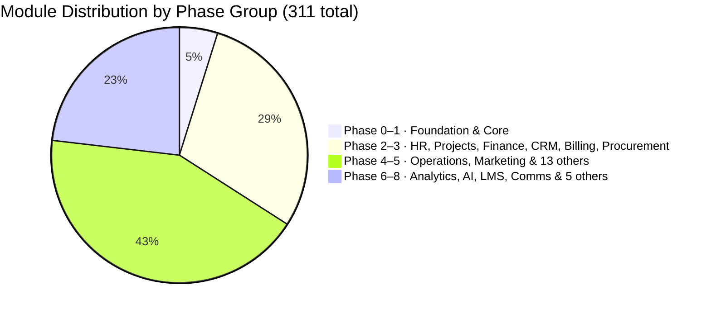

# STATUS Dashboard

Current build state across all 32 domains · 311 modules (including Foundation scaffold). Updated per session.

---

## Phase Progress

> **Build sequence**: Phase 0 must complete before Phase 1. Phase 1 must complete before any Phase 2 domain. No cross-phase shortcuts. Foundation is the Laravel 13 + Filament 5 project skeleton — not a business domain.

---

## Domain Status

| Domain | Phase | Built | Total | Progress |
|---|---|---|---|---|
| Foundation | 0 | 5 | 5 | ✅ 100% |
| Core Platform | 1 | 0 | 12 | 📅 0% |
| HR & People | 2–8 | 0 | 21 | 📅 0% |
| Projects & Work | 2/8 | 0 | 13 | 📅 0% |
| Finance & Accounting | 3/6 | 0 | 23 | 📅 0% |
| CRM & Sales | 3/8 | 0 | 22 | 📅 0% |
| Marketing & Content | 5 | 0 | 19 | 📅 0% |
| Operations | 4/5 | 0 | 18 | 📅 0% |
| Analytics & BI | 6 | 0 | 10 | 📅 0% |
| IT & Security | 4/6 | 0 | 12 | 📅 0% |
| Legal & Compliance | 4/7 | 0 | 8 | 📅 0% |
| E-commerce | 4/5 | 0 | 15 | 📅 0% |
| Communications | 5 | 0 | 11 | 📅 0% |
| Learning & Dev | 7 | 0 | 10 | 📅 0% |
| AI & Automation | 6 | 0 | 10 | 📅 0% |
| Community & Social | 7 | 0 | 7 | 📅 0% |
| Workplace & Facility | 4/6 | 0 | 6 | 📅 0% |
| Professional Services (PSA) | 5/7 | 0 | 6 | 📅 0% |
| Product-Led Growth | 6/7 | 0 | 6 | 📅 0% |
| Business Travel | 5/7 | 0 | 6 | 📅 0% |
| ESG & Sustainability | 5/6 | 0 | 6 | 📅 0% |
| Real Estate & Property | 6 | 0 | 6 | 📅 0% |
| Customer Success | 5 | 0 | 6 | 📅 0% |
| Subscription Billing & RevOps | 3 | 0 | 6 | 📅 0% |
| Procurement & Spend Management | 3 | 0 | 6 | 📅 0% |
| Financial Planning & Analysis | 4 | 0 | 6 | 📅 0% |
| Events Management | 5 | 0 | 6 | 📅 0% |
| Document Management | 4 | 0 | 6 | 📅 0% |
| Whistleblowing & Ethics | 4 | 0 | 6 | 📅 0% |
| Field Service Management | 5 | 0 | 8 | 📅 0% |
| Pricing Management | 4 | 0 | 5 | 📅 0% |
| Enterprise Risk Management | 5 | 0 | 6 | 📅 0% |

**Total: 5 / 313 modules planned (2%) — Phase 0 Foundation complete** (Foundation: 5/5 ✅)

---

## Architecture Notes Status

| Note | Status |
|---|---|
| Analytics Data Architecture | ✅ Documented — Read Replica Phase 6, ClickHouse sidecar Phase 6+ |
| AI GDPR & Data Residency | ✅ Documented — sensitivity routing, EU residency option, sub-processor list |
| Portal Architecture | ✅ Documented — unified PortalKernel, 6 separate guards, shared Inertia kernel |
| Multi-Currency Data Model | ✅ Documented — Phase 1 schema pattern defined |
| Billing Model | ✅ Documented — per-user per-module pricing, module_catalog table, no fixed plans |

---

## Legend

- ✅ Complete — built, tested, production
- 🔄 In progress — partially built
- 📅 Planned — not yet started
- 🔴 Blocked — has an open issue

---

## Active Builder Logs

- [[builder-log-project-scaffolding]] — Phase 0 Foundation built 2026-05-09. Laravel 13 + Filament 5 v5.6.2, both panels registered, all migrations run, seeders pass.
- [[builder-log-docker-local-environment]] — Phase 0 Docker + monitoring built 2026-05-09. docker-compose (postgres:17, redis:8, mailpit, horizon, reverb), Horizon/Pulse/Telescope gates, local seeders.
- [[testing-standards]] — Phase 0 test suite complete 2026-05-09. 74 tests, 113 assertions, 0 failures. Critical bugs fixed: company scope data leak, last_login_at Carbon parse error.
- [[vault-audit-2026-05-09]] — Vault audit complete; vault is pre-build-ready. See [[ACTIVATION_GUIDE]] to start Phase 0.

---

## Recent Sessions

| Date | Module | Outcome |
|---|---|---|
| 2026-05-09 | GAP-007/008/009 resolved — Phase 0 fully clean, 0 open gaps | GAP-007: `CompanySettings::canAccess()` + `abort_unless(canManageModules(), 403)` in ModuleMarketplace; blade hides Enable/Disable for non-owners; 2 auth tests added. GAP-008: `RoleResource` has `DeleteAction` — hidden for `owner` role; blocks delete if users still assigned. GAP-009: migration 000013 indexes `sent_at`, `target`, `created_by` on `platform_announcements`. 91 tests pass (161 assertions). |
| 2026-05-09 | Phase 0 audit #2 — 4 bugs fixed, 3 gaps logged | Fixed: (1) PlatformAnnouncementResource `created_by` FK null violation — added `mutateFormDataBeforeCreate`. (2) Missing `notifications` table (migration 000011) — needed by `DispatchAnnouncementJob` database channel. (3) `company_feature_flags` NULL uniqueness bug in PostgreSQL — partial unique index on `(flag) WHERE company_id IS NULL` (migration 000012). (4) `DispatchAnnouncementJob` OOM — replaced `->get()` with `->chunk(200)`. Logged: GAP-007 (module/settings auth), GAP-008 (role delete), GAP-009 (announcement indexes). 89 tests pass. |
| 2026-05-09 | GAP-003/004/005 resolved — all Phase 0 gaps closed | GAP-003: `WithCompanyContext` job middleware (sets+clears CompanyContext + setPermissionsTeamId in finally). GAP-004: `user_invitations` table (migration 000010, ULID PK, token unique indexed, expires_at); `CompanyCreationService` now persists to DB instead of Redis cache; test updated to assert DB row. GAP-005: `PlatformAnnouncementSent` event, `DispatchAnnouncementJob` (ShouldQueue, 3 tries), `PlatformAnnouncementNotification` (database channel), resource send action now dispatches job + fires event. 89 tests pass (159 assertions). |
| 2026-05-09 | Filament Tailwind themes — custom classes now compile | Created per-panel theme CSS (app + admin). Root cause: Filament has own CSS pipeline; app.css never loaded in panels. Fix: theme.css files with source(none) + explicit @source paths, registered via ->viteTheme(). Build: 610KB + 618KB. 89 tests pass. |
| 2026-05-09 | TypeError fix, CRUD full-width, Marketplace redesign, GAP-006 closed | Fixed: PlatformAnnouncement TypeError (Filament 5 Get import), all CRUD forms half-width (columnSpanFull on sections). ModuleMarketplace redesigned: summary bar, domain sections, color-coded cards, core modules marked included. 15 new tests (89 total). GAP-006 resolved. |
| 2026-05-09 | Phase 0 Audit — Bugs + Security + Indexes | Fixed 6 issues: UserResource deactivate double-fire (update+delete), country field not persisted (new migration), AdminFactory invalid role, email uniqueness not company-scoped, CompanySettings slug missing unique validation, bcrypt redundancy. Added 4 missing DB indexes. 4 gaps logged (GAP-003–006). 74/74 pass. |
| 2026-05-09 | Test DB Isolation (root fix) | Fixed: Tests wiping live DB. Root cause: PHPUnit force=true sets $_ENV but not $_SERVER; Docker $_SERVER['DB_DATABASE']=flowflex persisted; Laravel Dotenv reads $_SERVER first. Fix: override createApplication() to sync $_ENV→$_SERVER before bootstrap. 74/74 pass, live DB preserved. |
| 2026-05-09 | Panel Styling + Test DB Isolation | Fixed: Filament layout (maxContentWidth Full, sidebarCollapsibleOnDesktop), nav groups (Team group added, Settings group in app panel), phpunit.xml force=true for SQLite override of Docker pgsql env. Root cause of test failures: config:cache bakes pgsql into static file, blocking phpunit env overrides — fix: config:clear before tests. 74/74 pass. |
| 2026-05-09 | Phase 0 — Testing Standards + Bug Fixes | Built: 74 Pest tests (auth, guard isolation, multi-tenancy, Filament panels, seeders). Fixed: company scope data leak in Filament (SetCompanyContext not in authMiddleware), last_login_at Carbon parse error, Inertia::share unconditional call. Phase 0 complete. |
| 2026-05-09 | Phase 0 — Docker + Monitoring + Local Seeders | Built: Dockerfile (PHP 8.4 FPM), docker-compose.yml (nginx, postgres:17, redis:8, mailpit, horizon, reverb), Horizon/Pulse/Telescope admin panel nav links + access gates, LocalAdminSeeder (test@test.nl/test1234), LocalCompanySeeder (FlowFlex Demo + test@test.nl/test1234). All seeders pass. |
| 2026-05-09 | Phase 0 Foundation + Filament 5 upgrade | Built: Laravel 13 + Filament 5 v5.6.2, 7 migrations, 6 models, 2 panels, multi-tenancy layer, 5 Admin resources, 2 App resources, 3 App pages, CompanyCreationService, DTOs, Events, Contracts. All migrations pass. 92 modules seeded. Upgraded from Filament 4 → 5, no code changes needed. |
| 2026-05-09 | Vault Audit (Session 2) | Fixed: Core Platform migration range, E-commerce count (10→15), 8 plan refs, admin role conflict (readonly→developer) |
| 2026-05-09 | Vault Audit (Session 1) | 28 fixes: billing model, Laravel 13, entity-admin, entity-module-catalog, event bus DLQ, MOC_Domains colors, broken links |

---

## Open Gaps

0 open gaps — Phase 0 is fully clean. See `right-brain/gaps/MOC_Gaps.md` for full history.
| GAP-003 ✅ | CompanyContext singleton queue worker leak | high | **resolved** |
| GAP-004 ✅ | Invite token cache-only (Redis flush = lockout) | medium | **resolved** |
| GAP-005 ✅ | PlatformAnnouncement Send is a stub | medium | **resolved** |
| GAP-006 ✅ | Missing tests: CompanyCreationService, ModuleMarketplace, CompanySettings | medium | **resolved** |

---

## Related

- [[ACTIVATION_GUIDE]]
- [[00_MOC_LeftBrain]]
- [[MOC_Roadmap]]
