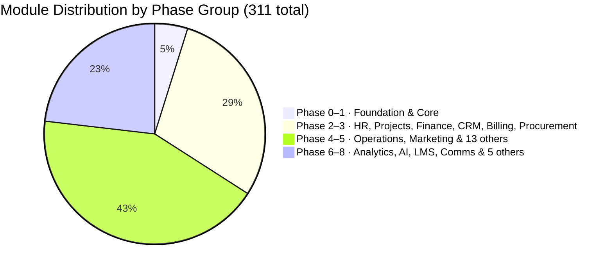

# STATUS Dashboard

Current build state across all 32 domains · 311 modules (including Foundation scaffold). Updated per session.

---

## Phase Progress

> **Build sequence**: Phase 0 must complete before Phase 1. Phase 1 must complete before any Phase 2 domain. No cross-phase shortcuts. Foundation is the Laravel 13 + Filament 5 project skeleton — not a business domain.

---

## Domain Status

| Domain | Phase | Built | Total | Progress |
|---|---|---|---|---|
| Foundation | 0 | 5 | 5 | ✅ 100% |
| Core Platform | 1 | 0 | 12 | 📅 0% |
| HR & People | 2–8 | 0 | 21 | 📅 0% |
| Projects & Work | 2/8 | 0 | 13 | 📅 0% |
| Finance & Accounting | 3/6 | 0 | 23 | 📅 0% |
| CRM & Sales | 3/8 | 0 | 22 | 📅 0% |
| Marketing & Content | 5 | 0 | 19 | 📅 0% |
| Operations | 4/5 | 0 | 18 | 📅 0% |
| Analytics & BI | 6 | 0 | 10 | 📅 0% |
| IT & Security | 4/6 | 0 | 12 | 📅 0% |
| Legal & Compliance | 4/7 | 0 | 8 | 📅 0% |
| E-commerce | 4/5 | 0 | 15 | 📅 0% |
| Communications | 5 | 0 | 11 | 📅 0% |
| Learning & Dev | 7 | 0 | 10 | 📅 0% |
| AI & Automation | 6 | 0 | 10 | 📅 0% |
| Community & Social | 7 | 0 | 7 | 📅 0% |
| Workplace & Facility | 4/6 | 0 | 6 | 📅 0% |
| Professional Services (PSA) | 5/7 | 0 | 6 | 📅 0% |
| Product-Led Growth | 6/7 | 0 | 6 | 📅 0% |
| Business Travel | 5/7 | 0 | 6 | 📅 0% |
| ESG & Sustainability | 5/6 | 0 | 6 | 📅 0% |
| Real Estate & Property | 6 | 0 | 6 | 📅 0% |
| Customer Success | 5 | 0 | 6 | 📅 0% |
| Subscription Billing & RevOps | 3 | 0 | 6 | 📅 0% |
| Procurement & Spend Management | 3 | 0 | 6 | 📅 0% |
| Financial Planning & Analysis | 4 | 0 | 6 | 📅 0% |
| Events Management | 5 | 0 | 6 | 📅 0% |
| Document Management | 4 | 0 | 6 | 📅 0% |
| Whistleblowing & Ethics | 4 | 0 | 6 | 📅 0% |
| Field Service Management | 5 | 0 | 8 | 📅 0% |
| Pricing Management | 4 | 0 | 5 | 📅 0% |
| Enterprise Risk Management | 5 | 0 | 6 | 📅 0% |

**Total: 5 / 313 modules planned (2%) — Phase 0 Foundation complete** (Foundation: 5/5 ✅)

---

## Architecture Notes Status

| Note | Status |
|---|---|
| Analytics Data Architecture | ✅ Documented — Read Replica Phase 6, ClickHouse sidecar Phase 6+ |
| AI GDPR & Data Residency | ✅ Documented — sensitivity routing, EU residency option, sub-processor list |
| Portal Architecture | ✅ Documented — unified PortalKernel, 6 separate guards, shared Inertia kernel |
| Multi-Currency Data Model | ✅ Documented — Phase 1 schema pattern defined |
| Billing Model | ✅ Documented — per-user per-module pricing, module_catalog table, no fixed plans |

---

## Legend

- ✅ Complete — built, tested, production
- 🔄 In progress — partially built
- 📅 Planned — not yet started
- 🔴 Blocked — has an open issue

---

## Active Builder Logs

- [[builder-log-project-scaffolding]] — Phase 0 Foundation built 2026-05-09. Laravel 13 + Filament 5 v5.6.2, both panels registered, all migrations run, seeders pass.
- [[builder-log-docker-local-environment]] — Phase 0 Docker + monitoring built 2026-05-09. docker-compose (postgres:17, redis:8, mailpit, horizon, reverb), Horizon/Pulse/Telescope gates, local seeders.
- [[testing-standards]] — Phase 0 test suite complete 2026-05-09. 74 tests, 113 assertions, 0 failures. Critical bugs fixed: company scope data leak, last_login_at Carbon parse error.
- [[vault-audit-2026-05-09]] — Vault audit complete; vault is pre-build-ready. See [[ACTIVATION_GUIDE]] to start Phase 0.

---

## Recent Sessions

| Date | Module | Outcome |
|---|---|---|
| 2026-05-09 | Phase 0 — Testing Standards + Bug Fixes | Built: 74 Pest tests (auth, guard isolation, multi-tenancy, Filament panels, seeders). Fixed: company scope data leak in Filament (SetCompanyContext not in authMiddleware), last_login_at Carbon parse error, Inertia::share unconditional call. Phase 0 complete. |
| 2026-05-09 | Phase 0 — Docker + Monitoring + Local Seeders | Built: Dockerfile (PHP 8.4 FPM), docker-compose.yml (nginx, postgres:17, redis:8, mailpit, horizon, reverb), Horizon/Pulse/Telescope admin panel nav links + access gates, LocalAdminSeeder (test@test.nl/test1234), LocalCompanySeeder (FlowFlex Demo + test@test.nl/test1234). All seeders pass. |
| 2026-05-09 | Phase 0 Foundation + Filament 5 upgrade | Built: Laravel 13 + Filament 5 v5.6.2, 7 migrations, 6 models, 2 panels, multi-tenancy layer, 5 Admin resources, 2 App resources, 3 App pages, CompanyCreationService, DTOs, Events, Contracts. All migrations pass. 92 modules seeded. Upgraded from Filament 4 → 5, no code changes needed. |
| 2026-05-09 | Vault Audit (Session 2) | Fixed: Core Platform migration range, E-commerce count (10→15), 8 plan refs, admin role conflict (readonly→developer) |
| 2026-05-09 | Vault Audit (Session 1) | 28 fixes: billing model, Laravel 13, entity-admin, entity-module-catalog, event bus DLQ, MOC_Domains colors, broken links |

---

## Open Gaps

See `right-brain/gaps/` directory.

---

## Related

- [[ACTIVATION_GUIDE]]
- [[00_MOC_LeftBrain]]
- [[MOC_Roadmap]]
