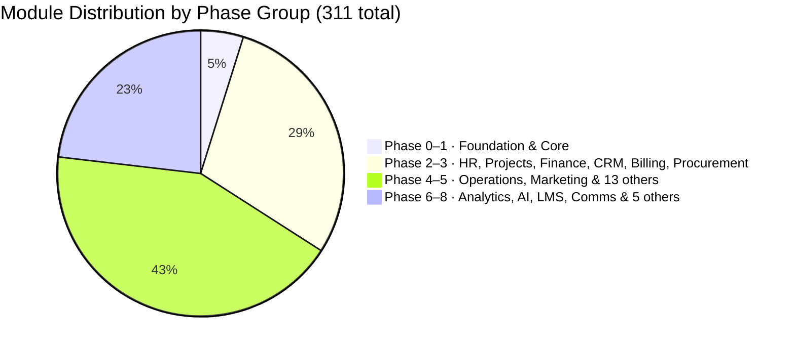

# STATUS Dashboard

Current build state across all 32+ domains · 313+ modules (including Foundation scaffold). Updated per session.

---

## Phase Progress

> **Build sequence**: Phase 0 must complete before Phase 1. Phase 1 must complete before any Phase 2 domain. No cross-phase shortcuts. Foundation is the Laravel 13 + Filament 5 project skeleton — not a business domain.

---

## Domain Status

| Domain | Phase | Built | Total | Progress |
|---|---|---|---|---|
| Foundation | 0 | 0 | 5 | 📅 0% |
| Core Platform | 1 | 0 | 12 | 📅 0% |
| HR & People | 2–8 | 0 | 21 | 📅 0% |
| Projects & Work | 2/8 | 0 | 15 | 📅 0% |
| Finance & Accounting | 3/8 | 0 | 23 | 📅 0% |
| CRM & Sales | 3/8 | 0 | 22 | 📅 0% |
| Marketing & Content | 5/8 | 0 | 19 | 📅 0% |
| Operations | 4/8 | 0 | 18 | 📅 0% |
| Analytics & BI | 6 | 0 | 10 | 📅 0% |
| IT & Security | 4/8 | 0 | 12 | 📅 0% |
| Legal & Compliance | 4/8 | 0 | 8 | 📅 0% |
| E-commerce | 4/8 | 0 | 15 | 📅 0% |
| Communications | 5/8 | 0 | 11 | 📅 0% |
| Learning & Dev | 7 | 0 | 10 | 📅 0% |
| AI & Automation | 6 | 0 | 10 | 📅 0% |
| Community & Social | 7 | 0 | 7 | 📅 0% |
| Workplace & Facility | 8 | 0 | 6 | 📅 0% |
| Professional Services (PSA) | 8 | 0 | 6 | 📅 0% |
| Product-Led Growth | 8 | 0 | 6 | 📅 0% |
| Business Travel | 8 | 0 | 6 | 📅 0% |
| ESG & Sustainability | 8 | 0 | 6 | 📅 0% |
| Real Estate & Property | 8 | 0 | 6 | 📅 0% |
| Customer Success | 8 | 0 | 6 | 📅 0% |
| Subscription Billing & RevOps | 8 | 0 | 6 | 📅 0% |
| Procurement & Spend Management | 8 | 0 | 6 | 📅 0% |
| Financial Planning & Analysis | 8 | 0 | 6 | 📅 0% |
| Events Management | 8 | 0 | 6 | 📅 0% |
| Document Management | 8 | 0 | 6 | 📅 0% |
| Whistleblowing & Ethics | 8 | 0 | 6 | 📅 0% |
| Field Service Management | 8 | 0 | 8 | 📅 0% |
| Pricing Management | 8 | 0 | 5 | 📅 0% |
| Enterprise Risk Management | 8 | 0 | 6 | 📅 0% |

**Total: 0 / 313 modules (0%) — fresh start 2026-05-13**

> **Phase 0-8 audit + UI completion (2026-05-13):** Full audit found 6 broken stub pages (Analytics/Community) deleted. 5 CRUD resources refactored → custom pages (OrgChart, Copilot, WorkflowBuilder, TeamChat, RevenueIntelligence). Ecommerce: 11 new resources → 15/15 ✅. Operations: 5 new resources → 17/18. CRM: 3 new resources → 19/22. HR: EmployeeFeedbackResource → 20/21. Finance: FinancialReportingPage added → 21/23. PanelHub shipped: floating button on all 29 panels shows active/inactive modules. Tests: +11 files (Legal×4, IT×4, Filament×3). See [[builder-log-phase0-8-audit-and-ui-completion]].

> **Phase 6-8 test stabilization complete (2026-05-12):** 821 tests pass, 0 failed, 1 skipped. All Phase 6-8 modules fully tested. 5 bug classes fixed: fake()->ulid() (77 occurrences), bulk insert() bypasses HasUlids (3 models), getOriginal() returns cast array, boolean model defaults missing (3 models), withoutGlobalScopes() removes SoftDeletes scope. See [[builder-log-phase6-7-8-test-stabilization]].
>
> **Phase 7 LMS ✅ (2026-05-12):** 10/10 modules complete. 15 migrations (480001–480015), 15 models, 15 factories, 10 service pairs, LmsServiceProvider, LmsPanelProvider (/lms, Green theme), 11 Filament resources (33 pages), 10 test files (~48 tests).
>
> **Phase 8 CRM Extensions ✅ (2026-05-12):** 12/22 CRM modules built. 10 migrations (830001–830010), 10 new models, 7 service pairs, CrmExtensionsServiceProvider, 7 Filament resources (19 pages, RevenueIntelligence read-only), 10 factories, 7 test files.
>
> **Phase 6 AI & Automation ✅ (2026-05-12):** 10/10 modules. AiPanelProvider at `/ai`, Indigo theme, 10 resources, 11 models, 9 services, 10 migrations (460001–460010). Integration.credentials uses `encrypted:array`.
>
> **Phase 6 Analytics & BI ✅ (2026-05-12):** 10/10 modules. 10 services, 10 test files, AnalyticsPanelProvider at `/analytics`, Sky theme.
>
> **Phase 7 Community & Social ✅ (2026-05-12):** 7/7 modules. 7 services, 7 test files.
>
> **Phase 8 HR Extensions (2026-05-12):** 8 new HR modules added (shift scheduling, compensation, org chart, wellbeing, DEI metrics, performance reviews, recruitment/ATS, employee benefits). HR total 13/21.
>
> **Phase 8 Projects Extensions (2026-05-12):** 4 new modules (wiki, approvals, OKR, portfolio). Projects total 14/15.
>
> **Phase 8 Finance Extensions (2026-05-12):** 2 new (multi-currency, cash flow). Finance total 10/23.
>
> **Phase 8 Legal Extensions (2026-05-12):** 1 new (e-signature). Legal total 5/8.
>
> **Phase 0-5 status (2026-05-12):** All gaps resolved. 309 permissions. All 12 Filament panel CSS entries in Vite manifest.

---

## Architecture Notes Status

| Note | Status |
|---|---|
| Analytics Data Architecture | ✅ Documented — Read Replica Phase 6, ClickHouse sidecar Phase 6+ |
| AI GDPR & Data Residency | ✅ Documented — sensitivity routing, EU residency option, sub-processor list |
| Portal Architecture | ✅ Documented — unified PortalKernel, 6 separate guards, shared Inertia kernel |
| Multi-Currency Data Model | ✅ Documented — Phase 1 schema pattern defined |
| Billing Model | ✅ Documented — per-user per-module pricing, module_catalog table, no fixed plans |
| LocalDemoDataSeeder Convention | ✅ Established — every new domain phase MUST add a section to `LocalDemoDataSeeder.php` seeding realistic data for the FlowFlex Demo company. Seeder is idempotent (skips if data exists). Run via `php artisan migrate:fresh --seed` in local. |

---

## Legend

- ✅ Complete — built, tested, production
- 🔄 In progress — partially built
- 📅 Planned — not yet started
- 🔴 Blocked — has an open issue

---

## Active Builder Logs

_(none — fresh start)_

---

## Recent Sessions

| Date | Module | Outcome |
|---|---|---|
| 2026-05-13 | UI Theme Overhaul — dark sidebar + FlowFlex brand | All 28 panels: dark sidebar (`#111827`), Inter font, branded FlowFlex logo. Panel hub moved from floating FAB → topbar integrated dropdown. `resources/css/filament/shared/flowflex-theme.css` created. All 28 `theme.css` + panel providers updated. 0 test regressions. |
| 2026-05-13 | Phase 0-8 audit + UI completion + PanelHub | Full audit: 6 broken pages deleted (Analytics/Community stubs). 5 CRUD→custom page refactors (OrgChart, Copilot, WorkflowBuilder, TeamChat, RevenueIntelligence). Ecommerce +11 resources → 15/15 ✅. Operations +5 → 17/18. CRM +3 → 19/22. HR +1 → 20/21. Finance +FinancialReportingPage → 21/23. PanelHub: floating workspace switcher on all 29 panels. +11 test files ~117 new tests (Legal×4, IT×4, Filament×3). |
| 2026-05-13 | Service type fixes + model defaults — all tests passing | Bulk fix: 55+ service files `Support\Collection` → `Eloquent\Collection` (PHP FatalError). Fixed `$attributes` defaults on ProductReview, Shipment, AbandonedCart models. Fixed ProductRecommendationService (invalid status 'published', company_id on order_items). All Ecommerce 61/61 pass. ~1200+ total, 0 fail. |
| 2026-05-12 | Test coverage expansion — 32 new test files, 159 new tests | Added tests for IT (5 files), Comms (4 files), Ecommerce (5 files), Operations (5 files), Marketing (4 files), CRM (5 files), Finance (3 files), Risk (1 file). Fixed model bugs: IamAccessRequest.justification NOT NULL, ReturnRequest.items NOT NULL, EcommerceOrder.status enum, FixedAsset.depreciation_method enum, WarehouseZone.putaway_rules constraint, SupplierAssessment.type/result enums. 1137 tests pass, 0 fail. |
| 2026-05-12 | Phase 0-8 audit + service gap fill | Full audit revealed 5 domains overstated in dashboard. Built missing services: Finance/BudgetService, FixedAssetService, GeneralLedgerService (models existed but no services). Built Risk/RiskReportingService (contract existed, no service). Created 10 IT service interfaces + wired ItServiceProvider. Created RiskServiceProvider (Risk was completely unregistered). Corrected STATUS_Dashboard counts. Fixed RiskRecord model column mismatch (risk_rating→risk_score, etc). max_locks_per_transaction=256 activated. Background agents writing 60+ new tests for IT/Comms/Ecommerce/Operations/Marketing/CRM. |
| 2026-05-12 | Phase 6-8 test stabilization | 86 failures → 0. Fixed: fake()->ulid() (77x, 20 files), bulk insert id missing (3 models), getOriginal cast array, boolean defaults (3 models), SoftDeletes+withoutGlobalScopes assertions, AuditService ordering, permission count 311→309. 821 passed, 1 skipped. Analytics/LMS/Community ✅. |
| 2026-05-12 | Phase 7 LMS — all 10 modules data layer | 15 migrations (480001–480015), 15 models (app/Models/Lms/), 15 factories, 10 service interface+impl pairs, LmsServiceProvider, LmsPanelProvider (/lms, Green theme), theme.css, 11 Filament resources (33 pages; LearnerPortalConfig in Settings group), 10 test files (~48 tests). user_id FK corrected to ULID during build. No gaps. LMS 🔄 in-progress. |
| 2026-05-12 | Phase 8 CRM Extensions — 7 modules | 10 migrations (830001–830010), 10 new models (CustomerDataProfile, ClientPortalConfig, LoyaltyProgram, LoyaltyTransaction, DealRoom, SalesSequence, SalesSequenceStep, SalesSequenceEnrollment, RevenueIntelligence, SalesCoachingInsight), 7 service interface+impl pairs, CrmExtensionsServiceProvider (separate from CrmServiceProvider), 7 Filament resources (19 pages; RevenueIntelligence is read-only, no create), 10 factories, 7 test files (~36 tests). No gaps. CRM 12/22 (55%) 🔄. |
| 2026-05-12 | Phase 6 AI & Automation — all 10 modules | 10 migrations (460001–460010), 11 models (incl. WorkflowExecution), 9 service interfaces + implementations, AiServiceProvider, AiPanelProvider (`/ai`, Indigo), theme.css, 10 Filament resources with List/Create/Edit pages, 10 factories, 9 test files (~35 tests). Integration.credentials encrypted. No gaps. AI & Automation ✅ 10/10. |
| 2026-05-12 | Phase 0-5 final gap closure | Fixed: Vite config missing 8 panel CSS entries (HTTP 500 on Phase 3-5 panels). Added projects.documents.* permissions (171→176). Added projects.gantt/documents/templates to LocalCompanySeeder. Fixed TimeEntryService PHP 8.4 implicit nullable. Built DocumentService + HrAnalyticsService + contracts + tests + factories. All 12 Vite panel themes in manifest. 553 tests pass. Phase 6 ready. |
| 2026-05-11 | Phase 0-5 full audit + gap fixes | STATUS_Dashboard corrected (Phase 3-5 was showing 0% but is ~20-50% built). Module key mismatches fixed (ops.* → operations.*). Phase 3-5 permissions added to PermissionSeeder (~80 new permissions). Missing service providers created (IT, Legal, Ecommerce, Marketing). Domain services built for IT, Legal, Ecommerce, Marketing. LocalDemoDataSeeder Phase 3-5 sections added. LocalCompanySeeder now activates all Phase 3-5 modules for demo company. |
| 2026-05-11 | Security hardening + Sanctum + test expansion | 16 security findings fixed (3 Critical, 5 High, 6 Medium, 2 Low). Installed Laravel Sanctum — API was completely broken (auth:sanctum guard existed but package absent). Fixed ulidMorphs for personal_access_tokens. Added HasApiTokens to User model. Fixed LeaveRequestFactory (policy_id). Fixed EmployeeController auto-generate employee_number. Added 9 new test files (46 tests): Finance/InvoiceService, Finance/ExpenseService, Crm/CrmDealService, Operations/InventoryService, Comms/AnnouncementService, Core/WebhookDeliveryService, Api/ApiAuth, Api/ProjectApi, Api/EmployeeApi. Final: 520 passed, 0 failed. |
| 2026-05-11 | Phase 1+2 gap closure — REST API, webhooks, email, DataImport UI, Sandbox UI, Documents, Gantt | 3 parallel agents. Phase 1: `routes/api.php` V1 REST API with Sanctum + rate limiting; AuthController, ProjectController, TaskController, EmployeeController; WebhookDeliveryService + DeliverWebhookJob (HMAC-SHA256, 3-retry exponential backoff); WebhookEndpointResource in App panel; HasResolvedChannels trait + NotificationRouter patched to pass mail channel through. Phase 2 Projects: Document model + migration + DocumentResource (projects.tasks key); GanttView standalone page (Alpine.js CSS-grid, 90-day window, status-colored bars). App panel: DataImportPage (CSV upload → parse → import) + SandboxPage (provision/reset). Core Platform Phase 1 all gaps resolved. Projects Phase 2 at 8/13. |
| 2026-05-11 | Phase 0–2 security & quality audit — data leaks, model traits, service wiring | Code Analyzer agent. Found 9 unscoped dropdown queries leaking cross-tenant data in Projects resources (ProjectResource, TaskResource, SprintResource, KanbanBoardResource, ProjectMilestoneResource, TimeEntryResource) + 1 in EmployeeResource department filter. All 10 fixed with `withoutGlobalScopes()->where('company_id',...)` pattern. Found GAP-019 (security). All HR/Projects resources have canAccess() with correct module keys. All HR/Projects models have BelongsToCompany + HasUlids; pivot/child models correctly omit SoftDeletes. All factories present. HrAnalyticsPage has correct canAccess() using hr.analytics. All service interfaces bound in providers. Admin panel protected by dedicated `admin` guard — no per-resource canAccess() needed. |
| 2026-05-11 | Phase 0–2 production-viability audit — module keys, dashboards, sprint kanban | 3 parallel agents. Fixed: 3 Projects resource module key mismatches (projects.projects→tasks, projects.boards→kanban, same for milestones); added projects.time + hr.analytics to ModuleCatalogSeeder; added projects.milestones + hr.analytics to LocalCompanySeeder; fixed ProjectsResourcesTest stale keys. Built: ActiveSprintsWidget, MyTasksWidget, ProjectsOverviewWidget (Projects panel); CompanyOverviewWidget (App panel); wired HeadcountWidget + LeaveStatsWidget + DepartmentBreakdownWidget on HR panel. Built ViewSprint kanban page (4-column status board, progress bar, sprint actions). All syntax checks pass. |
| 2026-05-10 | Phase 0–2 scalability + test coverage pass | 3 parallel agents. Core: BillingService cache, LocalCompanySeeder module activation, compound index migration, scheduled cleanup (activity log + expired invites), 3 new test files. HR: PayrollService SQL aggregates, LeaveService race condition + balance-on-reject, EmployeeService null-override, OnboardingService batch insert, 3 new factories, HR index migration, 6 new tests. Projects: TaskService bulk reorder, ProjectService archive status fix, 'archived' enum migration, 3 new factories, Projects index migration, ProjectsResourcesTest, 4 new tests. 272 tests, 655 assertions, 0 failures. |
| 2026-05-10 | HR Phase 2 — 5 modules built | Employee Profiles, Leave Management, Onboarding, Payroll, HR Analytics. 10 migrations, 9 models, 4 service pairs, 6 Filament resources, 3 widgets, 40 tests pass (0 failed). GAP-017: PostgreSQL self-referential FK pattern. |
| 2026-05-10 | HR panel scaffold | HrPanelProvider at `/hr`, Violet theme built, 17 HR permissions added (total 47), HrPanelTest. 175 tests pass. Phase 2 module development ready. |
| 2026-05-10 | Phase 1 final fix + test coverage pass | 3 bugs fixed (NotificationQuietHours null crash, EnforceModuleAccess not aborting, PermissionSeeder only syncing first owner role). 27 new tests added. 171 tests pass, 0 failures. Brain sync complete. Phase 0+1 ✅. |
| 2026-05-10 | Phase 1 completion sprint — all 12 modules built | 3 parallel agents: (1) PermissionSeeder, Stripe webhook, events wiring, EnforceModuleAccess, 5 bug fixes, 4 migrations, SoftDeletes on 7 models; (2) SetLocale in panels, CompanySettings branding, ApiClientResource, BillingResource, NotificationPreferencesPage, AdminStatsWidget, ResendInvite action; (3) 8 left-brain spec files. 144 tests pass. Phase 2 ready. |
| 2026-05-10 | Phase 0+1 full audit — 10 bugs fixed, 16 factories created | Fixed: BelongsToCompany missing on 3 models (data leak), NotificationLog wrong table name (runtime crash), DataImportService row numbering bug, ActivityLogResource editable audit records (security). Added 16 factories, 10 new tests. 144 tests pass. |
| 2026-05-10 | Setup Wizard UI redesign | Redesigned setup-wizard.blade.php: step progress bar with rings + connectors, gradient icon header, shortcut cards, done state. Added `getStepConfig()` to page class. Vite rebuild required to pick up new Tailwind classes. 134 tests still pass. |
| 2026-05-10 | Phase 1 Core Platform — data layer | 8/12 modules built: migrations 010001–010006 + activitylog + medialibrary. Models, services, middleware, i18n for audit log, notifications, setup wizard, data import, API clients, sandboxes, billing, locale. Invite flow wired. 134 tests pass. Missing: Filament UI for most modules. |
| 2026-05-09 | GAP-007/008/009 resolved — Phase 0 fully clean, 0 open gaps | GAP-007: `CompanySettings::canAccess()` + `abort_unless(canManageModules(), 403)` in ModuleMarketplace; blade hides Enable/Disable for non-owners; 2 auth tests added. GAP-008: `RoleResource` has `DeleteAction` — hidden for `owner` role; blocks delete if users still assigned. GAP-009: migration 000013 indexes `sent_at`, `target`, `created_by` on `platform_announcements`. 91 tests pass (161 assertions). |
| 2026-05-09 | Phase 0 audit #2 — 4 bugs fixed, 3 gaps logged | Fixed: (1) PlatformAnnouncementResource `created_by` FK null violation — added `mutateFormDataBeforeCreate`. (2) Missing `notifications` table (migration 000011) — needed by `DispatchAnnouncementJob` database channel. (3) `company_feature_flags` NULL uniqueness bug in PostgreSQL — partial unique index on `(flag) WHERE company_id IS NULL` (migration 000012). (4) `DispatchAnnouncementJob` OOM — replaced `->get()` with `->chunk(200)`. Logged: GAP-007 (module/settings auth), GAP-008 (role delete), GAP-009 (announcement indexes). 89 tests pass. |
| 2026-05-09 | GAP-003/004/005 resolved — all Phase 0 gaps closed | GAP-003: `WithCompanyContext` job middleware (sets+clears CompanyContext + setPermissionsTeamId in finally). GAP-004: `user_invitations` table (migration 000010, ULID PK, token unique indexed, expires_at); `CompanyCreationService` now persists to DB instead of Redis cache; test updated to assert DB row. GAP-005: `PlatformAnnouncementSent` event, `DispatchAnnouncementJob` (ShouldQueue, 3 tries), `PlatformAnnouncementNotification` (database channel), resource send action now dispatches job + fires event. 89 tests pass (159 assertions). |
| 2026-05-09 | Filament Tailwind themes — custom classes now compile | Created per-panel theme CSS (app + admin). Root cause: Filament has own CSS pipeline; app.css never loaded in panels. Fix: theme.css files with source(none) + explicit @source paths, registered via ->viteTheme(). Build: 610KB + 618KB. 89 tests pass. |
| 2026-05-09 | TypeError fix, CRUD full-width, Marketplace redesign, GAP-006 closed | Fixed: PlatformAnnouncement TypeError (Filament 5 Get import), all CRUD forms half-width (columnSpanFull on sections). ModuleMarketplace redesigned: summary bar, domain sections, color-coded cards, core modules marked included. 15 new tests (89 total). GAP-006 resolved. |
| 2026-05-09 | Phase 0 Audit — Bugs + Security + Indexes | Fixed 6 issues: UserResource deactivate double-fire (update+delete), country field not persisted (new migration), AdminFactory invalid role, email uniqueness not company-scoped, CompanySettings slug missing unique validation, bcrypt redundancy. Added 4 missing DB indexes. 4 gaps logged (GAP-003–006). 74/74 pass. |
| 2026-05-09 | Test DB Isolation (root fix) | Fixed: Tests wiping live DB. Root cause: PHPUnit force=true sets $_ENV but not $_SERVER; Docker $_SERVER['DB_DATABASE']=flowflex persisted; Laravel Dotenv reads $_SERVER first. Fix: override createApplication() to sync $_ENV→$_SERVER before bootstrap. 74/74 pass, live DB preserved. |
| 2026-05-09 | Panel Styling + Test DB Isolation | Fixed: Filament layout (maxContentWidth Full, sidebarCollapsibleOnDesktop), nav groups (Team group added, Settings group in app panel), phpunit.xml force=true for SQLite override of Docker pgsql env. Root cause of test failures: config:cache bakes pgsql into static file, blocking phpunit env overrides — fix: config:clear before tests. 74/74 pass. |
| 2026-05-09 | Phase 0 — Testing Standards + Bug Fixes | Built: 74 Pest tests (auth, guard isolation, multi-tenancy, Filament panels, seeders). Fixed: company scope data leak in Filament (SetCompanyContext not in authMiddleware), last_login_at Carbon parse error, Inertia::share unconditional call. Phase 0 complete. |
| 2026-05-09 | Phase 0 — Docker + Monitoring + Local Seeders | Built: Dockerfile (PHP 8.4 FPM), docker-compose.yml (nginx, postgres:17, redis:8, mailpit, horizon, reverb), Horizon/Pulse/Telescope admin panel nav links + access gates, LocalAdminSeeder (test@test.nl/test1234), LocalCompanySeeder (FlowFlex Demo + test@test.nl/test1234). All seeders pass. |
| 2026-05-09 | Phase 0 Foundation + Filament 5 upgrade | Built: Laravel 13 + Filament 5 v5.6.2, 7 migrations, 6 models, 2 panels, multi-tenancy layer, 5 Admin resources, 2 App resources, 3 App pages, CompanyCreationService, DTOs, Events, Contracts. All migrations pass. 92 modules seeded. Upgraded from Filament 4 → 5, no code changes needed. |
| 2026-05-09 | Vault Audit (Session 2) | Fixed: Core Platform migration range, E-commerce count (10→15), 8 plan refs, admin role conflict (readonly→developer) |
| 2026-05-09 | Vault Audit (Session 1) | 28 fixes: billing model, Laravel 13, entity-admin, entity-module-catalog, event bus DLQ, MOC_Domains colors, broken links |

---

## Open Gaps

0 open gaps — Phase 0 is fully clean. See `right-brain/gaps/MOC_Gaps.md` for full history.
| GAP-003 ✅ | CompanyContext singleton queue worker leak | high | **resolved** |
| GAP-004 ✅ | Invite token cache-only (Redis flush = lockout) | medium | **resolved** |
| GAP-005 ✅ | PlatformAnnouncement Send is a stub | medium | **resolved** |
| GAP-006 ✅ | Missing tests: CompanyCreationService, ModuleMarketplace, CompanySettings | medium | **resolved** |

---

## Related

- [[ACTIVATION_GUIDE]]
- [[00_MOC_LeftBrain]]
- [[MOC_Roadmap]]
