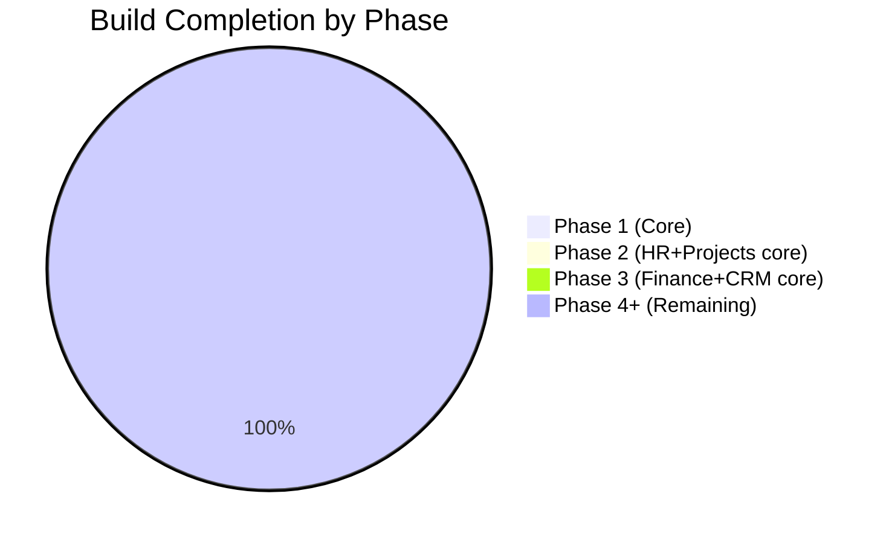

# STATUS Dashboard

Current build state across all 31 domains. Updated per session.

---

## Phase Progress

---

## Domain Status

| Domain | Phase | Built | Total | Progress |
|---|---|---|---|---|
| Core Platform | 1 | 0 | 12 | 📅 0% |
| HR & People | 2–8 | 0 | 19 | 📅 0% |
| Projects & Work | 2/8 | 0 | 11 | 📅 0% |
| Finance & Accounting | 3/6 | 0 | 21 | 📅 0% |
| CRM & Sales | 3/8 | 0 | 19 | 📅 0% |
| Marketing & Content | 5 | 0 | 17 | 📅 0% |
| Operations | 4/5 | 0 | 17 | 📅 0% |
| Analytics & BI | 6 | 0 | 10 | 📅 0% |
| IT & Security | 4/6 | 0 | 10 | 📅 0% |
| Legal & Compliance | 4/7 | 0 | 9 | 📅 0% |
| E-commerce | 4/5 | 0 | 15 | 📅 0% |
| Communications | 5 | 0 | 9 | 📅 0% |
| Learning & Dev | 7 | 0 | 10 | 📅 0% |
| AI & Automation | 6 | 0 | 9 | 📅 0% |
| Community & Social | 7 | 0 | 6 | 📅 0% |
| Workplace & Facility | 4/6 | 0 | 6 | 📅 0% |
| Professional Services (PSA) | 5/7 | 0 | 6 | 📅 0% |
| Product-Led Growth | 6/7 | 0 | 6 | 📅 0% |
| Business Travel | 5/7 | 0 | 6 | 📅 0% |
| ESG & Sustainability | 5/6 | 0 | 6 | 📅 0% |
| Real Estate & Property | 6 | 0 | 6 | 📅 0% |
| Customer Success | 5 | 0 | 6 | 📅 0% |
| Subscription Billing & RevOps | 3 | 0 | 6 | 📅 0% |
| Procurement & Spend Management | 3 | 0 | 6 | 📅 0% |
| Financial Planning & Analysis | 4 | 0 | 6 | 📅 0% |
| Events Management | 5 | 0 | 6 | 📅 0% |
| Document Management | 4 | 0 | 6 | 📅 0% |
| Whistleblowing & Ethics | 4 | 0 | 4 | 📅 0% |
| Field Service Management | 5 | 0 | 6 | 📅 0% |
| Pricing Management | 4 | 0 | 5 | 📅 0% |
| Enterprise Risk Management | 5 | 0 | 6 | 📅 0% |

**Total: 0 / 350+ modules built (0%) — full rebuild in progress**

---

## Architecture Notes Status

| Note | Status |
|---|---|
| Analytics Data Architecture | 📝 Decision Required — read replica vs warehouse |
| AI GDPR & Data Residency | 📝 Decision Required — LLM routing, EU AI Act |
| Portal Architecture | 📝 Decision Required — unified framework chosen, review needed |
| Multi-Currency Data Model | ✅ Documented — Phase 1 schema pattern defined |

---

## Legend

- ✅ Complete — built, tested, production
- 🔄 In progress — partially built
- 📅 Planned — not yet started
- 🔴 Blocked — has an open issue

---

## Active Builder Logs

None active. See [[ACTIVATION_GUIDE]] to start building a module.

---

## Recent Sessions

| Date | Module | Outcome |
|---|---|---|
| _none yet_ | | |

---

## Open Gaps

See `right-brain/gaps/` directory.

---

## Related

- [[ACTIVATION_GUIDE]]
- [[00_MOC_LeftBrain]]
- [[MOC_Roadmap]]
