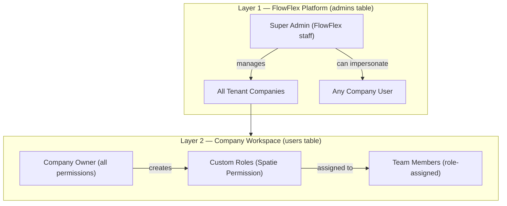

# Authentication and RBAC

FlowFlex uses a two-layer access control model: one layer for FlowFlex platform staff, one layer for company users. They use separate database tables, separate Laravel guards, and separate Filament panels.

---

## Two-Layer Architecture



### Layer 1 — `admins` Table

- Separate `admins` table, separate `Admin` Eloquent model
- Authenticated via the `admin` guard
- Login at `/admin` Filament panel — not accessible to company users
- Can view all companies' data (no `CompanyScope` in admin panel)
- Can impersonate any company user with full audit log entry
- Manages module pricing, company creation, and billing

### Layer 2 — `users` Table

- Standard `users` table, scoped to `company_id`
- Authenticated via the `web` guard
- Login routes to the `/app` workspace panel, then navigates to domain panels
- Each user is assigned one or more roles scoped to their company
- Company owner role is assigned at company creation and cannot be removed
- Permissions follow the format `domain.module.action`

---

## Permission Format

Permissions are stored as strings in Spatie Permission's `permissions` table, namespaced by domain, module, and action:

```
hr.employees.view-any
hr.employees.view
hr.employees.create
hr.employees.update
hr.employees.delete
finance.invoices.view-any
finance.invoices.approve
crm.contacts.view-any
crm.contacts.create
```

Wildcard patterns are used internally for shorthand checks but are not stored as separate permissions:

```
hr.*              → all permissions in the HR domain
finance.invoices.* → all permissions on the invoice module
```

---

## Built-In Roles

| Role | Scope | Description |
|---|---|---|
| `owner` | Company | All permissions. Assigned at company creation. Cannot be removed. |
| `admin` | Company | All permissions except company deletion and owner management. |
| `manager` | Company | View-any and update within assigned modules. Cannot delete. |
| `employee` | Company | View-only within modules they are subscribed to. |

Companies can create additional custom roles with any permission combination.

---

## Guards

```php
// web guard — company users (all domain panels)
->authGuard('web')
->authModel(User::class)

// admin guard — FlowFlex staff only
->authGuard('admin')
->authModel(Admin::class)

// sanctum — API token authentication
'middleware' => ['auth:sanctum']
```

Each Filament panel declares its guard in the `PanelProvider`. The `admin` panel uses the `admin` guard. All 31 business domain panels and the `/app` workspace panel use the `web` guard.

---

## Filament Panel Auth

The admin panel restricts to `Admin` model users:

```php
// AdminPanelProvider
->authGuard('admin')
->authModel(Admin::class)
```

Domain panels check both guard and a panel-level permission:

```php
// HrPanelProvider
->authGuard('web')
->authModel(User::class)
->auth(fn (User $user) => $user->can('access.hr-panel'))
```

The `access.hr-panel` permission is granted to any user whose role has at least one HR permission. This prevents a user with only Finance permissions from landing on the HR panel URL.

---

## canAccess() on Resources

Every Filament resource and page within a domain panel implements `canAccess()` to enforce both permission and module subscription:

```php
public static function canAccess(): bool
{
    return Auth::check()
        && Auth::user()->can('hr.employees.view-any')
        && BillingService::hasModule('hr.employees');
}
```

This is called by Filament before rendering navigation links and before allowing access to the resource URL. If either condition fails, the resource is hidden from navigation and the URL returns a 403.

---

## Spatie Permission Team Setup

Spatie Permission's "teams" feature maps to companies. Every role and permission assignment is scoped to a `team_id` which equals `company_id`. This prevents role assignments from leaking across companies.

`setPermissionsTeamId($company->id)` must be called on every request and in every queue job before any permission check:

```php
// In SetCompanyContext middleware
setPermissionsTeamId($company->id);

// In WithCompanyContext job middleware
setPermissionsTeamId($company->id);
```

Without this call, `$user->hasRole('owner')` queries the wrong team and returns incorrect results.

---

## API Authentication (Sanctum)

The REST API at `/api/v1/` uses Laravel Sanctum token authentication:

```
POST /api/v1/auth/token
Body: { email, password, device_name }
Response: { token: "xxx" }

GET /api/v1/employees
Header: Authorization: Bearer xxx
```

Tokens carry abilities (scopes) that restrict what the token can do. Rate limiting is applied per endpoint. Token abilities and rate limits are defined in `app/Http/Controllers/Api/V1/AuthController.php`.

---

## Company Owner Bootstrap

When a company is created, the owner user is assigned a role with all permissions:

```php
$role = Role::create(['name' => 'owner', 'team_id' => $company->id]);
$role->syncPermissions(Permission::all());
$owner->assignRole($role);
setPermissionsTeamId($company->id);
```

This runs inside `CompanyCreationService`, called from the admin panel when FlowFlex staff create a new tenant company.
