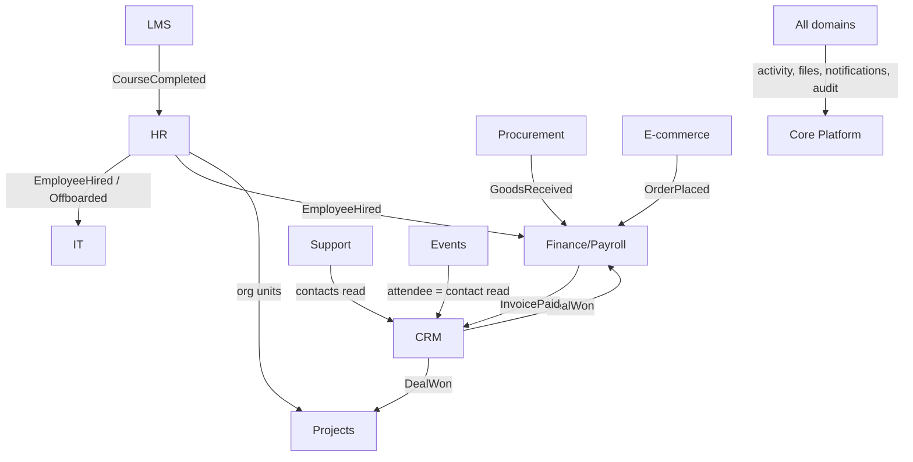

# Cross-Domain Relations

How domains relate without violating [[../security/data-ownership|data ownership]]. All cross-domain
coupling is one of three shapes — **event**, **read**, or **shared reference** — never a direct write.

## The three legal couplings

1. **Event** — domain A fires a domain event; domain B's listener reacts and writes B's own tables.
   Contracts live in [[event-bus]]. Payloads carry `company_id` + IDs as scalars.
2. **Read** — domain B reads domain A's data through A's service/query API (read-only).
3. **Shared reference** — one module owns reference data (currencies, tax rates, org units, tags); others read it.

## Cross-domain relation map (high level)

*(This is the seed map — each domain's `_index` + feature notes carry the authoritative edges; this note
is regenerated as domains are fully mapped.)*

## Convention

- Every module `_index`/`_module` note keeps a **Cross-Domain Edges** table (fires / consumes + counterpart).
- Every `feature` note keeps a `## Relations` section (see [[../_meta/feature-template]]).
- A relation that would require writing another domain's table is a **design error** — model it as an event.

## Related

- [[event-bus]] · [[../security/data-ownership]] · [[module-system]] · [[../decisions/decision-2026-06-20-full-mapping-conventions]]
