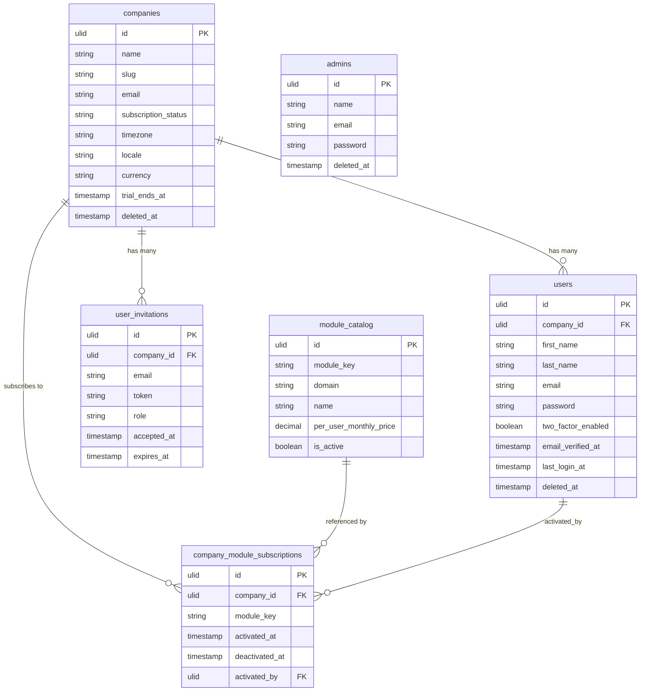

# Core Data Model

---

## Principles

- **ULID PKs everywhere** — `ulid('id')->primary()` on all tables. Sortable, URL-safe, 26 chars, no enumeration attacks.
- **`company_id` on all tenant tables** — non-nullable ULID FK to `companies.id`. Global scope via `BelongsToCompany` trait.
- **Soft deletes on all models** — `deleted_at` on every model. Hard delete only via purge jobs or GDPR erasure.
- **Backed string enums** — status columns use PHP 8.1+ backed string enums, cast in the model.
- **Unique constraints scoped to company** — `UNIQUE (company_id, email)` not `UNIQUE (email)`.

---

## Standard Table Schema

```php
Schema::create('hr_employees', function (Blueprint $table) {
    $table->ulid('id')->primary();
    $table->foreignUlid('company_id')->references('id')->on('companies');

    // business columns
    $table->string('first_name');
    $table->string('last_name');
    $table->string('email')->nullable();
    $table->string('status')->default('active');

    // audit columns (optional but standard)
    $table->foreignUlid('created_by')->nullable()->references('id')->on('users');
    $table->foreignUlid('updated_by')->nullable()->references('id')->on('users');

    $table->timestamps();
    $table->softDeletes();

    $table->index('company_id');                      // mandatory
    $table->unique(['company_id', 'email']);           // uniqueness scoped to company
});
```

---

## Core Entities

| Table | Tenant Scoped | Description |
|---|---|---|
| `companies` | No (anchor) | Tenant record. Every other table's `company_id` points here. |
| `users` | Yes | Platform users — people who log in to Filament panels |
| `admins` | No | FlowFlex staff — separate model and guard for `/admin` |
| `user_invitations` | Yes | Pending invitations to join a workspace |
| `company_module_subscriptions` | Yes | Which modules a company has activated |
| `module_catalog` | No (platform-level) | All available modules — keys, domain, price |
| `activity_log` | Yes | Spatie activitylog — full audit trail |
| `notifications` | Yes | Laravel notification table — in-app inbox |
| `media` | Yes | Spatie media-library — file attachments |
| `personal_access_tokens` | Yes | Sanctum API tokens |

---

## Core ERD



---

## Non-Tenant Models

Platform-level models (no `company_id`) use `HasUlids` only — no `BelongsToCompany`, no `SoftDeletes` unless explicitly needed:

```php
// Module catalog — static data backed by Sushi
class ModuleCatalog extends Model
{
    use HasUlids;
    // No BelongsToCompany — not tenant-scoped
    // No SoftDeletes — platform data, not deleted
}
```
