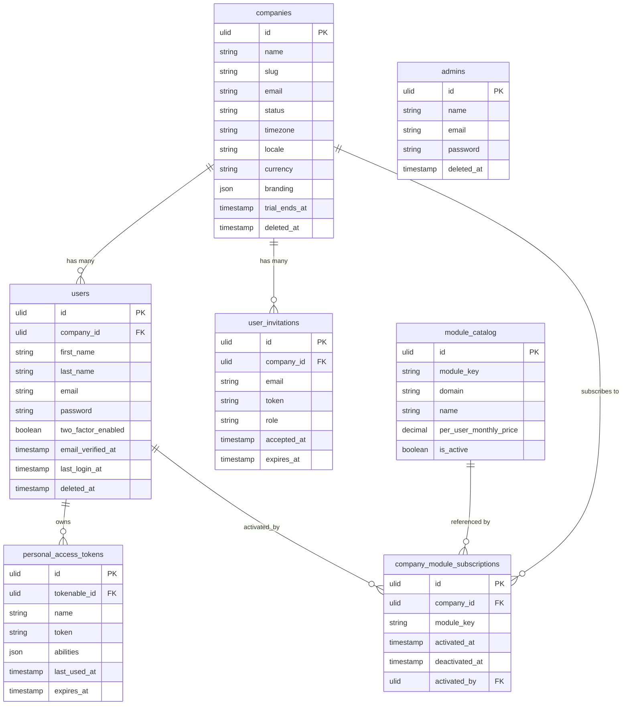

# Data Model

---

## Core Principles

**ULID primary keys on all tables.** Every table uses a ULID (`ulid('id')->primary()`) as its primary key. ULIDs are sortable by timestamp prefix, URL-safe, 26 characters long, and avoid sequential enumeration attacks. The `HasUlids` trait from Laravel's core applies this automatically.

**company_id on all tenant tables.** Every table that stores data belonging to a specific company carries a non-nullable `company_id` ULID foreign key referencing `companies.id`. The `BelongsToCompany` trait and `CompanyScope` global scope enforce per-company filtering automatically on every Eloquent query.

**Soft deletes on all models.** No record is ever hard-deleted through normal application flow. The `SoftDeletes` trait adds `deleted_at` to every model. Hard deletes only occur via scheduled purge jobs (90 days post-soft-delete) or GDPR erasure flows.

**Enum columns as PHP-backed string enums.** Status columns and other constrained string fields use PHP 8.1+ backed string enums. The enum is cast in the model via `$casts` and stored as a string in the database.

---

## Standard Table Schema

```php
Schema::create('hr_employees', function (Blueprint $table) {
    $table->ulid('id')->primary();
    $table->foreignUlid('company_id')->references('id')->on('companies');

    // business columns
    $table->string('first_name');
    $table->string('last_name');
    $table->string('email')->nullable();
    $table->string('status')->default('active');

    // audit columns
    $table->foreignUlid('created_by')->nullable()->references('id')->on('users');
    $table->foreignUlid('updated_by')->nullable()->references('id')->on('users');

    // standard timestamps
    $table->timestamps();
    $table->softDeletes();

    // indices
    $table->index('company_id');
    $table->unique(['company_id', 'email']); // uniqueness always scoped to company
});
```

---

## Core Entities

| Table | Tenant Scoped | Description |
|---|---|---|
| `companies` | No (is the tenant anchor) | Tenant record. Every other table's `company_id` points here. |
| `users` | Yes | Platform users — people who log in to Filament panels |
| `admins` | No | FlowFlex staff — separate model and guard for the `/admin` panel |
| `user_invitations` | Yes | Pending invitations to join a company workspace |
| `company_module_subscriptions` | Yes | Which modules a company has activated and when |
| `module_catalog` | No (platform-level) | All available modules with keys, domain, and per-user price |
| `billing_subscriptions` | Yes | Overall company subscription state (trial, active, suspended) |
| `activity_log` | Yes | Spatie activitylog records — full audit trail per company |
| `notifications` | Yes | Laravel notification table — in-app notification inbox |
| `media` | Yes | Spatie media-library — file attachments linked to any model |
| `personal_access_tokens` | Yes | Sanctum API tokens — scoped to company users |

---

## Entity Relationship Diagram



---

## Multi-Tenancy Schema Pattern

Every tenant table follows this pattern — `company_id` is always non-nullable and always indexed:

```sql
-- correct: company_id not null, indexed
ALTER TABLE hr_employees ADD COLUMN company_id ulid NOT NULL REFERENCES companies(id);
CREATE INDEX idx_hr_employees_company_id ON hr_employees(company_id);

-- wrong: nullable company_id breaks BelongsToCompany creating logic
ALTER TABLE hr_employees ADD COLUMN company_id ulid REFERENCES companies(id);
```

Unique constraints that apply within a company scope the uniqueness to `company_id`:

```sql
-- correct: email unique per company (same email allowed in different companies)
ALTER TABLE users ADD CONSTRAINT users_company_email_unique UNIQUE (company_id, email);

-- wrong: global uniqueness blocks same email across companies
ALTER TABLE users ADD CONSTRAINT users_email_unique UNIQUE (email);
```

---

## Required Model Traits

Every tenant model (any model with `company_id`) must use exactly these three traits:

```php
use Illuminate\Database\Eloquent\Concerns\HasUlids;
use App\Support\Traits\BelongsToCompany;
use Illuminate\Database\Eloquent\SoftDeletes;

class Employee extends Model
{
    use HasUlids;
    use BelongsToCompany;
    use SoftDeletes;
}
```

- `HasUlids` — ULID primary key generation and casting
- `BelongsToCompany` — boots `CompanyScope` global scope; auto-sets `company_id` on create; adds `company()` relation
- `SoftDeletes` — adds `deleted_at`, scopes queries to non-deleted records by default

Non-tenant models (platform-level tables like `admins` and `module_catalog`) use `HasUlids` only.
