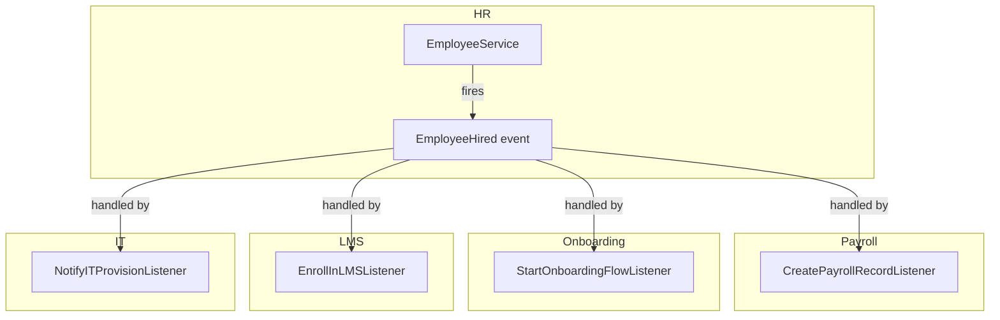

# Event Bus

Domains communicate with each other exclusively through Laravel Events. No service in Domain A calls a service in Domain B directly. The emitting domain fires an event and has no knowledge of which other domains consume it.

---

## Architecture



The HR domain's `EmployeeService` fires `EmployeeHired` and moves on. It does not import `PayrollService`, `OnboardingService`, or `LMSService`. Cross-domain coupling is zero.

---

## Event Structure

Every domain event:
- Carries `company_id` as a typed scalar — required for queue context restoration
- Uses typed scalar properties (string IDs, not Eloquent model references)
- Is an immutable value object (readonly properties)

```php
namespace App\Events\HR;

class EmployeeHired
{
    public function __construct(
        public readonly string $company_id,
        public readonly string $employee_id,
        public readonly string $user_id,
        public readonly CarbonImmutable $start_date,
        public readonly string $job_title,
    ) {}
}
```

**Why no model references in events**: the consuming domain may not have the model in its context. Passing an `Employee` model across a domain boundary creates a hidden dependency. Scalar IDs allow each listener to load only what it needs through its own service.

---

## Queued Listeners

All cross-domain listeners implement `ShouldQueue`. The event emission is synchronous; the listener execution is asynchronous:

```php
class CreatePayrollRecordListener implements ShouldQueue
{
    use InteractsWithQueue;

    public string $queue = 'domain-events';
    public int $tries = 3;
    public int $backoff = 30; // seconds between retries

    public function handle(EmployeeHired $event): void
    {
        // Uses PayrollServiceInterface — no direct HR model access
        app(PayrollServiceInterface::class)->createRecord(
            companyId: $event->company_id,
            employeeId: $event->employee_id,
            startDate: $event->start_date,
        );
    }
}
```

Listener failure does not break the emitting transaction. The event was fired after the HR service completed its own work. A payroll listener failure is a payroll problem, not an HR problem.

After 3 failed attempts, the job moves to `failed_jobs`. Laravel Horizon monitors the `domain-events-failed` queue and fires a `JobFailed` event that the Notifications domain forwards as a Slack alert to `#platform-alerts`. Failed jobs are retained for 30 days then purged by a scheduled command.

---

## Event Registration

Listeners are registered in `App\Providers\EventServiceProvider`:

```php
protected $listen = [
    EmployeeHired::class => [
        CreatePayrollRecordListener::class,
        StartOnboardingFlowListener::class,
        EnrollInLMSListener::class,
        NotifyITProvisionListener::class,
    ],

    LeaveApproved::class => [
        UpdatePayrollDeductionsListener::class,
        UpdateShiftRosterListener::class,
    ],

    InvoicePaid::class => [
        UpdateRevenueReportListener::class,
        TriggerUpsellSequenceListener::class,
    ],
];
```

---

## Event Naming Convention

Event classes are named `{ModelName}{PastTenseAction}`:

- `EmployeeHired` (not `EmployeeCreated` — HR has specific language)
- `LeaveRequestApproved`
- `InvoicePaid`
- `TaskCompleted`
- `PurchaseOrderApproved`

Use domain language, not CRUD language. `EmployeeHired` communicates intent. `EmployeeCreated` communicates only the database operation.

---

## Cross-Domain Event Map

| Event | Source Domain | Consumed By |
|---|---|---|
| `EmployeeHired` | HR | Payroll, Onboarding, IT, LMS |
| `EmployeeOffboarded` | HR | IT (revoke access), Payroll (final pay), Assets (recover) |
| `LeaveApproved` | HR | Payroll, Scheduling |
| `TimeEntryApproved` | Projects | Payroll, Client Billing |
| `TaskCompleted` | Projects | Project Planning, Invoicing |
| `InvoicePaid` | Finance | CRM, Analytics, Marketing (email trigger) |
| `PurchaseOrderApproved` | Operations | Finance AP/AR |
| `FormSubmissionReceived` | Marketing | CRM (create contact), Email (trigger sequence) |
| `CheckoutCompleted` | Ecommerce | Finance (record sale), Inventory (deduct), CRM |
| `CartAbandoned` | Ecommerce | Marketing (trigger sequence) |
| `TicketResolved` | CRM | Marketing (send CSAT survey) |
| `EventRegistrationReceived` | Events | Email (confirmation), CRM (create/update contact) |
| `FieldJobCompleted` | Field Service | Finance (create invoice), Inventory (deduct parts) |
| `CertificationExpired` | HR | LMS (renewal course), Notifications |
| `TimesheetApproved` | PSA | Finance (client billing), Payroll |
| `ProjectBudgetExceeded` | PSA | Notifications (account manager, client) |
| `FeatureFlagEnabled` | PLG | PLG Analytics (track rollout), Notifications |
| `NPSSurveyResponseReceived` | PLG | CRM (update health score), Notifications |
| `TravelBookingApproved` | Travel | Finance (create expense), Notifications (traveller) |
| `DSARRequestSubmitted` | Legal | Legal (open queue), Notifications (legal team) |
| `DSAREraseCompleted` | Legal | All domains (anonymise), Analytics (warehouse erasure) |
| `ProductionOrderCompleted` | Operations | Inventory (add finished goods), Finance (post COGS) |

---

## Rules

1. **Cross-domain = always via event** — never call a service from another domain directly
2. **Within-domain = direct service call is fine** — HR services can call other HR services
3. **Events carry scalar IDs, not model references** — `string $employee_id`, not `Employee $employee`
4. **All cross-domain listeners are queued** — `ShouldQueue` is not optional
5. **Listener failure must not break the emitting transaction** — emit after the primary write completes
6. **company_id is always in the event payload** — without it, `WithCompanyContext` middleware cannot restore the queue worker's tenant context
