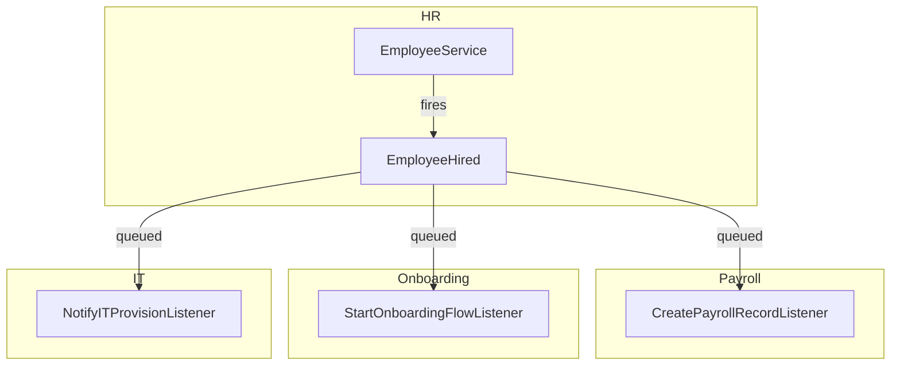

# Event Bus

Domains communicate exclusively through Laravel Events. No service in Domain A calls a service in Domain B directly. The emitting domain fires an event and has zero knowledge of which domains consume it.

---

## Architecture



HR fires `EmployeeHired` and moves on. It does not import `PayrollService` or `OnboardingService`. Cross-domain coupling is zero.

---

## Event Structure

Every domain event:
- Carries `company_id` as a typed scalar — required for `WithCompanyContext` queue middleware
- Uses typed scalar properties (string IDs, not Eloquent model references)
- Is an immutable value object (readonly properties)

```php
namespace App\Events\HR;

class EmployeeHired
{
    public function __construct(
        public readonly string $company_id,
        public readonly string $employee_id,
        public readonly string $user_id,
        public readonly CarbonImmutable $start_date,
        public readonly string $job_title,
    ) {}
}
```

**Why no model references**: the consuming domain may not have the model in its context. Passing an `Employee` model creates a hidden dependency. Scalar IDs let each listener load only what it needs.

---

## Queued Listeners

All cross-domain listeners implement `ShouldQueue`:

```php
class StartOnboardingFlowListener implements ShouldQueue
{
    use InteractsWithQueue;

    public string $queue = 'domain-events';
    public int $tries = 3;
    public int $backoff = 30;

    public array $middleware = [WithCompanyContext::class];

    public function handle(EmployeeHired $event): void
    {
        app(OnboardingServiceInterface::class)->startPlan(
            companyId: $event->company_id,
            employeeId: $event->employee_id,
        );
    }
}
```

Listener failure does not break the emitting transaction. Failed jobs after 3 attempts move to `failed_jobs`. Horizon monitors and fires a notification to `#platform-alerts`.

---

## Event Registration

`app/Providers/EventServiceProvider.php`:

```php
protected $listen = [
    EmployeeHired::class => [
        CreatePayrollRecordListener::class,
        StartOnboardingFlowListener::class,
        NotifyITProvisionListener::class,
    ],

    LeaveRequestApproved::class => [
        UpdatePayrollDeductionsListener::class,
    ],

    InvoicePaid::class => [
        UpdateARAgingListener::class,
        TriggerUpsellSequenceListener::class,
    ],

    DealWon::class => [
        CreateInvoiceStubListener::class,   // Finance
        EnrollInSuccessSequenceListener::class, // CRM sequences
    ],

    PayrollRunApproved::class => [
        PostPayrollJournalEntryListener::class, // Finance GL
    ],
];
```

---

## Cross-Domain Event Map

| Event | Source | Consumed By |
|---|---|---|
| `EmployeeHired` | HR | Payroll, Onboarding, IT |
| `EmployeeOffboarded` | HR | IT (revoke access), Payroll (final pay) |
| `LeaveRequestApproved` | HR | Payroll, Scheduling |
| `TimesheetApproved` | HR | Payroll |
| `PayrollRunApproved` | HR | Finance (GL journal entry) |
| `InvoicePaid` | Finance | CRM (update account), Analytics |
| `ExpenseApproved` | Finance | Payroll (reimbursement trigger) |
| `DealWon` | CRM | Finance (invoice stub), CRM Sequences |
| `FormSubmissionReceived` | Marketing | CRM (create contact) |
| `CheckoutCompleted` | E-commerce | Finance (record sale), Analytics |
| `TicketResolved` | Support | Marketing (CSAT survey) |
| `DSARRequestSubmitted` | Core | Legal, Notifications |
| `ModuleActivated` | Core | Analytics, Notifications |
| `CompanySubscriptionSuspended` | Core | Notifications (warn company) |

---

## Naming Convention

`{ModelName}{PastTenseAction}` using domain language, not CRUD language:

- `EmployeeHired` (not `EmployeeCreated`)
- `InvoicePaid` (not `InvoiceUpdated`)
- `DealWon` (not `DealStatusChanged`)
- `LeaveRequestApproved` (not `LeaveRequestUpdated`)

---

## Rules

1. **Cross-domain = always via event** — never call a service from another domain directly
2. **Within-domain = direct service call is fine** — `HRService` may call `LeaveService` within HR
3. **Events carry scalar IDs, not model references**
4. **All cross-domain listeners are queued** — `ShouldQueue` is mandatory
5. **Listener failure must not break the emitting transaction** — emit after the primary write
6. **`company_id` is always in the payload** — `WithCompanyContext` middleware requires it
