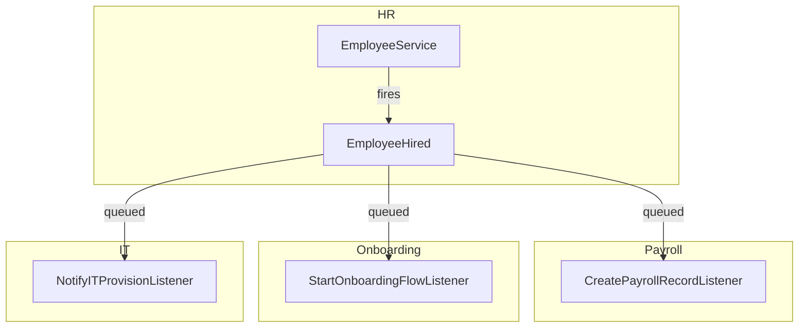

# Event Bus

Domains communicate exclusively through Laravel Events. No service in Domain A calls a service in Domain B directly. The emitting domain fires an event and has zero knowledge of which domains consume it.

---

## Architecture



HR fires `EmployeeHired` and moves on. It does not import `PayrollService` or `OnboardingService`. Cross-domain coupling is zero.

---

## Event Structure

Every domain event:
- Carries `company_id` as a typed scalar — required for `WithCompanyContext` queue middleware
- Uses typed scalar properties (string IDs, not Eloquent model references)
- Is an immutable value object (readonly properties)

```php
namespace App\Events\HR;

class EmployeeHired
{
    public function __construct(
        public readonly string $company_id,
        public readonly string $employee_id,
        public readonly string $user_id,
        public readonly CarbonImmutable $start_date,
        public readonly string $job_title,
    ) {}
}
```

**Why no model references**: the consuming domain may not have the model in its context. Passing an `Employee` model creates a hidden dependency. Scalar IDs let each listener load only what it needs.

---

## Queued Listeners

All cross-domain listeners implement `ShouldQueue`:

```php
class StartOnboardingFlowListener implements ShouldQueue
{
    use InteractsWithQueue;

    public string $queue = 'domain-events';
    public int $tries = 3;
    public int $backoff = 30;

    public array $middleware = [WithCompanyContext::class];

    public function handle(EmployeeHired $event): void
    {
        app(OnboardingServiceInterface::class)->startPlan(
            companyId: $event->company_id,
            employeeId: $event->employee_id,
        );
    }
}
```

Listener failure does not break the emitting transaction. Failed jobs after 3 attempts move to `failed_jobs`. Horizon monitors and fires a notification to `#platform-alerts`.

---

## Event Registration

`app/Providers/EventServiceProvider.php`:

```php
protected $listen = [
    EmployeeHired::class => [
        CreatePayrollRecordListener::class,
        StartOnboardingFlowListener::class,
        NotifyITProvisionListener::class,
    ],

    LeaveRequestApproved::class => [
        UpdatePayrollDeductionsListener::class,
    ],

    InvoicePaid::class => [
        UpdateARAgingListener::class,
        TriggerUpsellSequenceListener::class,
    ],

    DealWon::class => [
        CreateInvoiceStubListener::class,   // Finance
        EnrollInSuccessSequenceListener::class, // CRM sequences
    ],

    PayrollRunApproved::class => [
        PostPayrollJournalEntryListener::class, // Finance GL
    ],
];
```

---

## Cross-Domain Event Map

| Event | Source | Consumed By |
|---|---|---|
| `EmployeeHired` | HR | Payroll, Onboarding, IT |
| `EmployeeOffboarded` | HR | IT (revoke access), Payroll (final pay) |
| `LeaveRequestApproved` | HR | Payroll, Scheduling |
| `TimesheetApproved` | HR | Payroll |
| `PayrollRunApproved` | HR | Finance (GL journal entry) |
| `InvoicePaid` | Finance | CRM (update account), Analytics |
| `ExpenseApproved` | Finance | Payroll (reimbursement trigger) |
| `DealWon` | CRM | Finance (invoice stub), CRM Sequences |
| `FormSubmissionReceived` | Marketing | CRM (create contact) |
| `CheckoutCompleted` | E-commerce | Finance (record sale), Analytics |
| `TicketResolved` | Support | Marketing (CSAT survey) |
| `DSARRequestSubmitted` | Core | Legal, Notifications |
| `ModuleActivated` | Core | Analytics, Notifications |
| `CompanySubscriptionSuspended` | Core | Notifications (warn company) |
| `DealLost` | CRM | (none in v1 — Analytics in Phase 3) |
| `EventRegistrationReceived` | Events (P3) | CRM (create contact) |

---

## Listener Contracts

**The authoritative payload schemas.** Module specs copy these character-exact — never paraphrase. Every payload starts with `company_id: string`. All listeners: `ShouldQueue`, queue `domain-events`, `tries: 3`, `backoff: 30`, middleware `[WithCompanyContext::class]`.

### EmployeeHired (HR)
| Field | Type |
|---|---|
| company_id | string |
| employee_id | string |
| user_id | ?string |
| start_date | CarbonImmutable |
| job_title | string |

- `CreatePayrollRecordListener` (hr.payroll): creates payroll employee record, no compensation set (status `incomplete` until HR enters salary)
- `StartOnboardingFlowListener` (hr.onboarding): starts the company's default onboarding plan if one exists; no-op otherwise
- `NotifyITProvisionListener` (it, P3): creates provisioning checklist ticket; stub until IT domain built

### EmployeeOffboarded (HR)
| Field | Type |
|---|---|
| company_id | string |
| employee_id | string |
| user_id | ?string |
| termination_date | CarbonImmutable |

- IT (P3): revoke-access checklist
- `FinalPayListener` (hr.payroll): flags final payroll run incl. leave payout

### LeaveRequestApproved (HR)
| Field | Type |
|---|---|
| company_id | string |
| leave_request_id | string |
| employee_id | string |
| leave_type_id | string |
| start_date | CarbonImmutable |
| end_date | CarbonImmutable |
| days | float |

- `UpdatePayrollDeductionsListener` (hr.payroll): deduction only for unpaid leave types; paid types no-op
- Scheduling listener (hr.shifts, P2): blocks shift assignment over the range

### TimesheetApproved (HR)
| Field | Type |
|---|---|
| company_id | string |
| timesheet_id | string |
| employee_id | string |
| period_start | CarbonImmutable |
| period_end | CarbonImmutable |
| total_minutes | int |

- Payroll: hours feed the pay run for hourly employees

### PayrollRunApproved (HR)
| Field | Type |
|---|---|
| company_id | string |
| payroll_run_id | string |
| period_start | CarbonImmutable |
| period_end | CarbonImmutable |
| total_gross_cents | int |
| total_net_cents | int |
| currency | string |

- `PostPayrollJournalEntryListener` (finance.ledger): balanced journal entry (gross wages / withholdings / net payable), posted to period; throws + retries if period closed

### InvoicePaid (Finance)
| Field | Type |
|---|---|
| company_id | string |
| invoice_id | string |
| crm_account_id | ?string |
| amount_cents | int |
| currency | string |
| paid_at | CarbonImmutable |

- `UpdateARAgingListener` (finance): recompute AR aging buckets for the account
- CRM listener: update account lifetime value + last-payment activity (no-op when `crm_account_id` null)
- `TriggerUpsellSequenceListener` (crm.sequences, conditional): enrols account per sequence rules

### ExpenseApproved (Finance)
| Field | Type |
|---|---|
| company_id | string |
| expense_id | string |
| employee_id | ?string |
| amount_cents | int |
| currency | string |

- Payroll: reimbursement line on next pay run (only when `employee_id` non-null)

### DealWon (CRM)
| Field | Type |
|---|---|
| company_id | string |
| deal_id | string |
| account_id | ?string |
| contact_id | ?string |
| owner_id | string |
| value_cents | int |
| currency | string |
| won_at | CarbonImmutable |

- `CreateInvoiceStubListener` (finance.invoicing): draft invoice, line items copied from `crm_deal_products` (fallback: one line "Deal: {name}" at `value_cents`), due date = company default payment terms, **never auto-sent**; no-op when module inactive
- `EnrollInSuccessSequenceListener` (crm.sequences): per sequence rules

### DealLost (CRM)
| Field | Type |
|---|---|
| company_id | string |
| deal_id | string |
| owner_id | string |
| lost_reason | string |
| lost_at | CarbonImmutable |

- No v1 consumers; Analytics (P3)

### FormSubmissionReceived (Marketing, P3)
| Field | Type |
|---|---|
| company_id | string |
| form_id | string |
| submission_id | string |
| email | string |
| fields | array<string,string> |

- CRM: find-or-create contact by email, attach submission as activity

### CheckoutCompleted (E-commerce, P3)
| Field | Type |
|---|---|
| company_id | string |
| order_id | string |
| customer_email | string |
| total_cents | int |
| currency | string |

- Finance: record sale (order → invoice/receipt); Analytics: revenue metrics

### TicketResolved (Support, P2)
| Field | Type |
|---|---|
| company_id | string |
| ticket_id | string |
| contact_id | ?string |
| resolved_by | string |
| resolved_at | CarbonImmutable |

- Marketing (P3): CSAT survey email after configurable delay

### EventRegistrationReceived (Events, P3)
| Field | Type |
|---|---|
| company_id | string |
| event_id | string |
| registration_id | string |
| attendee_email | string |
| attendee_name | string |

- CRM: find-or-create contact; confirmation email with .ics fired by Events itself (not a listener)

### DSARRequestSubmitted (Core)
| Field | Type |
|---|---|
| company_id | string |
| dsar_request_id | string |
| request_type | string ("access"\|"erasure") |
| subject_email | string |
| due_at | CarbonImmutable |

- Legal (P3): matter record; Notifications: alert owner/admins of 30-day deadline

### ModuleActivated (Core)
| Field | Type |
|---|---|
| company_id | string |
| module_key | string |
| activated_by | string |
| activated_at | CarbonImmutable |

- Notifications: confirm to owner; Analytics (P3): adoption metrics. (Cache bust is done synchronously in BillingService, NOT via listener)

### CompanySubscriptionSuspended (Core)
| Field | Type |
|---|---|
| company_id | string |
| reason | string |
| suspended_at | CarbonImmutable |

- Notifications: email owner with payment-update link (mail must not require panel access — company is blocked)

---

## Naming Convention

`{ModelName}{PastTenseAction}` using domain language, not CRUD language:

- `EmployeeHired` (not `EmployeeCreated`)
- `InvoicePaid` (not `InvoiceUpdated`)
- `DealWon` (not `DealStatusChanged`)
- `LeaveRequestApproved` (not `LeaveRequestUpdated`)

---

## Rules

1. **Cross-domain = always via event** — never call a service from another domain directly
2. **Within-domain = direct service call is fine** — `HRService` may call `LeaveService` within HR
3. **Events carry scalar IDs, not model references**
4. **All cross-domain listeners are queued** — `ShouldQueue` is mandatory
5. **Listener failure must not break the emitting transaction** — emit after the primary write
6. **`company_id` is always in the payload** — `WithCompanyContext` middleware requires it
