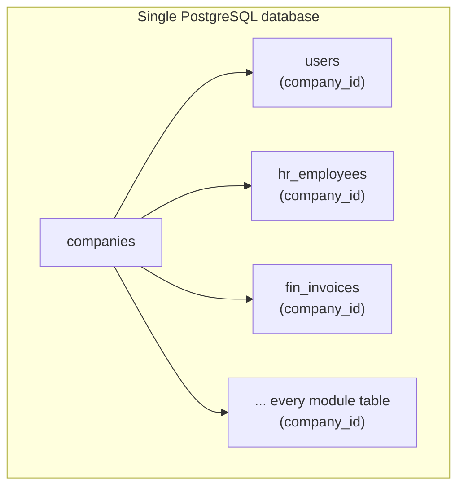

# Multi-Tenancy

FlowFlex uses shared-database, shared-schema multi-tenancy. All companies' data lives in the same PostgreSQL database. Tenant isolation is enforced at the application layer through a global Eloquent scope, not through separate schemas or databases.

---

## Strategy



**Why shared schema**: no per-tenant migrations, no connection pool explosion, simple super-admin cross-tenant analytics. The trade-off — a missing scope leaks data — is mitigated by making the scope automatic via `BelongsToCompany`.

---

## CompanyContext Service

`CompanyContext` is a singleton bound to the application container. It holds the current company for the duration of one HTTP request or one queued job.

```php
class CompanyContext
{
    private ?Company $company = null;

    public function set(Company $company): void
    {
        $this->company = $company;
    }

    public function current(): Company
    {
        return $this->company ?? throw new MissingCompanyContextException();
    }

    public function currentId(): ?string
    {
        return $this->company?->id;
    }
}
```

`SetCompanyContext` middleware runs after authentication on every web request. It resolves the company from the authenticated user's `company_id`, calls `app(CompanyContext::class)->set($company)`, and also calls `setPermissionsTeamId($company->id)` so that Spatie Permission uses the correct team scope for the rest of the request.

---

## BelongsToCompany Trait

Applied to every model that has a `company_id` column:

```php
trait BelongsToCompany
{
    protected static function bootBelongsToCompany(): void
    {
        static::addGlobalScope(new CompanyScope());

        static::creating(function ($model) {
            if (! $model->company_id) {
                $model->company_id = app(CompanyContext::class)->current()->id;
            }
        });
    }

    public function company(): BelongsTo
    {
        return $this->belongsTo(Company::class);
    }
}
```

The trait does three things:
1. Registers `CompanyScope` as a global scope — all queries automatically filter by the current company
2. Auto-populates `company_id` on create if not explicitly set — prevents missing-scope bugs
3. Provides the `company()` relationship for eager loading

---

## CompanyScope Global Scope

```php
class CompanyScope implements Scope
{
    public function apply(Builder $builder, Model $model): void
    {
        if ($companyId = app(CompanyContext::class)->currentId()) {
            $builder->where($model->getTable() . '.company_id', $companyId);
        }
    }
}
```

This scope is applied automatically to every Eloquent query on every model that uses `BelongsToCompany`. It is invisible — builders do not need to add `.where('company_id', ...)` manually.

**Bypassing the scope** is only permitted in the `/admin` Filament panel (FlowFlex staff context):

```php
// Admin panel only — never in app/Filament/App/, controllers, or services
Employee::withoutGlobalScope(CompanyScope::class)->find($id);
```

Using `withoutGlobalScope(CompanyScope::class)` outside the admin panel is a critical security defect.

---

## Queue Context Restoration

HTTP requests set `CompanyContext` via middleware. Queue workers have no HTTP request — the singleton is empty when a listener runs. The `WithCompanyContext` job middleware restores context in the worker:

```php
class WithCompanyContext implements ShouldBeUnique
{
    public function handle(mixed $job, callable $next): void
    {
        $companyId = $job->event->company_id ?? $job->company_id ?? null;

        if ($companyId) {
            $company = Company::withoutGlobalScope(CompanyScope::class)->findOrFail($companyId);
            app(CompanyContext::class)->set($company);
            setPermissionsTeamId($company->id);
        }

        $next($job);
    }
}
```

All cross-domain event listeners that touch tenant models must include this middleware in their `$middleware` array. Events must carry `company_id` as a typed scalar property (not a model reference) to make this possible.

---

## Spatie Permission Team Isolation

Spatie Permission uses the "teams" feature to scope roles and permissions per company. `setPermissionsTeamId($company->id)` must be called:

1. In `SetCompanyContext` middleware — for every web request
2. In `WithCompanyContext` job middleware — for every queued job that touches permissions

Without this call, `$user->hasRole('owner')` returns permissions from the wrong company's team, which can cause both false positives and false negatives in access control.

---

## Tenant Isolation Checklist

Every new module migration and model must pass this checklist before merging:

- [ ] Migration has `company_id ulid not null references companies(id)` and an index on it
- [ ] Model uses `BelongsToCompany` trait
- [ ] Model uses `HasUlids` trait
- [ ] Model uses `SoftDeletes` trait
- [ ] No raw queries that omit a `company_id` filter
- [ ] File uploads stored under `companies/{company_id}/...` via `FileStorageService::pathFor()` — never `Storage::put()` with a raw path
- [ ] Events dispatched from this domain's services carry `company_id` in the payload
- [ ] Queue jobs that handle these events use `WithCompanyContext` middleware
