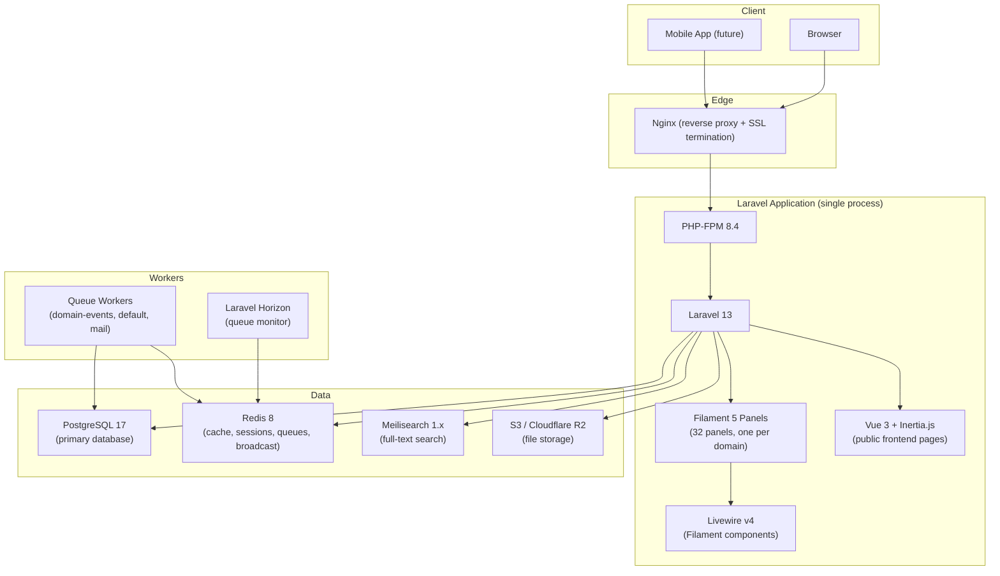

# Architecture Overview

---

## System Diagram

The entire application is a single Laravel monolith. Filament panels and Vue+Inertia pages are both served by the same PHP process. There is no microservice boundary — domain isolation is enforced by convention (interface/service pattern, event-driven cross-domain communication) not by network separation.

---

## Key Non-Obvious Decisions

### 1. Multi-tenancy via company_id global scope — not separate databases

Every tenant table has a `company_id` column. A global Eloquent scope (`CompanyScope`) automatically appends `WHERE company_id = ?` to every query for every model that uses the `BelongsToCompany` trait. There are no per-tenant databases, no schema separation, and no connection pool per tenant.

The trade-off is that a missing scope on any query would leak data across tenants. The `BelongsToCompany` trait makes the scope automatic and non-opt-in — every model that carries `company_id` gets the scope for free by using the trait. The only code permitted to bypass the scope is the `/admin` Filament panel (FlowFlex staff, super-admin context only). Bypassing the scope anywhere in the application layer — controllers, services, or the `/app` panel — is a critical bug.

### 2. ULID primary keys everywhere — not UUID, not auto-increment

All primary keys are ULIDs (`01ARZ3NDEKTSV4RRFFQ69G5FAV` format, 26 characters). ULIDs are sortable by timestamp prefix, which gives B-tree index performance comparable to auto-increment integers while avoiding sequential enumeration attacks and merge conflicts in multi-source imports. They are shorter than UUID4 (26 vs 36 chars) and URL-safe. The `HasUlids` trait (from `Illuminate\Database\Eloquent\Concerns\HasUlids`) is applied to every model without exception.

Auto-increment integers are explicitly banned: they expose record count, invite IDOR vulnerabilities, and create import conflicts. UUID4 is not used because its random structure creates index fragmentation at scale.

### 3. One Filament panel per domain — not one mega admin

Each of the 32 domains (31 business + 1 admin) has its own `PanelProvider` class, its own URL path, its own primary colour, and its own `discoverResources()` directory. This means a builder working on the HR domain can add, modify, or remove resources without touching any other domain's panel configuration.

The alternative — one panel with 32 navigation groups — would create a monolithic panel provider that becomes a merge conflict bottleneck as soon as more than one person works on the app simultaneously. The per-domain panel architecture keeps domain boundaries enforced at the framework level.

### 4. Module activation via canAccess() on every resource

There is no middleware that blocks access to a domain panel at the panel level. Instead, every individual Filament resource and page implements `canAccess()`, which checks both the user's permission and the company's active module subscription. This granularity allows a company to activate individual modules within a domain (e.g. HR Payroll but not HR Recruitment) rather than activating an entire domain at once.

The implication: every new resource or page must have a `canAccess()` method. Missing it means the resource is visible to all authenticated users regardless of their module subscription. This is enforced by code review, not by a compile-time check.

### 5. DTOs (spatie/laravel-data) on all input/output boundaries

`spatie/laravel-data` Data classes replace both Laravel FormRequests (for input validation) and Laravel API Resources (for output serialisation). A single DTO class handles both concerns: its constructor attributes carry validation rules, and `spatie/laravel-typescript-transformer` reads the class to auto-generate the corresponding TypeScript interface.

This means the type contract between PHP and Vue is generated, not written manually. When a DTO changes, the TypeScript types update on the next build. Controllers never pass raw arrays to services, and services never return raw Eloquent models to controllers.

### 6. Events always carry company_id — for queue context restoration

When a domain event is dispatched and its listener runs in a queue worker, the `CompanyContext` singleton is empty — it was set during the originating HTTP request, which is long gone. Every event carries `company_id` as a typed scalar property. The `WithCompanyContext` job middleware reads `company_id` from the event, looks up the company, and calls `app(CompanyContext::class)->set($company)` before the listener's `handle()` method runs.

Without this pattern, any listener that touches a model with `BelongsToCompany` would either throw `MissingCompanyContextException` or, worse, silently query without the company scope and return results from the wrong tenant.
