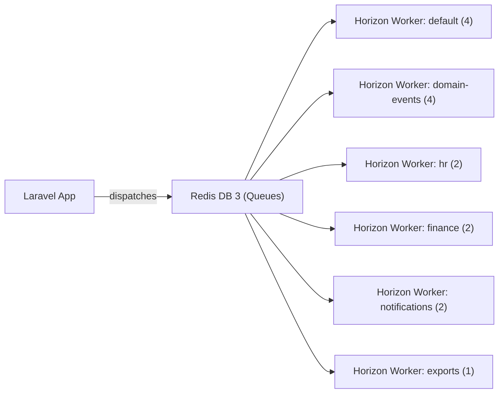

# Queue Jobs & Horizon

All background work runs through Laravel Horizon on Redis. Domain-specific queues prevent one slow domain from starving another.

---

## Queue Architecture



---

## Queue Names

| Queue | Purpose | Workers | Priority |
|---|---|---|---|
| `default` | Miscellaneous one-off jobs | 4 | Normal |
| `domain-events` | Cross-domain event listeners (`ShouldQueue`) | 4 | High |
| `hr` | HR-specific jobs (payroll calculation, onboarding triggers) | 2 | Normal |
| `finance` | Finance jobs (invoice PDF, report generation, journal entries) | 2 | Normal |
| `notifications` | Email/push/in-app notification delivery | 2 | High |
| `exports` | Excel/PDF exports (slow, memory-intensive) | 1 | Low |
| `webhooks` | Outbound webhook delivery | 2 | Normal |
| `imports` | CSV/Excel data import processing | 1 | Low |

---

## Horizon Configuration

`config/horizon.php`:

```php
'environments' => [
    'production' => [
        'supervisor-1' => [
            'connection' => 'redis',
            'queue' => ['domain-events', 'notifications', 'default'],
            'balance' => 'auto',
            'processes' => 10,
            'tries' => 3,
            'timeout' => 60,
        ],
        'supervisor-2' => [
            'queue' => ['hr', 'finance', 'webhooks'],
            'balance' => 'auto',
            'processes' => 6,
            'tries' => 3,
            'timeout' => 120,
        ],
        'supervisor-3' => [
            'queue' => ['exports', 'imports'],
            'balance' => 'simple',
            'processes' => 2,
            'tries' => 1,
            'timeout' => 600, // 10 minutes for large exports
        ],
    ],
],
```

---

## Job Structure

Every queued job:

```php
class GeneratePayrollPdfJob implements ShouldQueue
{
    use Dispatchable, InteractsWithQueue, Queueable, SerializesModels;

    public string $queue = 'finance';
    public int $tries = 3;
    public int $timeout = 120;
    public int $backoff = 30;

    public array $middleware = [WithCompanyContext::class];

    public function __construct(
        public readonly string $company_id,   // required for WithCompanyContext
        public readonly string $payroll_run_id,
    ) {}

    public function handle(): void
    {
        $run = PayrollRun::findOrFail($this->payroll_run_id);
        PayrollPdfService::generate($run);
    }

    public function failed(\Throwable $e): void
    {
        Log::error('PayrollPdf generation failed', [
            'company_id' => $this->company_id,
            'payroll_run_id' => $this->payroll_run_id,
            'error' => $e->getMessage(),
        ]);

        // Notify HR manager via notifications domain
        NotifyPayrollPdfFailed::run(
            companyId: $this->company_id,
            payrollRunId: $this->payroll_run_id,
        );
    }
}
```

---

## Retry & Failure Strategy

| Queue | Tries | Backoff | On failure |
|---|---|---|---|
| `domain-events` | 3 | 30s, 5m, 30m | Move to `failed_jobs`, Slack alert |
| `notifications` | 3 | 10s, 60s, 5m | Log, no user alert |
| `finance` | 3 | 30s, 5m, 30m | Notify finance manager |
| `exports` | 1 | — | Notify user: "Export failed, try again" |
| `imports` | 1 | — | Mark import as failed in UI |
| `webhooks` | 3 | 30s, 5m, 30m | Mark delivery as failed |

Failed jobs are retained in `failed_jobs` for 30 days. Horizon dashboard at `/horizon` shows queue depth, throughput, and failed job history.

---

## WithCompanyContext Middleware

Every job that touches tenant models must include `WithCompanyContext` in its `$middleware` array and must pass `company_id` in the constructor. See [[architecture/multi-tenancy]] for the full implementation.

---

## Job Dispatch Patterns

```php
// Dispatch immediately (queued async)
GeneratePayrollPdfJob::dispatch(
    company_id: $run->company_id,
    payroll_run_id: $run->id,
);

// Dispatch with delay
GenerateInvoiceReminderJob::dispatch($invoice->company_id, $invoice->id)
    ->delay(now()->addDays(3));

// Dispatch on specific queue
SendBulkEmailJob::dispatch($campaign->company_id, $campaign->id)
    ->onQueue('notifications');

// Chain jobs
GeneratePayrollPdfJob::withChain([
    new EmailPayslipsJob($run->company_id, $run->id),
])->dispatch($run->company_id, $run->id);
```

---

## Scheduled Commands

`app/Console/Kernel.php` schedules recurring jobs:

```php
// Daily: recalculate leave balances
$schedule->job(RecalculateLeaveBalancesJob::class)->dailyAt('02:00');

// Daily: mark overdue invoices
$schedule->job(MarkOverdueInvoicesJob::class)->dailyAt('03:00');

// Monthly: generate recurring invoices
$schedule->job(GenerateRecurringInvoicesJob::class)->monthlyOn(1, '06:00');

// Hourly: check payroll run scheduled dates
$schedule->job(TriggerScheduledPayrollRunsJob::class)->hourly();

// Weekly: purge soft-deleted records past retention
$schedule->job(PurgeExpiredSoftDeletesJob::class)->weeklyOn(0, '04:00');

// Daily: prune failed jobs older than 30 days
$schedule->command('queue:prune-failed --hours=720')->daily();

// Daily: prune Telescope entries older than 48 hours (dev only)
$schedule->command('telescope:prune --hours=48')->daily()->environments('local');
```
