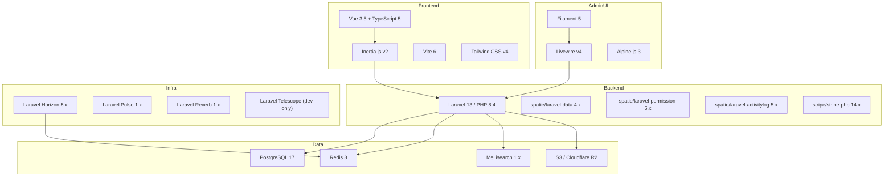
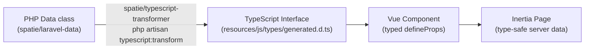

# Tech Stack

---

## System Diagram

---

## Backend

| Package | Version | Purpose |
|---|---|---|
| `php` | 8.4 | Language — named arguments, typed properties, readonly, enums, first-class callables |
| `laravel/framework` | 13.x | Core application framework |
| `laravel/sanctum` | 4.x | SPA session auth + API token issuance |
| `laravel/horizon` | 5.x | Queue monitoring dashboard + worker management |
| `laravel/pulse` | 1.x | Application health metrics (slow queries, exceptions, queue) |
| `laravel/reverb` | 1.x | First-party WebSocket server for real-time features |
| `laravel/telescope` | latest | Debug and introspection tool — dev environment only |
| `spatie/laravel-data` | 4.x | DTOs for all input validation and output serialisation |
| `spatie/laravel-permission` | 6.x | Role/permission RBAC with team support (teams = company_id) |
| `spatie/laravel-activitylog` | 5.x | Audit trail on all models |
| `spatie/laravel-media-library` | 11.x | File attachments on any model |
| `spatie/laravel-typescript-transformer` | 2.x | Auto-generates TypeScript interfaces from PHP Data classes |
| `stripe/stripe-php` | 14.x | Stripe payment processing and webhook handling |

---

## Admin UI (Filament 5)

| Package | Purpose |
|---|---|
| `filament/filament` | Panel framework — resources, pages, widgets, actions |
| `filament/spatie-laravel-media-library-plugin` | File upload and media fields in Filament forms |
| `filament/spatie-laravel-translatable-plugin` | Translatable field support in Filament |
| `bezhansalleh/filament-shield` | Permission management UI for Spatie/permission inside Filament |
| `livewire/livewire` | 4.x — Filament's component runtime |
| `alpinejs` | 3.x — JavaScript sprinkles in Filament components |

---

## Frontend (Vue 3 + Inertia)

| Package | Version | Purpose |
|---|---|---|
| `vue` | 3.5.x | UI component framework for public-facing pages |
| `@inertiajs/vue3` | 2.x | Server-driven SPA — no API layer needed for standard page data |
| `typescript` | 5.x | Type safety across all Vue components and composables |
| `vite` | 6.x | Build tool — handles both Vue+Inertia pages and Filament panel themes |
| `tailwindcss` | 4.x | Utility CSS — used in both Vue pages and Filament custom components |
| `@vueuse/core` | latest | Composables for reactivity, browser APIs, and utilities |
| `zod` | 3.x | Client-side validation for forms not managed by Inertia |
| `chart.js` | 4.x | Data visualisation in analytics widgets and dashboards |
| `@tiptap/vue-3` | 2.x | Rich text editor for documents, wiki pages, and email templates |

---

## Data Layer

| Technology | Version | Purpose |
|---|---|---|
| PostgreSQL | 17 | Primary relational database — all application data |
| Redis | 8 | Cache store, queue backend, session store, WebSocket broadcast channel |
| Meilisearch | 1.x | Full-text search across employees, contacts, documents, and products |
| S3 / Cloudflare R2 | — | Object storage for uploaded files, media, and exports |

---

## Type Flow: PHP to TypeScript

All server-to-client data is typed end-to-end. The TypeScript types are never written by hand — they are generated from the PHP DTOs. Running `php artisan typescript:transform` regenerates the file.

---

## Frontend vs Admin Decision Table

| Context | Technology | Reason |
|---|---|---|
| Business domain panels (HR, Finance, CRM, etc.) | Filament 5 | CRUD-first; fastest to build; Livewire handles state |
| FlowFlex admin panel (staff only) | Filament 5 | Same pattern as domain panels; tight access control |
| Public marketing site | Vue 3 + Inertia | Custom design, SEO, no auth requirement |
| Client portal | Vue 3 + Inertia | External users, branded UX, custom flow |
| Learner portal (LMS) | Vue 3 + Inertia | External learners, custom completion flow |
| Community pages | Vue 3 + Inertia | Social UX, public and authenticated views |
| Checkout and booking flows | Vue 3 + Inertia | Conversion-optimised, custom step flow |
| Mobile app | React Native / Capacitor (TBD) | Native app APIs; cross-platform |

---

## Key Constraints

Every builder must follow these unconditionally:

- **PHP 8.4+ features**: use named arguments, typed properties, readonly classes/properties, backed enums, and first-class callables — they are standard, not optional
- **PostgreSQL only**: no MySQL compatibility layer; use PostgreSQL-specific features freely (JSONB, generated columns, advisory locks)
- **ULID primary keys on all tables**: no integer PKs, no UUID4 — see [[data-model]] for rationale
- **Soft deletes on all models**: hard delete is only performed by scheduled purge jobs and GDPR erasure flows
- **BelongsToCompany on every tenant model**: any model with `company_id` must use the trait — global scope is not applied via migration constraint; it is applied via trait
- **No N+1 queries**: always use `with()` for relationships; verify with Laravel Telescope in development; no exceptions
- **All mutations through DTOs**: never pass `$request->all()` or raw arrays into a service or model; always go through a Data class
