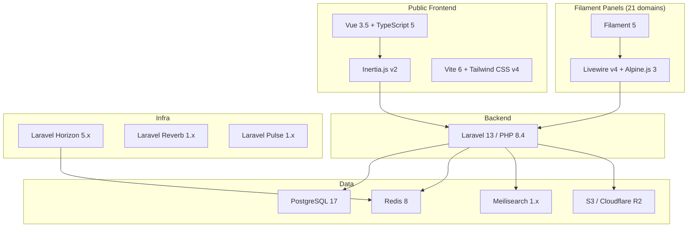
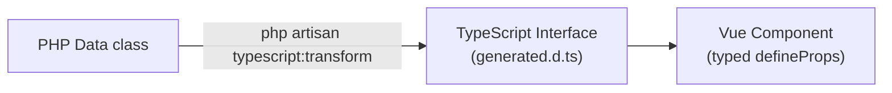

# Tech Stack

---

## System Diagram



---

## Backend

| Package | Version | Purpose |
|---|---|---|
| `php` | 8.4 | Named args, typed props, readonly, enums, first-class callables |
| `laravel/framework` | 13.x | Core framework |
| `laravel/sanctum` | 4.x | SPA session auth + API token issuance |
| `laravel/horizon` | 5.x | Queue monitoring + worker management |
| `laravel/pulse` | 1.x | App health metrics (slow queries, exceptions, queue) |
| `laravel/reverb` | 1.x | First-party WebSocket server |
| `laravel/telescope` | latest | Dev-only debug tool |
| `spatie/laravel-data` | 4.x | DTOs for all input validation and output serialisation |
| `spatie/laravel-permission` | 6.x | RBAC with team support (teams = company_id) |
| `spatie/laravel-activitylog` | 5.x | Audit trail on all models |
| `spatie/laravel-media-library` | 11.x | File attachments on any model |
| `spatie/laravel-typescript-transformer` | 2.x | Auto-generates TypeScript interfaces from PHP Data classes |
| `stripe/stripe-php` | 14.x | Stripe payment processing + webhooks |
| `laravel/scout` | latest | Full-text search driver layer for Meilisearch |
| `spatie/laravel-model-states` | latest | State machines for status fields |
| `spatie/laravel-settings` | latest | Type-safe per-company settings |
| `spatie/laravel-sluggable` | latest | Auto-slug generation on models |
| `spatie/laravel-health` | latest | Health check endpoints |
| `spatie/laravel-pdf` | latest | Chromium-based PDF generation |
| `spatie/laravel-backup` | latest | Automated DB + file backups |
| `lorisleiva/laravel-actions` | latest | Single-class actions for simple operations |
| `maatwebsite/laravel-excel` | latest | Chunked Excel import/export jobs |
| `brick/money` | latest | Type-safe monetary arithmetic |
| `propaganistas/laravel-phone` | latest | Phone validation → E.164 storage |
| `ezyang/htmlpurifier` | latest | XSS-safe rich text storage |
| `calebporzio/sushi` | latest | Static array-backed Eloquent models (module catalog) |
| `sentry/sentry-laravel` | latest | Production error tracking |
| Dev only: `nunomaduro/larastan`, `laravel/pint`, `pestphp/pest-plugin-livewire` | — | Static analysis, code style, Filament testing |

See [[architecture/packages]] for full evaluation notes on all packages.

---

## Admin UI (Filament 5)

| Package | Purpose |
|---|---|
| `filament/filament` | Panel framework — resources, pages, widgets, actions |
| `filament/spatie-laravel-media-library-plugin` | File upload fields in Filament forms |
| `bezhansalleh/filament-shield` | Permission management UI inside Filament |
| `livewire/livewire` | 4.x — Filament's component runtime |
| `alpinejs` | 3.x — JavaScript sprinkles |

---

## Frontend (Vue 3 + Inertia)

Used for: marketing site, client portal, learner portal, checkout flows.

| Package | Version | Purpose |
|---|---|---|
| `vue` | 3.5.x | UI components for public pages |
| `@inertiajs/vue3` | 2.x | Server-driven SPA — no separate API layer, no Vue Router |
| `typescript` | 5.x | Type safety across Vue components |
| `vite` | 6.x | Build tool (handles Vue pages + Filament themes) |
| `tailwindcss` | 4.x | Utility CSS |
| `@vueuse/core` | latest | Composables for reactivity and browser APIs |
| `tightenco/ziggy` | latest | Named Laravel route generation in Vue (`route('hr.employees.create')`) |
| `pinia` | latest | Client-side state (only for wizard flows + pure UI state — not server data) |
| `zod` | 3.x | Client-side validation for non-Inertia forms |
| Dev only: `vitest`, `@playwright/test` | — | Unit and E2E testing |

---

## Data Layer

| Technology | Version | Purpose |
|---|---|---|
| PostgreSQL | 17 | Primary relational database |
| Redis | 8 | Cache, queue backend, sessions, WebSocket channels |
| Meilisearch | 1.x | Full-text search (employees, contacts, documents, products) |
| S3 / Cloudflare R2 | — | Object storage for uploads, media, exports |

---

## Frontend vs Admin Decision

| Context | Tech | Reason |
|---|---|---|
| Business domain panels | Filament 5 | CRUD-first, fastest to build, Livewire handles state |
| `/admin` panel (staff) | Filament 5 | Same pattern as domain panels |
| Public marketing site | Vue 3 + Inertia | Custom design, SEO, no auth |
| Client portal | Vue 3 + Inertia | External users, branded UX |
| Learner portal | Vue 3 + Inertia | External learners, custom completion flow |
| Custom domain views (Kanban, Gantt, Calendar) | Custom Filament pages | Still inside Filament panel, not Inertia |

---

## Dev Environment

**Docker Compose** — commands use `docker exec flowflex_app`.

```bash
docker exec flowflex_app php artisan migrate
docker exec flowflex_app php artisan test
docker exec flowflex_app php artisan typescript:transform
```

---

## Key Constraints (Non-Negotiable)

- **PHP 8.4+ features**: named arguments, typed properties, readonly, backed enums — standard, not optional
- **PostgreSQL only**: no MySQL compatibility; use JSONB, generated columns, advisory locks freely
- **ULID PKs everywhere**: no integers, no UUID4 — see [[architecture/patterns/belongs-to-company]]
- **Soft deletes on all models**: hard delete only via scheduled purge and GDPR erasure
- **`BelongsToCompany` on every tenant model** — see [[architecture/multi-tenancy]]
- **No N+1 queries**: always use `with()`, verify with Telescope
- **All mutations through DTOs**: no `$request->all()` into services — see [[architecture/patterns/dto-pattern]]

---

## Type Flow: PHP → TypeScript



Never write TypeScript types by hand for server-to-client data. Run `typescript:transform` after changing any Data class.
