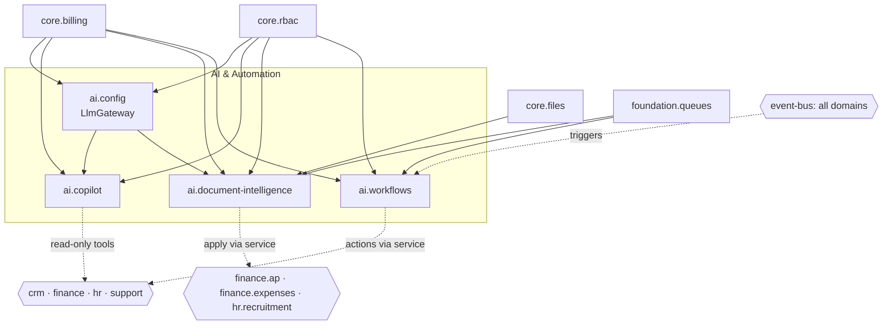

# AI & Automation — MOC

Map of content for the `/ai` domain (Indigo, Phase 3). Four modules: an AI model gateway, a cross-domain copilot, document intelligence, and a no-code automation builder. **Displaces:** Zapier, Make, Workato, and per-seat AI copilots.

Every LLM call in the domain routes through `ai.config`'s metered `LlmGateway`; `ai.workflows` is LLM-free (deterministic orchestration, "AI" only by placement).

## Modules

| Module | Key | Build | Notes |
|---|---|---|---|
| [[model-config/_module\|AI Model Configuration]] | `ai.config` | planned | build first — the `LlmGateway` every AI feature calls |
| [[copilot/_module\|AI Copilot]] | `ai.copilot` | planned | cross-domain assistant; data only via permission-checked tools |
| [[document-intelligence/_module\|Document Intelligence]] | `ai.document-intelligence` | planned | invoice/receipt/CV extraction behind mandatory human review |
| [[workflow-builder/_module\|Workflow Builder]] | `ai.workflows` | planned | Zapier-inside; universal event listener, no LLM |

## Dependency Graph

Solid = hard dependency; dotted = runtime cross-domain edge (read-only tool, apply-via-service, event trigger, action-via-service). No dotted edge is ever a direct cross-domain table write — see [[../../security/data-ownership]].

## Navigation Groups

- **Settings** — [[model-config/features/provider-config|AI Model Configuration]], [[model-config/features/usage-dashboard|Usage]]
- **Copilot** — [[copilot/features/chat-console|Chat]]
- **Document Intelligence** — [[document-intelligence/features/upload-and-extract|Extractions]]
- **Workflows** — [[workflow-builder/features/flow-editor|Workflow Builder]], [[workflow-builder/features/run-history|Run History]]

## Cross-Domain Posture

The domain fires **no domain events of its own**. Its cross-domain edges are all *inbound reads* or *outbound service calls*:

| Module | Edge | Detail |
|---|---|---|
| `ai.config` | provides | `LlmGateway::complete` — the single metered LLM path for the whole app |
| `ai.copilot` | reads (tools) | permission-checked, CompanyScope-bound, read-only metrics/records from crm/finance/hr/support |
| `ai.document-intelligence` | reads + apply | reads core.files media; applies via `ApService`/`ExpenseService`/recruitment service (never their tables) |
| `ai.workflows` | consumes + acts | universal listener on **all** event-bus contracts; actions execute through owning services |

Data ownership: each module writes only its own `ai_*` tables; every cross-domain effect is read-only-query or an owning-service call ([[../../security/data-ownership]]).

## Key Patterns

- `LlmGateway` (ai.config) = the single LLM call path: budget hard-stop, usage metering, fallback, encrypted BYO keys.
- Copilot data access **only** via permission-checked, CompanyScope-bound tools — never free-form queries; prompt-injection guardrails ([[../../architecture/security]]).
- Document extraction always behind human review + target-module DTO validation.
- Workflow actions always execute through the owning module's service — no raw cross-domain writes; loop-guarded.
- Token usage metered → usage-based billing candidate ([[../../product/pricing-model]]).

## Related

- [[_opportunities|AI Opportunities]] — web-researched differentiators + gaps
- [[../../security/data-ownership]] · [[../../architecture/event-bus]] · [[../../architecture/cross-domain-relations]]
- [[../../decisions/decision-2026-06-20-full-mapping-conventions]]
